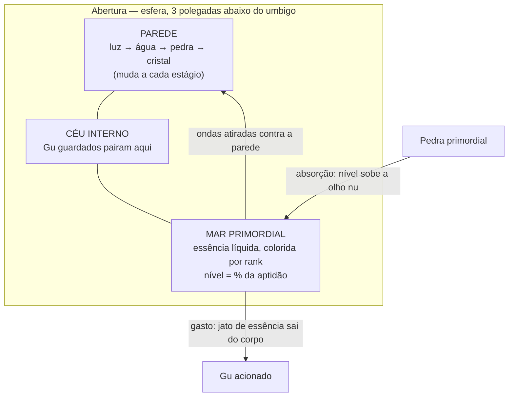

---
tags:
  - cultivo/mortal
  - cultivo/abertura
aliases:
  - Aperture
  - Primeval Sea
  - Mar Primordial
  - Cerimônia do Despertar
status: consolidado
fontes: ["cap. 5-7", "cap. 10", "cap. 17", "cap. 19", "cap. 22", "cap. 26", "cap. 35", "cap. 43", "cap. 50", "cap. 80", "cap. 90", "cap. 92", "cap. 96", "cap. 111", "cap. 141", "cap. 145", "cap. 152-153", "cap. 167", "cap. 179", "cap. 187-188", "cap. 212", "cap. 230", "cap. 273", "cap. 312", "cap. 331", "cap. 490", "cap. 493-494", "cap. 504", "cap. 598", "cap. 1646", "cap. 1796", "cap. 180-181", "cap. 33", "cap. 52", "cap. 86", "cap. 106", "cap. 437", "cap. 377-378", "cap. 486-487", "cap. 767", "cap. 1739", "cap. 1870"]
conhecimento: comum
---

# Abertura

**Em uma frase:** a ==abertura (aperture)== é o órgão espiritual invisível que todo Mestre Gu forma dentro do próprio corpo aos quinze anos, e que funciona ao mesmo tempo como reservatório de energia, como mochila onde seus Gu vivem e como ficha de progressão — sem abertura, a pessoa é um mortal comum e nunca poderá cultivar.[^1]

## A Cerimônia do Despertar

A abertura nasce num ritual, e o ritual merece detalhamento próprio: ele é, na prática, **a
cena de criação de personagem deste mundo**, e provavelmente a primeira sessão de qualquer
campanha ambientada aqui.

**Quando e para quem.** Uma vez por ano, para os jovens do clã que completaram **quinze
anos**. E aqui está o dado mais importante de todos, porque é político e não mágico: **só
membros de sangue do clã passam pela cerimônia**. Cultivo é reservado à linhagem e negado
aos servos mortais, deliberadamente, por estabilidade. A raridade dos Mestres Gu no mundo
não mede quanta gente tem talento — mede quanta gente foi **autorizada a descobrir** se tem.

**Onde e como.** Numa câmara subterrânea construída sobre a nascente espiritual do clã. O
candidato precisa atravessar um rio subterrâneo de uns nove metros de largura **caminhando
sobre um mar de flores** — orquídeas-lua. Cada passo exige vencer uma pressão invisível que
aumenta, e a cada passo dado ==Hope Gu (Gu da Esperança)==, criaturas de luz ligadas ao mito
fundador do mundo, saem das flores e entram no corpo do jovem, acumulando-se abaixo do
umbigo. Quanto maior a aptidão, mais forte a luz que o envolve — de modo que **a plateia vê
o resultado antes do anúncio**.

**O desfecho.** Quando o jovem chega ao próprio limite de passos, a bola de Hope Gu explode
dentro do corpo e forma a abertura, com seu Mar Primordial. **O número de passos determina o
grau de aptidão** — a tabela completa está em [[03 - Aptidão|Aptidão]] —, e quem não alcança dez passos
**jamais será Mestre Gu**. Não há segunda chance: a cerimônia acontece uma vez na vida, e o
resultado é definitivo.

**O instante em que o órgão nasce, por dentro.** Vale registrar aqui, porque é a única vez em
que a obra descreve a abertura se formando: o jovem ouve um estouro que ninguém mais escuta;
os pelos do corpo se arrepiam, os poros se fecham, a mente se estica até um limite tenso. Logo
depois a mente apaga, o corpo amolece como se estivesse caindo dentro de uma nuvem, o coração
relaxa, os pelos baixam, os poros reabrem — e ele está encharcado de suor. Parece longo e é
curtíssimo. Quando volta a si, ele vira a atenção para dentro e encontra, abaixo do umbigo e
entre os dois rins, **uma abertura que não existia**. A cena completa da cerimônia, do ponto de
vista de quem a atravessa e de quem assiste, está em [[03 - Aptidão#A cerimônia como cena|Aptidão]].

**O que acontece com quem não passa.** Permanece mortal comum, dentro do próprio clã, para
sempre. Não é exílio nem desonra formal — é irrelevância: a pessoa deixa de ser investimento
e passa a ser população. Existem três rotas raras de escapar disso mais tarde, e todas ficam
**fora** do sistema de clãs: topar por acaso com um Hope Gu selvagem, encontrar uma herança
que conceda força, ou receber instrução pessoal de um membro de clã disposto a quebrar a
regra. Quem entra por essas portas é um "Mestre sem clã", nunca plenamente aceito — e
empurrado, na prática, para o lado demoníaco do mundo.

**O que ela custa e o que ela vale.** Para o clã, é o maior evento social do ano: define
quanto será investido em cada jovem pelos vinte anos seguintes e funciona como vitrine
política, com anciãos exibindo netos talentosos como capital de facção. Para a aldeia, é a
única vez na vida em que a maioria das pessoas entra na área restrita do clã. Tudo é
registrado por um Gu de imagem e som, o que permite reexame posterior — e já serviu de prova
em investigação formal.

**Dá para fraudar?** O ritual em si é considerado preciso e difícil de burlar, mas um ancião
com autoridade suficiente consegue **adulterar o resultado divulgado** — anunciar como B um
grau C real. A fraude nunca se sustenta por muito tempo: a velocidade de cultivo do jovem
denuncia o talento verdadeiro em poucos anos. Em pelo menos um clã, reagir com emoção
audível durante a cerimônia acarreta punição severa, incluindo exílio — o que, para um jovem
mortal, costuma equivaler a uma sentença de morte.

> [!note] Para o design
> A cerimônia é uma **sessão zero diegética**: ela gera a ficha do personagem — grau,
> porcentagem de capacidade, e portanto o teto de carreira inteiro — dentro de um evento
> público, com plateia, apostas de família, hierarquia de investimento em jogo e a
> possibilidade real de fraude por parte de quem conduz. Três coisas caem prontas na mesa:
> (1) a rolagem de atributo acontece **na frente de todo mundo**, o que dá consequência
> social imediata a um número; (2) o resultado decide quanto o clã vai gastar com o
> personagem, transformando a ficha numa relação de dependência; (3) existe uma autoridade
> capaz de mentir sobre o resultado, o que é um segredo de campanha embutido no primeiro
> minuto de jogo.

## Como funciona

Mecanicamente, o que a cerimônia produz é isto: criaturas de luz entram no corpo do jovem, acumulam-se cerca de três polegadas abaixo do umbigo e explodem, abrindo ali uma cavidade esférica coberta por uma película fina e luminosa. É um órgão real para efeitos de mundo — pode ser ferido, inspecionado, sobrecarregado, rachado —, mas não aparece em nenhuma dissecação: existe na camada espiritual do corpo.

Dentro dessa cavidade fica o ==Mar Primordial (Primeval Sea)==: um pequeno mar de [[04 - Essência Primordial|essência primordial]] líquida, a condensação da vitalidade, da energia e da alma que o indivíduo acumulou ao longo da vida. É esse líquido que o Mestre Gu gasta para acionar seus Gu, e é o nível dele que responde à pergunta prática "quanto ainda posso lutar hoje?".

O nível do Mar Primordial é medido em **porcentagem da capacidade da abertura**, e essa capacidade máxima é fixada pela [[03 - Aptidão|aptidão]] da pessoa. Isso merece atenção porque é contraintuitivo: alguém com aptidão de 44% nunca acumulará mais que 44% de essência, **mesmo havendo espaço físico sobrando na cavidade**. Ao atingir o próprio limite, o mar simplesmente para de subir. A essência é reposta por recuperação natural, numa taxa também proporcional à aptidão, ou pela absorção de [[02 - Pedras Primordiais|pedras primordiais]] — a moeda do mundo, que dobra de função como bateria portátil.

Além de energia, a abertura guarda os **Gu**. Os vermes mágicos do Mestre Gu vivem ali dentro, alimentados por ele, e são chamados para fora quando usados. Na prática isso significa que a abertura é também o inventário do personagem — e que atacar a abertura de alguém é atacar simultaneamente sua mana, seu equipamento e sua vida.

### Por dentro: o que o cultivador vê quando "olha" para a própria abertura

A designer precisa poder imaginar este órgão, e a obra o descreve com generosidade. Vale
começar pelo que ele **não** é: não é um espaço físico. A abertura fica dentro do corpo mas
**não divide espaço com os órgãos** — não aparece numa dissecação, não desloca nada, não
pode ser alcançada por uma faca.

**Onde fica.** Num ponto preciso e sempre o mesmo: cerca de **três polegadas abaixo do
umbigo, entre os dois rins**. É por isso que o gesto informal de chamar um Gu para fora é
dar um tapinha na própria barriga.

**Que tamanho tem.** Aqui a obra é deliberadamente evasiva, e a evasão é a resposta: a
abertura é descrita como "infinitamente grande e, ao mesmo tempo, infinitamente pequena".
Não há centímetros, não há litros. Existe uma única medida citada, e ela é burocrática, não
física: ao registrar o resultado de um jovem na cerimônia, o ancião anota "Mar Primordial
medindo seis por seis" — uma notação de cartório de clã, sem unidade declarada e sem
explicação. Para efeito de mesa, a leitura útil é que **a abertura não tem tamanho absoluto;
só tem tamanho relativo**, medido em porcentagem de si mesma, e é por isso que todo o
sistema fala em "44% de essência" e nunca em "quatro litros de essência".

**Como se olha para dentro.** Não com os olhos. O Mestre Gu fecha os olhos, acalma a mente e
**deixa a atenção escorregar para dentro do Mar Primordial**. É um sentido interno, aprendido
na primeira semana de aula do clã junto com meditar e movimentar a essência pelo corpo. O
procedimento é rápido o bastante para ser feito no meio de uma viagem, montado, ou entre dois
lances de uma luta — e não é contemplativo: é o gesto de conferir o próprio painel.

**O que ele vê.** Uma paisagem interior, e sempre a mesma:

- Uma **cavidade esférica**, fechada por quatro paredes que são, no primeiro estágio, uma
  fina camada de **luz branca**, lisa e sem impurezas, brilhando como uma casca luminosa que
  sustenta a esfera para que não desabe.
- No fundo, o **Mar Primordial**: água de verdade, com ondas que sobem e descem, superfície
  lisa como um espelho quando em repouso, densa, com brilho metálico, emitindo luz da cor do
  próprio rank. **Cada gota é uma gota de essência.**
- O nível do mar é literalmente um nível de água: ele sobe e desce à vista. Absorvendo uma
  [[02 - Pedras Primordiais|pedra primordial]], o nível sobe "numa velocidade visível a olho
  nu" — e, ao bater no teto imposto pela [[03 - Aptidão|aptidão]], **para de repente**, com
  espaço de sobra acima.
- Acima do mar existe um **céu vazio** dentro da esfera. É onde os [[04 - Onde um Gu Mora|Gu
  guardados]] pairam. Gu de água ficam boiando na superfície do mar; um Gu chamado para uso
  sobe do mar até o meio da esfera e sai dali para o corpo.
- Em combate ou em cultivo, o mar **se agita sozinho**: ondas se levantam sem vento e se
  atiram contra as paredes, tempestades, marés, maremotos. É essa a imagem que a obra usa
  para descrever o esforço de avançar de estágio.

Nada disso é visível de fora. **Um forasteiro não vê a abertura de ninguém** — nem por
observação, nem por dissecação. O único acesso é a inspeção por toque descrita adiante: a
mão no ombro, os olhos fechados, alguns segundos de concentração. Daí o tabu.

> O diagrama acima é **leitura nossa** do que a obra descreve em cena; a obra não apresenta
> nenhum esquema da abertura.

### O que muda, fisicamente, a cada degrau

Duas coisas mudam de aparência, e são exatamente as duas que um inspetor lê:

| O que muda | Ao subir de **estágio** (dentro do rank) | Ao subir de **rank** |
|---|---|---|
| **A parede** | muda de material — luz, água, pedra, cristal — e fica **mais espessa** a cada degrau: a parede de luz é lisa e sem impurezas; a de água é visivelmente mais grossa que a de luz, com ondulações de luz correndo e piscando sobre ela; a de cristal é branca e sólida | volta ao começo: a parede de cristal estilhaça e se refaz como uma nova parede de luz, fina outra vez, agora do rank seguinte |
| **A cor do mar** | muda de tom dentro da mesma família (verde-jade → verde-claro → verde-escuro → verde-negro, no rank 1) | muda de família inteira (verde-cobre → vermelho-aço → branco-prata → amarelo-dourado → roxo-cristal) |

Fora isso, a abertura **não muda de aparência**: não ganha decoração, não muda de formato,
não acumula marcas. Os detalhes de cor estão em [[04 - Essência Primordial|Essência Primordial]].

### As paredes por estágio

A membrana que sustenta a abertura não é sempre a mesma. Ela **muda de material** conforme o Mestre Gu avança pelos quatro estágios de um mesmo rank, e é essa mudança que define o estágio:

| Estágio dentro do rank | Parede da abertura |
|---|---|
| Inicial | membrana de luz |
| Médio | membrana de água |
| Superior | membrana de pedra |
| Pico | **membrana de cristal** |

Avançar de estágio não é apenas acumular energia parada: é **nutrir a parede**, arremessando grandes volumes de essência contra ela repetidamente até que sua natureza se transforme — luz vira água, água vira pedra, pedra vira cristal. Cada material é mais sólido e mais condensado que o anterior.

Para subir de **rank**, porém, o processo se inverte: em vez de fortalecer a parede, o Mestre Gu precisa **destruí-la**. A membrana de cristal do estágio de pico é atacada com essência contínua até rachar e colapsar "como um iceberg"; os cacos se dissolvem no fundo do Mar Primordial, e uma nova membrana de luz — fina outra vez, agora correspondente ao rank seguinte — se forma no lugar.

**E isso tem imagem e tem som.** Vale registrar como cena, porque é o momento mais dramático da vida interior de um Mestre Gu e a obra o descreve passo a passo. Primeiro aparecem as rachaduras: linhas que se cruzam sobre o cristal branco translúcido, umas superficiais, outras fundas e nítidas, até se juntarem numa única placa quebrada. Se o cultivador para de bater, **as rachaduras se fecham sozinhas e o cristal sara** — por isso a ruptura exige impacto explosivo, não paciência. Quando a parede finalmente cede, ela **estoura com um estrondo alto**, e o estrondo é ouvido de dentro, pelo dono. Os estilhaços caem no Mar Primordial, **levantam ondas e marolas ao bater na água**, e então viram pontinhos brancos que se apagam no ar. No lugar deles surge uma esfera de luz novinha. A primeira gota de essência da nova cor emerge do fundo do mar nesse instante. A parede se **autorregenera** enquanto está sendo atacada: parar por cerca de quinze minutos já apaga o progresso, o que transforma a ruptura de rank num esforço contínuo de dias. Os detalhes desse processo estão em [[05 - Ranks e Avanço|Ranks e Avanço]].

## Regras e limites

- **Dano à abertura é catastrófico e frequentemente permanente.** Ferir a abertura reduz o cultivo e pode reduzir a própria [[03 - Aptidão|aptidão]]; destruí-la por completo mata o Mestre Gu na hora. As ==técnicas proibidas (forbidden techniques)== — a família de golpes que se aciona em desespero, comprando um salto explosivo de força de combate com **tempo de vida do próprio usuário** e, nas versões mais extremas, com a morte certa dele — cobram também na abertura: uma delas, usada para escapar de uma batalha perdida, deixou a abertura do usuário coberta de rachaduras e **rebaixou-o de grau A para grau B** — isto é, derrubá-lo um degrau inteiro na escala de talento, que vai de D (pior) a A (melhor) e está explicada em [[03 - Aptidão|Aptidão]]. A queda de rank causada por ferimento, por velhice e por conflito entre efeitos artificiais é assunto de [[07 - Perder Cultivo|Perder Cultivo]] — e é uma parte grande do sistema, não uma nota de rodapé.
- **A energia de outra pessoa contamina.** Não existem duas essências primordiais idênticas — elas são tão pessoais quanto uma impressão digital. Essência alheia injetada na abertura conflita com a nativa e, acumulada, impregna as paredes de forma permanente, sufocando o desenvolvimento futuro do talento. Essência contaminada tem ainda dois efeitos imediatos: **injetada num Gu, mata o Gu**, e deixada na abertura, corrói a parede e derruba a [[03 - Aptidão|aptidão]] proporcionalmente ao tempo que fica lá.
- **A limpeza tem duas versões, e uma delas é gratuita.** A definitiva é o ==Cleansing Water Gu (Gu da Água Purificadora)==, que **lava por completo as impurezas da abertura** — e que também serve, na prática, para **apagar a evidência** de dopagem antes de uma avaliação pública. É raríssimo: no único caso registrado, um exemplar apareceu à venda uma única vez na feira de Gu de um clã e foi arrematado na hora por uma facção interna. A caseira está ao alcance de qualquer Mestre Gu: **expulsar do corpo toda a própria essência e reformá-la do zero** a partir de [[02 - Pedras Primordiais|pedras primordiais]]. Cada rodada corta a impureza aproximadamente pela metade, até sobrar um **traço residual que nenhuma repetição adicional remove**. O procedimento completo e o que volta ou não volta estão em [[07 - Perder Cultivo|Perder Cultivo]].
- **Inspeção de abertura é o maior tabu social entre Mestres Gu.** Por toque, um Mestre Gu consegue "escanear" a abertura de outro e ver a cor e a quantidade da essência (o que revela rank e estágio exatos) e os Gu guardados ali. Fazer isso sem consentimento é ofensa gravíssima. Um Gu de rank muito superior ao do inspetor consegue se ocultar da leitura: um inspetor rank 4 não detecta um Gu rank 6.
- **Existe uma "segunda caverna secreta"** onde é possível manter Gu fora da abertura principal, justamente para escapar de inspeções. É um recurso conhecido, não um segredo absoluto, mas o mecanismo nunca é detalhado.
- **A abertura só acomoda confortavelmente Gu de rank compatível.** Um Gu de rank muito superior em plena força faria a abertura explodir. Um Gu poderoso guardado ali enquanto se recupera volta a crescer com o tempo e pode acabar ferindo ou matando o portador por sobrecarga — causa comum de morte entre Mestres Gu ambiciosos.
- **Sobrecarga deliberada existe, e o preço é a abertura.** Em emergência é possível forçar o uso de um Gu acima do próprio rank. O resultado padrão é a destruição da abertura: morte ou transformação irreversível.
- **Aptidões extremas vivem sob pressão constante.** Quem armazena 100% de essência tem a abertura permanentemente tensionada e sob risco de explodir; a maioria desses portadores morre cedo.
- **Uma segunda abertura é possível — e rara.** O que a concede é um Gu com nome e ficha: o ==Second Aperture Gu (Gu da Segunda Abertura)==, um Gu Imortal de **rank 6** e de **uso único** (desaparece na ativação). Ele entra no corpo como uma luz verde do tamanho de um grão de feijão, é **rejeitado pela abertura já existente** e se aloja no **centro do peito**, onde abre a segunda cavidade — que começa no rank 1 e progride de forma independente da primeira. A receita tem cerca de **mil passos**: centenas de materiais na fase inicial, grandes quantidades de Gu de rank 4 e 5 no meio (inclusive **aberturas humanas** como insumo) e, no passo final, o consumo de **outro Gu Imortal de rank 6**. Não existe Gu da Terceira Abertura: seria preciso deduzir uma receita inteiramente nova. Ela dobra a capacidade de energia e a velocidade de recuperação, aceita um segundo conjunto de Gu e, principalmente, funciona como **seguro de vida na ascensão**: quem tem duas aberturas pode estilhaçar só uma e sobreviver à falha. Como a essência das duas é a mesma assinatura pessoal, transferi-la entre elas é seguro — e serve de atalho, empurrando a energia da abertura forte contra a parede da fraca para forçar uma ruptura.

> [!warning] Uma exceção deliberada, e o que ela revela
> Rachaduras estruturais na abertura são um defeito — mas podem ser **deixadas de propósito por terceiros**, porque tornam mais fácil estilhaçar a abertura no momento da [[14 - Ascensão Imortal|ascensão imortal]]. É a primeira vez que a obra mostra alguém sacrificando aptidão como investimento consciente. A leitura correta: no fim da carreira mortal, a abertura deixa de ser um cofre a preservar e passa a ser um obstáculo a demolir.

## Na vida de um Mestre Gu

O cultivo diário é literalmente contemplar o próprio Mar Primordial em meditação, circulando essência pelo corpo. Não substitui o sono e não é heroico: é rotina, como treinar.

Em combate, o número que importa é a porcentagem. Cada Gu tem um custo declarado — uma lâmina de luar custa 10% da reserva no estágio inicial —, e a norma entre veteranos é **nunca gastar os últimos 10%**, porque um Mestre Gu de abertura vazia luta pior que um camponês. A frase usada no mundo para descrever isso é a passagem "de tigre a gato doente".

Socialmente, a abertura é o que se esconde. A cor da essência vaza como aura e denuncia o rank a olho nu, mas o *conteúdo* — quais Gu você tem, qual é a sua combinação real de combate — só se revela por inspeção. Daí o tabu, daí a segunda caverna secreta, daí toda uma cultura de blefe sobre o que cada um realmente carrega.

> [!example] Caso mecânico
> Antes de um exame público que incluía inspeção de abertura, um Mestre Gu rank 1 escondeu dois Gu comprometedores numa segunda caverna secreta e confiou que seu Gu rank 6 se camuflaria sozinho da leitura, por diferença de rank, diante de um inspetor rank 4. A inspeção viu apenas essência e dois Gu triviais. Nenhuma regra foi quebrada: as duas brechas usadas são propriedades normais do sistema.

> [!note] Para o design
> A abertura resolve, num único objeto diegético, três coisas que a maioria dos sistemas mantém separadas: **barra de mana** (o Mar Primordial em %), **inventário mágico** (os Gu guardados) e **ficha de progressão** (o material da parede diz o estágio). Isso rende três consequências jogáveis imediatas: (1) dano à abertura é um ferimento *de atributo* — o personagem sai da luta com o teto de mana menor, não com menos pontos de vida; (2) a contaminação por essência alheia dá um custo elegantíssimo para buffs de aliado, transformando "receber ajuda" numa decisão com consequência de longo prazo; (3) a inspeção como tabu social converte a ficha de personagem em informação disputada — ocultar a própria build é uma mecânica, não uma cortesia da mesa.

## Relações

- [[04 - Essência Primordial|Essência Primordial]] — o conteúdo do Mar Primordial.
- [[03 - Aptidão|Aptidão]] — o grau que a cerimônia mede: o que fixa a capacidade máxima da abertura, e o teto de carreira que ele impõe.
- [[05 - Ranks e Avanço|Ranks e Avanço]] — avanço é transformar ou quebrar as paredes.
- [[14 - Ascensão Imortal|Ascensão Imortal]] — o momento em que a abertura é destruída de propósito.
- [[02 - Pedras Primordiais|Pedras Primordiais]] — a recarga externa.
- [[07 - Perder Cultivo|Perder Cultivo]] — o que acontece quando este órgão é ferido, contaminado ou envelhece.
- [[11 - Cultivo Fora do Humano|Cultivo Fora do Humano]] — quem vive sem abertura, e quem vive com uma abertura morta.

[^1]: A abertura também aparece na obra sob nomes populares e poéticos ("Palácio Púrpuro", "Lago Chinês"), que são sinônimos do mesmo órgão. A tradução brasileira consagrada é "abertura"; "mar primordial" e "mar primitivo" circulam como variantes para o Mar Primordial, sem diferença de significado.
