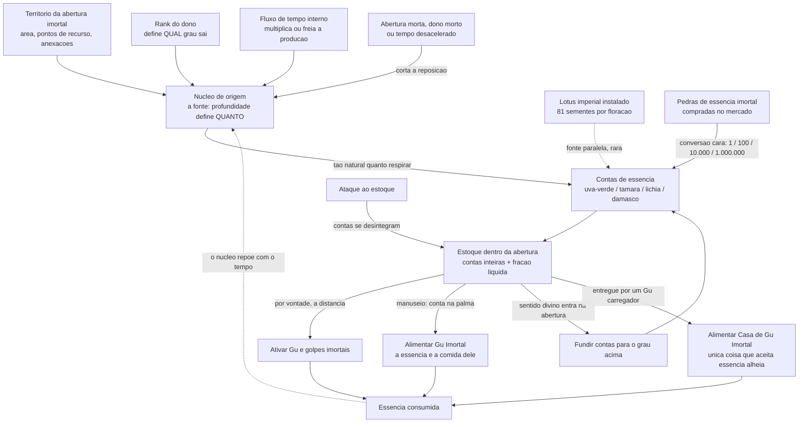

---
tags:
  - cultivo/imortal
  - cultivo/essencia
  - economia/imortal
aliases:
  - Immortal Essence
  - Immortal essence bead
  - Conta de essência
  - Uva-verde
  - Green grape immortal essence
  - Tâmara-vermelha
  - Red date immortal essence
  - Lichia-branca
  - White litchi immortal essence
  - Damasco-amarelo
  - Yellow apricot immortal essence
  - Núcleo de origem
  - Immortal aperture origin core
status: verificado-no-texto
conhecimento: especializado
fontes: ["cap. 377", "cap. 379", "cap. 387", "cap. 409-410", "cap. 416", "cap. 460", "cap. 463", "cap. 466", "cap. 587", "cap. 608", "cap. 611", "cap. 616", "cap. 638", "cap. 641-642", "cap. 650-655", "cap. 666", "cap. 678-684", "cap. 699", "cap. 703", "cap. 710", "cap. 729", "cap. 750", "cap. 767", "cap. 788-794", "cap. 804", "cap. 810", "cap. 820", "cap. 851", "cap. 971", "cap. 1008", "cap. 1038", "cap. 1051", "cap. 1070", "cap. 1082", "cap. 1094-1096", "cap. 1129", "cap. 1166", "cap. 1207", "cap. 1245", "cap. 1252", "cap. 1427", "cap. 1449", "cap. 1457", "cap. 1459", "cap. 1468", "cap. 1547", "cap. 1556", "cap. 1625", "cap. 1633", "cap. 1644", "cap. 1681", "cap. 1766", "cap. 1777", "cap. 1925", "cap. 2073", "cap. 2085", "cap. 2090", "cap. 2182", "cap. 2196", "cap. 2207", "cap. 2221", "cap. 2225-2229", "cap. 2235-2247", "cap. 2285", "cap. 2293", "cap. 2297-2298", "cap. 2302"]
---

# Essência Imortal

**Em uma frase:** a ==essência imortal (immortal essence)== é o combustível dos Gu Imortais — e, ao contrário da [[04 - Essência Primordial|essência primordial]] do mundo mortal, ela não é um líquido que enche um reservatório interno, e sim um punhado de **contas** sólidas, contáveis como moedas, que a abertura imortal do cultivador fabrica sozinha e que ele gasta uma a uma até acabar.

> [!info] Os quatro estados de confiabilidade
> Esta nota separa, à vista, o que a obra afirma do que nós preenchemos.
>
> - **Texto simples** — canônico: a obra afirma.
> - **`(ded.)`** — dedução segura a partir de algo que a obra afirma.
> - **`*`** — indução ou invenção nossa, sem base textual.
> - **`—`** — a obra não informa e nada foi preenchido.
>
> Apagar tudo que estiver marcado com `*` devolve este documento a cem por cento canônico.

## Por que esta nota existe

A pergunta que ela responde é a mais concreta possível, e é a que a maioria das fontes secundárias pula: **o que é, fisicamente, essa conta?** Onde ela nasce dentro da terra do imortal, onde fica parada quando ninguém a usa, e o que acontece no instante em que um golpe é disparado — a conta some da mão, evapora do bolso, ou nada disso, e o gasto é mental?

Se você vai desenhar regras a partir deste mundo, a diferença importa. Um recurso que o personagem **carrega** produz um jogo (pode ser roubado, esquecido, derrubado no rio). Um recurso que ele **acessa por vontade** produz outro. Reverend Insanity faz as duas coisas, em momentos diferentes, e esta nota separa quando é qual.

## 1. O que é, e por que ela substitui a essência primordial

Um Mestre Gu mortal tem uma abertura cheia de essência primordial. A [[03 - Aptidão|aptidão]] dele define quanto cabe lá dentro; cada golpe custa uma porcentagem do total; a reserva se recompõe sozinha com o tempo, e é isso.

A [[11 - Ascensão Imortal|ascensão ao rank 6]] quebra esse arranjo em dois pedaços, e é essencial entender que **as duas metades vão para lados opostos**:

- A **essência primordial deixa de ser um problema**. A obra é literal: uma conta de essência imortal pode ser tratada como essência primordial ilimitada, e o imortal a **dilui** para produzir essência primordial sem fim. Um Gu Imortal nunca mais fica sem combustível para acionar Gu mortais — pode movimentar centenas deles, voar por dias, sustentar formações inteiras.
- A **essência imortal passa a ser o único recurso escasso da vida dele**. Ela não se recompõe sozinha ao longo de uma tarde de descanso: ela é *fabricada*, lentamente, por uma propriedade produtiva, e sai contada em unidades inteiras.

| | Essência primordial | Essência imortal |
|---|---|---|
| Quem tem | todo Mestre Gu, rank 1 a 5 | só quem tem abertura imortal, rank 6 a 9 |
| Onde mora | no Mar Primordial da [[02 - Abertura\|abertura]] | dentro da abertura imortal |
| Forma | líquido, muda de cor por rank | **contas** sólidas, uma por unidade; frações ficam líquidas |
| Como se conta | em porcentagem da reserva | em **unidades inteiras**, como moedas |
| Como repõe | sozinha, em horas | fabricada pela terra, em meses ou anos |
| Serve para refinar Gu Imortal | **não** | **sim, e só ela** |
| Pode usar a de outra pessoa | não | não, com uma exceção grande (seção 6) |

A trava mais importante é a penúltima linha. Refinar um [[12 - Gu Imortais|Gu Imortal]] **não pode ser feito com essência primordial** — por mais que o imortal tenha essência primordial infinita, ela não serve. Toda a economia da camada imortal existe por causa dessa única frase.

## 2. A forma física: uma conta que cabe na palma da mão

As contas são nomeadas por fruta, e o nome carrega cor e tamanho ao mesmo tempo:

| Nome | Nome original | Produzida por | Cor e tamanho |
|---|---|---|---|
| Uva-verde | *green grape* | rank 6 | verde; do tamanho de uma uva |
| Tâmara-vermelha | *red date* | rank 7 | vermelha; do tamanho de uma tâmara (ded.) |
| Lichia-branca | *white litchi* | rank 8 | branca; do tamanho de uma lichia (ded.) |
| Damasco-amarelo | *yellow apricot* | rank 9 | amarela; do tamanho de um damasco (ded.) |

A cor e o tamanho da **uva-verde** são confirmados no texto: a obra descreve um depósito "cheio de essência imortal verde" e chama a fração líquida de "essência imortal líquida verde-azulada". As outras três linhas são dedução a partir do nome — a obra nunca as descreve fisicamente. Como as quatro frutas crescem de tamanho na mesma ordem dos ranks, a leitura de que a conta também cresce é razoável, mas é leitura nossa.

**As respostas literais às perguntas que importam:**

- **Dá para segurar uma na mão?** Sim, e a obra mostra exatamente isso: um imortal *tira uma conta de uva-verde e a segura na mão*, depois abre a palma para que o Gu-borboleta pouse. É um objeto sólido, do tamanho de uma fruta pequena, manipulável com os dedos.
- **Cabem dez numa mãozada?** A obra não faz essa conta. Mas dá as duas pontas: setenta e oito contas e meia cabem, com folga, numa tigela; e um Gu do tamanho do punho de um bebê consegue **envolver** uma conta inteira para consumi-la. Uma dúzia numa concha de mãos é plausível (ded.), e uma centena já exige um recipiente `*`.
- **É sólida ou líquida?** As duas coisas, e essa é a parte elegante do sistema. A conta inteira é sólida. **A fração é líquida**: no fundo do depósito acumula-se uma camada de líquido verde-azulado, e o imortal contabiliza o estoque como "setenta e oito contas **e meia**". Meia conta é uma unidade real e contável, não uma figura de linguagem. Quando o estoque de um espírito da terra se esgota, a obra o descreve como um caldeirão com uma película de líquido no fundo que "diminui gota a gota".
- **Tem peso?** — A obra não informa.
- **Brilha? Tem cheiro?** A essência líquida é descrita como cristalina e com **cheiro de ferrugem**. Sobre brilho das contas: —. O que a obra diz é que um Gu Imortal **sente a aura** de uma conta próxima e voa até ela por conta própria, como um bicho farejando comida.

> [!example] A cena que responde a pergunta inteira
> Um imortal recém-ascendido, ainda ferido, entra no salão mais profundo do palácio da sua terra abençoada. Lá está uma tigela de ouro enorme, cheia de essência imortal verde: setenta e oito contas, mais uma camada de líquido no fundo que fecha a meia conta. Ele tira **uma** conta e a segura na mão. Chama, com um pensamento, o seu Gu Imortal — uma borboleta de jade. A borboleta sente o cheiro da conta, esvoaça até ele e pousa na palma aberta. Deita-se sobre a conta e a consome devagar. Um instante depois, a conta acabou. "O nome dele tem a palavra 'imortal', e isso não é enfeite: a comida dele é essência imortal."

## 3. Onde nasce: o núcleo de origem

Toda abertura imortal — terra abençoada ou gruta-céu — tem um ==núcleo de origem (immortal aperture origin core)==, e é dele, e só dele, que a essência sai. A obra o compara a uma **fonte espiritual**: o imortal não "colhe" a essência, ele a **puxa da fonte**. Produzir essência é descrito como algo tão automático para o núcleo quanto respirar.

O núcleo é um objeto: um Gu Imortal de alto nível o descreve como um **caroço de cor branco-leitosa** quando é de rank 8, e vermelho quando rebaixado a rank 7. Ele é a fundação da abertura inteira — se for danificado ou extraído, o território encolhe, a energia primordial diminui e as criaturas lá dentro morrem em massa. Ver [[10 - Viver Dentro da Abertura Imortal|Viver Dentro da Abertura Imortal]], que trata o núcleo como órgão vital e como propriedade.

**Não existe uma "usina" ou instalação que produza a essência.** A produção é uma propriedade do núcleo, não de um prédio. O que o imortal constrói na abertura são **pontos de recurso** — ver [[12 - Produzir Gu Dentro da Abertura|Produzir Gu Dentro da Abertura]] — e esses pontos engordam o núcleo indiretamente, ao aumentar a fundação do território.

**Três coisas fazem a produção subir ou descer:**

1. **A qualidade do núcleo** define *que grau* de conta sai. Um núcleo de rank 6 produz uva-verde; de rank 7, tâmara-vermelha; de rank 8, lichia-branca. Para produzir damasco-amarelo, o núcleo precisa passar por uma **mudança qualitativa**, que só ocorre depois que o dono rompe o bloqueio do Dao Celestial — é uma das quatro condições formais para se tornar Venerável (ver [[13 - Tornar-se Venerável|Tornar-se Venerável]]). Um imortal de rank 7 simplesmente **não consegue** produzir essência de rank 8, por mais rica que seja sua terra.
2. **A fundação do núcleo** define *quantas* contas saem. E ela cresce com o desenvolvimento do território: instalar pontos de recurso, expandir a área, **anexar** aberturas de outros imortais. É por isso que um imortal com problema de caixa não "trabalha mais" — ele investe na propriedade, ou toma a de alguém.
3. **O fluxo de tempo interno** multiplica tudo. A produção é contada em **anos internos** da abertura, e a abertura corre mais rápido que o mundo. Uma terra que produz noventa e seis contas por ano interno, correndo a sessenta para um, entrega dezesseis contas por dia do mundo lá fora. O inverso também vale, e é uma decisão estratégica real: um imortal que **desacelera** o tempo interno — para adiar tribulações, por exemplo — vê a produção de essência despencar junto.

> [!warning] Os números de produção não moram aqui
> As tabelas de produção por grade de terra, o câmbio entre os graus e a renda esperada por rank ficam em [[02 - Tabelas de Referência Rápida|Tabelas de Referência Rápida]], que é a fonte soberana dos números deste vault. Onde esta nota e o apêndice divergirem, o apêndice vence. Aqui só ficam as ordens de grandeza necessárias para entender o mecanismo.

### O recurso que fabrica essência por conta própria

Há um item que produz essência **fora** do núcleo, e a obra o descreve em detalhe — vale como modelo de "recurso lendário instalável", que é exatamente o tipo de coisa que rende design.

É uma **flor de lótus imperial**, plantada dentro da abertura. A partir do rank 6 ela produz essência imortal; na sua forma mais alta, essência de rank 9. O ciclo funciona assim: a flor floresce e forma uma vagem; dentro da vagem há **oitenta e uma sementes, e cada semente é uma conta de damasco-amarelo**. Extraídas as contas, a flor se contrai, volta a ficar branca, absorve gotas de orvalho límpido e recomeça o processo do zero.

O dono histórico dessa flor foi o Venerável com as maiores reservas de essência de toda a história — a obra diz que ele nunca precisou se preocupar com essência primordial nem imortal, e que os inimigos dele é que se viam sem combustível no meio da luta. Uma floração dessa flor rendeu, num caso registrado, noventa e nove contas de damasco-amarelo de uma vez.

Um espírito da terra que possua uma dessas flores consegue se sustentar sozinho por eras, e a recusa a negociá-la é absoluta: sem a flor, ele não resiste às calamidades e não refina mais nada.

## 4. Onde fica guardada

**Dentro da abertura imortal.** O imortal "inspeciona a abertura" para ver quanto tem, e a obra descreve o estoque tanto em contas ("cem contas de damasco-amarelo armazenadas") quanto em porcentagem da reserva ("só me restam vinte por cento da minha essência imortal"). O estoque é uma leitura que ele faz de dentro, não um objeto que ele carrega.

**Não fica no bolso, e não precisa ficar.** A abertura viaja com o dono — é um espaço próprio, colado nele. Enquanto ela estiver viva e não selada, a essência está ao alcance dele em qualquer lugar do mundo. O imortal não guarda contas no cinto e não corre o risco de "esquecer o dinheiro em casa".

**Onde exatamente, dentro da terra, as contas se depositam? A obra não diz** — não para uma abertura pessoal. Os dois depósitos que ela descreve de fato pertencem a **espíritos da terra**, e nos dois casos é um recipiente único num ponto fixo:

- uma **tigela de ouro enorme**, no salão mais profundo do palácio da montanha central da terra abençoada;
- um **caldeirão de bronze de três pés e duas alças**, escondido sob o piso de um salão, que sobe quando chamado.

É uma leitura razoável (ded.) que esses recipientes existam porque o espírito da terra guarda a herança de um imortal **morto** — um estoque fechado, que só diminui — enquanto o imortal vivo tem um fluxo contínuo que ele lê de dentro. Mas a obra não afirma isso, e um mestre que queira dar endereço físico ao cofre de um imortal vivo tem precedente para fazê-lo: `*` um lago, uma árvore de contas ou um relicário na capital da abertura funcionam perfeitamente e não contradizem nada.

**As contas não precisam ser colhidas.** Não há nenhuma cena em que o imortal caminhe até um ponto da abertura para recolher a produção do mês. A produção é automática — "tão natural quanto respirar" — e a conta simplesmente entra no estoque. (ded.)

**Quando ele precisa mexer nelas**, a obra mostra como: ele senta de pernas cruzadas, imóvel, e **envia o sentido divino para dentro da própria abertura**. Lá dentro ele opera sobre as contas como quem trabalha num galpão — no caso descrito, dezenas de milhares de contas de uva-verde empilhadas dentro de uma formação de Gu mortais que as funde, lentamente, em contas de tâmara-vermelha que vão se formando no fundo da pilha. É um processo de fábrica, com tempo de forno, não um comando instantâneo.

### O caso especial: a abertura fantasma

Quem entra para o [[15 - Tribunal Celestial|Tribunal Celestial]] entrega a própria abertura imortal, que é fundida à gruta-céu da organização. Em troca, ao sair a campo, recebe uma **abertura fantasma** — uma carteira pura, e nada além disso:

- **só armazena** essência imortal, Gu e vontade;
- **não pode ser administrada nem desenvolvida** como uma abertura normal, e portanto **não produz nada**;
- **precisa ser reabastecida em intervalos** e não dura para sempre;
- em compensação, guarda Gu Imortal de **qualquer rank** sem arrebentar, o que uma abertura verdadeira do mesmo nível não faria;
- e o portador não sofre calamidades nem tribulações, porque a abertura que as atrairia não é dele.

O mesmo dispositivo, nas mãos de outra organização, é usado para fabricar **falsos imortais**: um mortal recebe uma abertura fantasma, passa a possuir essência de uva-verde e, com isso, consegue refinar e usar Gu Imortais sem nunca ter ascendido.

## 5. Como se usa: a resposta literal

A obra mostra **dois modos**, e eles não se contradizem — são situações diferentes.

**Modo mental, que é o normal.** No uso corrente, especialmente em combate, não há manuseio nenhum. As descrições são sempre de **injetar**, **despejar**, **verter** essência no Gu ou na formação: "à vontade dele, injetou essência de uva-verde neste Gu Imortal"; "segurou o Gu Imortal da espada voadora na mão e injetou essência nele"; "pousou as duas palmas sobre o manto e despejou uma grande quantidade de essência dentro dele". O que o imortal segura na mão é o **Gu**, não a conta. A essência vem da abertura por vontade, à distância, sem gesto.

**Modo físico, quando a conta é o objeto da cena.** A obra mostra o imortal tirando uma conta e segurando-a na palma para **alimentar** um Gu Imortal — porque a essência é literalmente a comida dele, e Gu se alimentam mordendo. E mostra uma conta sendo **entregue**: um imortal tira uma conta e a envia através de um Gu voador que a carrega até o destino, rodada após rodada, como quem alimenta uma máquina com fichas.

**E o que acontece quando o golpe é disparado?** A conta é **consumida**, e o consumo é contínuo, não discreto:

- A obra fala em "gastar três contas inteiras" para restaurar a paisagem de uma abertura após uma tribulação — o "inteiras" só faz sentido porque gastar frações é o normal.
- Fala em estoques de "setenta e oito contas e meia", e em uma pedra render "meia conta".
- E fala em porcentagem da reserva: "perdi trinta por cento do meu estoque de essência imortal", "só me restam vinte por cento".

Então: um golpe barato não faz uma conta sumir de uma vez; ele morde um pedaço da reserva. A conta é a **unidade de conta**, e a essência escoa de forma granular por baixo dela — exatamente como notas e centavos. Um golpe caro consome contas inteiras, e a obra as conta uma a uma.

**Um detalhe cruel e ótimo para mesa:** contas guardadas podem ser **destruídas por ataque**. Num cerco descrito, as casas onde os imortais estavam foram atingidas e "muitas de suas contas de essência imortal começaram a se desintegrar e desaparecer". A reserva não é um número abstrato num livro-caixa: é matéria, e matéria pode ser quebrada.

### Ordens de grandeza do consumo

Todas em contas de uva-verde (rank 6), salvo indicação. Lembre que uma tâmara-vermelha vale cem uva-verdes.

| Ação | Custo |
|---|---|
| Atravessar meio mundo com um Gu de teleporte fixo | 1 conta por viagem |
| Deduzir uma receita de Gu Imortal a partir de fragmento | 5 a 11 contas, conforme o quanto falta da receita |
| Restaurar a paisagem da própria abertura após uma tribulação | 3 contas |
| Reconstruir uma montanha danificada dentro da abertura | 6 contas |
| Um golpe imortal pesado do caminho da espada | mais de 100 contas por uso |
| Matar uma besta desolada antiga | várias centenas de uva-verde, ou dezenas de tâmara-vermelha |
| Uma invasão forçada na mente de outro imortal | 2 contas de tâmara-vermelha por uso |
| Um golpe capaz de temperar a própria abertura contra tribulações | dezenas de milhares de contas |
| Sustentar uma Casa de Gu Imortal em combate | seis meses inteiros da renda de um imortal próspero de rank 6 não pagam **trinta segundos** de funcionamento |
| Refinar um Gu Imortal de rank 9 | "dezenas de contas de damasco-amarelo são insuficientes" |

Para comparação de escala: um imortal de rank 7 com uma abertura excepcional produz dezesseis contas de tâmara-vermelha por dia do mundo exterior. Um Venerável no auge tinha **mil** contas de damasco-amarelo, e a obra o classifica como o mais rico dos três em atividade.

> [!note] Para o design
> Repare no formato do sistema: o imortal não tem uma barra de mana que enche — ele tem **renda passiva de uma propriedade** e um **estoque contável**. Isso transforma toda cena de combate numa decisão de gasto com consequência de longo prazo: usar o golpe grande hoje significa não refinar o Gu novo por dois anos. É o oposto do descanso longo que restaura tudo, e resolve sozinho o problema de personagens de alto nível "sem nada em jogo".
>
> A granularidade dupla — conta inteira como unidade, fração líquida por baixo — dá de graça duas escalas de custo na mesma moeda: efeitos rotineiros mordem centavos, trunfos custam moedas inteiras, e o jogador sente a diferença sem consultar tabela.

## 6. Como se transfere: quase nunca

Aqui está a regra que amarra a economia inteira da camada imortal, e ela é curta:

> **Um Mestre Gu não pode usar a essência primordial de outro. Um Gu Imortal não pode usar a essência imortal de outro.**

O motivo é declarado no texto e é o mesmo dos dois lados: **a essência contém a vontade humana de quem a produziu**. Ela é assinada. Não é uma questão de compatibilidade química — é de identidade.

**Quem consegue usar a essência de um imortal morto:**

- O **espírito da terra** ou **espírito celestial** que ele deixou para trás. Espíritos da terra nascem da obsessão do próprio imortal, então a assinatura bate. Uma terra abençoada herdada vem com um estoque de essência do dono anterior que **só o espírito da terra** consegue queimar — o novo dono, não. Na prática ele usa esse estoque *através* do espírito, negociando com ele.
- A **vontade remanescente** do próprio morto. Um Venerável que deixou uma vontade guardada num legado consegue acionar Gu Imortais porque a vontade está literalmente **segurando** a essência dele. Corte a ligação entre a vontade e a essência — o que um Gu de sabedoria fez, num caso célebre — e mais de dez Gu Imortais param de funcionar de uma vez.

**A exceção grande: as Casas de Gu Imortal.** Uma Casa de Gu Imortal (*Immortal Gu House*, o artefato-fortaleza descrito em [[12 - Gu Imortais|Gu Imortais]]) **absorve a essência imortal de qualquer um**. A obra diz que essa é a *característica fundamental* do tipo: integrar o poder de um grupo de imortais numa coisa só. Um imortal que apanhou o estoque de essência de rank 9 de um Venerável morto não consegue usá-la em nada — mas consegue jogá-la dentro de uma Casa e voar com ela. É por isso que Casas existem: elas são o único ralo por onde essência alheia escoa.

E há a regra irmã, para Gu emprestados: quando um Gu é emprestado, **a vontade humana dentro dele passa a reconhecer o novo portador**, que então o aciona com a **própria** essência. Ou seja, o que circula entre imortais aliados não é combustível — é equipamento. "Empresta-me tua Casa" é uma frase da obra; "empresta-me tuas contas" não é.

**Como o dinheiro circula, então:**

| Forma de transferência | Funciona? | Como |
|---|---|---|
| Dar uma conta a outro imortal para ele **usar** | não | a vontade dentro dela é sua |
| Dar uma conta a outro imortal para ele **alimentar uma Casa de Gu Imortal** | sim | a Casa aceita essência de qualquer um |
| Mover fisicamente uma conta | sim | é um objeto; um Gu voador consegue carregá-la |
| Emprestar o **Gu**, não a essência | sim | é a prática normal entre aliados |
| Pagar, comprar, indenizar | sim, mas em **pedras de essência imortal** | ver [[11 - Economia Imortal\|Economia Imortal]] |
| Tomar de um morto | sim | matar o dono e saquear a abertura é dito explicitamente |
| Extrair o **núcleo de origem** de outro imortal | sim, e é o roubo definitivo | exige formação especializada; a vítima perde a fundação inteira |

Existe um caso registrado que parece violar a regra: uma mortal conseguia usar Gu Imortais porque a irmã, imortal, tinha deixado dentro da abertura dela um grande estoque de essência de uva-verde **junto com uma emoção familiar** — um Gu de emoção da própria irmã. A leitura coerente (ded.) é que a presença da vontade da doadora, guardada na emoção, faz a assinatura bater. Não é um contraexemplo: é a mesma regra, satisfeita por outro caminho.

> [!note] Para o design
> A intransferibilidade é o achado mais valioso desta nota para uma mesa. Ela impede o problema clássico de economias de RPG — o personagem rico bancar o grupo inteiro — sem precisar de nenhuma regra artificial. Riqueza imortal **não se empresta**; só se empresta ferramenta. E a única exceção (a Casa de Gu Imortal) é justamente o artefato que exige um *grupo* para funcionar, o que empurra os jogadores para a cooperação em vez do subsídio.

## 7. Reposição

**Quanto tempo leva.** Não existe taxa por hora. A obra sempre mede a produção em **anos internos da abertura**, convertidos para dias do mundo lá fora pelo fluxo de tempo. Uma terra abençoada recém-nascida rende poucas dezenas de contas de uva-verde por ano interno; uma abertura excepcional de rank 7 chega a dezesseis contas de tâmara-vermelha por dia externo. A obra descreve terras que produzem "a cada intervalo fixo de tempo" — em uma delas, uma vez por mês interno.

**O que interrompe:**

- **A morte do dono.** Uma terra sem seu Gu Imortal não produz mais nada. O estoque que resta vira um saldo fechado que só diminui.
- **A abertura morta.** Um cultivador que se transforma em [[17 - Zumbis e Corpos Transformados|zumbi imortal]] mantém a abertura, mas ela morre: nada cresce lá dentro, ela encolhe e se desfaz em pedaços a cada intervalo, e **não produz essência**. A frase do texto é a definição perfeita do problema: *"usar uma conta significa uma conta a menos, sem reposição"*. Zumbis imortais lutam com força de combate abaixo dos imortais comuns por causa disso e de mais nada — e passam a depender inteiramente de comprar pedras no mercado.
- **A desaceleração do tempo interno.** Uma decisão voluntária, e cara: quem freia o relógio da própria abertura para adiar tribulações freia a renda junto.
- **A abertura fantasma**, que nunca produziu e precisa de reabastecimento externo periódico.

**A alternativa externa: pedras de essência imortal.** Um imortal pode converter **pedras de essência imortal** (a moeda da camada imortal, do tamanho de um ovo de pato, redonda como pérola, translúcida e com brilho de jade) em essência **sua**. A conversão é um ato deliberado, feito na base, e ela **imprime a assinatura dele** — pedra alheia vira essência própria. Mas o câmbio é péssimo e piora a cada rank: uma pedra dá uma conta de uva-verde, mas são precisas dez mil pedras para uma única lichia-branca. Por isso, diz a obra, imortais de rank 8 em geral **produzem a própria essência e a estocam**, em vez de comprar.

> [!warning] Segredo de mestre: o que vem dentro da pedra
> Só o [[15 - Tribunal Celestial|Tribunal Celestial]] consegue produzir pedras de essência imortal, e a origem delas é um dos segredos mais sujos do mundo: elas saem da abertura de uma criatura cativa, e saem **carregadas da vontade do céu** — só quando a criatura está insana. Sã, ela produz essência limpa; insana, produz pedras.
>
> A consequência mecânica é concreta: quanto mais alto o rank da pedra, mais vontade do céu vem dentro, e o comprador precisa **expurgá-la** antes de absorver. Se fizer mal o serviço, uma pedra de rank 8 rende só meia conta em vez de uma; um refinador cuidadoso ainda perde cerca de trinta por cento. Pedras de rank 6 não têm esse problema, porque a quantidade de vontade do céu dentro delas é pequena demais — e é exatamente por isso que **só as de rank 6 são distribuídas ao mundo**. Todo imortal das cinco regiões usa, diariamente, uma moeda calibrada para não deixar rastro.

## 8. A economia, em duas linhas

O câmbio completo, os preços de mercado e a renda esperada por rank vivem em [[11 - Economia Imortal|Economia Imortal]] e em [[02 - Tabelas de Referência Rápida|Tabelas de Referência Rápida]]. O que basta guardar aqui é a forma da escada:

**Cada rank multiplica por cem.** Uma pedra de essência imortal equivale a uma conta de uva-verde; cem uva-verdes equivalem a uma tâmara-vermelha; cem tâmaras a uma lichia-branca; cem lichias a um damasco-amarelo. Uma conta de damasco-amarelo vale, portanto, **um milhão** de pedras de essência imortal.

E a consequência que dá vertigem: **subir de rank empobrece a pessoa**. O imortal que passa a precisar de lichia-branca descobre que a fortuna que ele juntou a vida inteira em uva-verde não compra quase nada — e que a única saída é a propriedade produzir sozinha o combustível novo.

## 9. O ciclo, num diagrama

> [!info] Este diagrama é leitura nossa
> A obra descreve cada uma destas etapas, mas em nenhum momento apresenta um esquema do ciclo. O desenho abaixo é **nossa organização** do que ela descreve, feito para você ver o sistema inteiro de uma vez.

## 10. As regras do mundo, enumeradas

1. Só quem tem abertura imortal produz essência imortal. Um mortal pode *possuir* essência imortal emprestada ou uma abertura fantasma, mas não produzir.
2. A essência sai do núcleo de origem da abertura, e de mais lugar nenhum — salvo o lótus imperial, um recurso lendário instalável.
3. O **grau** da conta é determinado pelo rank do núcleo; a **quantidade**, pela fundação do território; a **velocidade aparente**, pelo fluxo de tempo interno.
4. Um imortal não consegue produzir essência de rank acima do seu, por mais rica que seja sua terra.
5. A conta é um objeto sólido, do tamanho da fruta que a nomeia, que cabe na palma da mão. Frações existem, e são líquidas.
6. O uso corrente é por vontade, à distância, sem tocar em nada. O manuseio aparece quando a conta é entregue a alguém ou dada de comer a um Gu.
7. A essência carrega a vontade de quem a produziu. Ninguém usa a de outro.
8. As exceções: o espírito da terra do falecido, a vontade remanescente do falecido, e as Casas de Gu Imortal, que aceitam a essência de qualquer um por projeto.
9. Refino de Gu Imortal exige essência imortal. Essência primordial, por mais infinita que seja, não substitui.
10. Abertura morta armazena, mas não repõe. Cada conta gasta é uma conta a menos, para sempre.
11. Contas guardadas são matéria e podem ser destruídas por um ataque à abertura.
12. Extrair o núcleo de origem de um imortal é o roubo total: ele perde a renda, o território regride e tudo lá dentro morre.

## 11. O que a obra não diz

- **Peso, brilho e textura das contas.** Só a cor e o cheiro da variedade de uva-verde aparecem. As outras três só existem pelo nome.
- **Onde, dentro de uma abertura pessoal viva, o estoque se deposita.** Os dois depósitos descritos pertencem a espíritos da terra: uma tigela de ouro e um caldeirão de bronze. Para um imortal vivo, a obra só diz "está na abertura".
- **Quanto tempo leva para repor uma conta específica.** Só existem taxas agregadas, por ano interno ou por dia externo.
- **Se um imortal com a abertura selada consegue sacar essência.** A obra mostra aberturas seladas, mas nunca resolve essa pergunta.
- **Quantas contas cabem numa mão.** Dá para deduzir a ordem de grandeza pelo tamanho da fruta e pela tigela; um número, não.

## Relações

- [[04 - Essência Primordial|Essência Primordial]] — o sistema que esta essência substitui, e que continua existindo, agora infinito.
- [[11 - Ascensão Imortal|Ascensão Imortal]] — o momento em que a abertura vira território e o primeiro lote de contas nasce.
- [[10 - Viver Dentro da Abertura Imortal|Viver Dentro da Abertura Imortal]] — o núcleo de origem como órgão vital, o tempo interno e a rotina de administrar a propriedade.
- [[12 - Produzir Gu Dentro da Abertura|Produzir Gu Dentro da Abertura]] — os pontos de recurso que engordam o núcleo, e a outra fábrica que a terra abriga.
- [[11 - Economia Imortal|Economia Imortal]] — o câmbio completo, o mercado e o que a essência compra.
- [[02 - Tabelas de Referência Rápida|Tabelas de Referência Rápida]] — a fonte soberana de todos os números.
- [[12 - Gu Imortais|Gu Imortais]] — o que come a essência, e as Casas que aceitam a de estranhos.
- [[17 - Zumbis e Corpos Transformados|Zumbis e Corpos Transformados]] — o que é viver com uma abertura que não repõe.
- [[13 - Tornar-se Venerável|Tornar-se Venerável]] — por que produzir lichia-branca é condição formal para chegar ao topo.
- [[15 - Tribunal Celestial|Tribunal Celestial]] — quem emite as pedras, e a abertura fantasma que substitui a de verdade.
