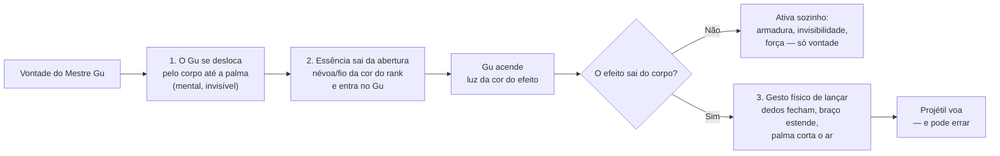

---
tags:
  - gu/alimentacao
  - gu/uso
aliases:
  - Feeding Gu
  - Alimentação de Gu
  - Expendable Gu
status: consolidado
fontes: ["cap. 15", "cap. 23", "cap. 39", "cap. 40", "cap. 57", "cap. 62", "cap. 64", "cap. 79", "cap. 100", "cap. 128", "cap. 137", "cap. 156", "cap. 183", "cap. 186", "cap. 202", "cap. 210", "cap. 375", "cap. 410", "cap. 466", "cap. 671", "cap. 717", "cap. 735", "cap. 860", "cap. 1093", "cap. 1114", "cap. 1128", "cap. 1457", "cap. 1570", "cap. 1600", "cap. 1681", "cap. 2292", "cap. 8", "cap. 10", "cap. 20", "cap. 22", "cap. 44", "cap. 156", "cap. 162", "cap. 297", "cap. 563", "cap. 575", "cap. 854", "cap. 923", "cap. 1791"]
conhecimento: comum
---

# Usar e Alimentar Gu

**Em uma frase:** todo Gu refinado custa duas coisas ao dono — ==essência== para ser
acionado e ==comida== para continuar vivo — e é esse custo contínuo, não uma regra
arbitrária, que limita quantos Gu um Mestre consegue carregar.

Há um dito popular no mundo que resume a coisa melhor que qualquer manual: **criar um Gu é
como sustentar uma amante**.

## Os três ofícios: alimentar, usar, refinar

Antes de qualquer número, vale fixar a arquitetura, porque o mundo a enuncia como doutrina
e o resto desta pasta se organiza em cima dela.

> Um Mestre Gu **refina** Gu, **usa** Gu e, ao mesmo tempo, precisa **criar** Gu.

São três ofícios diferentes, com dificuldades de naturezas diferentes, e ninguém é bom nos
três por acidente:

| Ofício | O que é | Onde a dificuldade mora |
|---|---|---|
| **Refinar** | dominar o bicho e torná-lo seu | o risco de contra-ataque — o Gu pode revidar contra a mente de quem o domina |
| **Usar** | acionar o Gu na hora certa, do jeito certo | **prática**; o mesmo bicho rende categorias diferentes em mãos diferentes |
| **Criar** (alimentar) | manter o bicho vivo | **conhecimento**: cada espécie come uma coisa, e as dietas são estranhíssimas — terra, luz de estrela, lágrimas, o ar dos nove céus |

A obra é explícita ao dizer qual dos três é o mais profundo: **criar**. Refinar é
arriscado, usar exige treino, mas o saber de alimentação é "ainda mais extenso e
profundo", porque é uma zoologia inteira em vez de uma técnica.

### Cada Gu pode ter uma exigência especial — em qualquer um dos três eixos

Esta é a parte que transforma a arquitetura acima numa mecânica de jogo. **Casos especiais
existem nos três ofícios**, e são categoria formal, não curiosidade:

- **No alimentar** — a espécie só come uma coisa, e às vezes essa coisa não é um material.
  Ver a tabela de dietas mais abaixo.
- **No refinar** — o Gu impõe requisitos ao candidato a dono. Um Gu do caminho da sorte só
  se deixa dominar por quem tem, de fato, coração de sacrifício. Outro só aceita quem
  nunca mentiu na vida — e, se um mentiroso tentar, o refino não apenas falha: **o Gu
  morre na hora**.
- **No usar** — a condição recai sobre quem aciona. O Gu que detecta mentiras **só pode ser
  usado por um Mestre que nunca mentiu na vida**; um Gu de justiça exige que quem o aciona
  tenha coração justo. E as condições não são só morais: uma formação imortal registrada só
  funciona nas mãos de uma **raça** específica e mata qualquer outro que entre nela.

Há ainda condições **posicionais**: um Gu de nível 6 ou mais, uma vez consagrado
[[05 - Gu Vital|Gu Vital]], fica preso no centro da abertura e **não pode mais ser retirado
nem manifestado** — funciona como fundação e nunca como arma.

O exemplo que exibe os três eixos ao mesmo tempo é um Gu de nível 4 que detecta mentiras:
ele **come** honestidade, só pode ser **refinado** por quem jamais mentiu, e só pode ser
**usado** por quem jamais mentiu. Três travas empilhadas no mesmo bicho — e é por isso que
ele é raríssimo apesar de não ser especialmente forte. Repare que a exigência é sobre a
vida inteira da pessoa, não sobre o momento: uma única mentira dita anos antes já a
desqualifica para sempre.

> [!note] Para o design
> Requisitos de uso são a forma mais barata de amarrar mecânica a personagem. Um poder que
> só funciona se o personagem nunca mentiu não precisa de nenhuma regra de moral: a regra
> **é** o item. E, como a sanção documentada é a morte do próprio Gu, mentir custa
> patrimônio, não pontos de reputação.

## O gesto: o que exatamente se faz para acionar um Gu

A pergunta é básica e nenhuma regra a responde: o Mestre Gu **pensa, fala, toca, aponta?** A
obra responde numa aula — literalmente uma aula, dada por um ancião a cinquenta e sete
adolescentes num campo de treino, com demonstração. É a passagem canônica sobre o gesto, e ela
divide o acionamento em **três etapas**.

**Etapa 1 — mover o Gu até o ponto de uso. Só com a mente.** O ancião abre a mão direita, os
cinco dedos bem afastados, e vira a palma para os alunos verem. "Primeiro, vocês usam a mente
para mobilizar o Gu, levando-o até o centro da palma." E a marca em forma de lua crescente que
representa o Gu **desce pelo braço dele e chega à palma**. Não há gesto, não há palavra, não há
toque: o bicho anda por dentro do corpo do dono, obedecendo a um pensamento. (Onde ele mora
enquanto isso é assunto de [[04 - Onde um Gu Mora|Onde um Gu Mora]].)

**Etapa 2 — empurrar essência para dentro do Gu. Também só com a mente.** "Depois, vocês
mobilizam a essência primordial da abertura e a despejam dentro do Gu." Um **fio de essência
branco-prateada tão fino que quase não se vê** sai do corpo do ancião e entra no Gu na palma. O
Gu **acende**: brilha cada vez mais forte e, mesmo sendo dia claro, emite uma luz azul-pálida
nítida. A cor da luz é a do efeito; a cor do fio é a do rank de quem o aciona.

**Etapa 3 — lançar. Esta é física.** Para um Gu de projétil, existe um movimento, e ele é
ensinado como um golpe de esgrima: os cinco dedos abertos se fecham lentamente, o braço sobe e
se estende para a frente, e a palma faz um **corte leve no ar**. Firme e sem pressa. *Swoosh* —
e a luz condensada na palma sai voando.

### O que isso implica na mesa

- **Nem todo Gu exige a etapa 3.** Gu defensivos e de reforço se acionam só com a mente: a
  armadura de luz branca cristalina simplesmente aparece sobre o corpo, as ondulações de
  invisibilidade correm pela pele. A etapa física só existe quando o efeito **sai do corpo** e
  precisa de direção.
- **Falar não é obrigatório.** A obra mostra as duas coisas: Mestres Gu que acionam em silêncio
  ("com um pensamento") e Mestres Gu que dizem o nome do Gu em voz alta antes de agir. O segundo
  é hábito, ênfase ou teatro — nunca requisito.
- **Mirar é perícia, e erra-se muito.** Aqui está o detalhe mais jogável de toda a nota. Depois
  de cinco minutos de prática, a turma de adolescentes já conseguia **produzir** lâminas de luar
  — mas quase nenhuma acertava o boneco. Umas se apagavam no meio do caminho, outras colidiam
  entre si, outras saíram voando para fora do campo. O aluno que acertou o pescoço de um boneco
  virou notícia, e nem ele sabia se a lâmina era dele. A doutrina que o ancião enuncia é
  "praticar até acertar" — e a observação amarga que ele faz em seguida é que **quem tem aptidão
  alta treina mais vezes por dia**, porque tem mais essência para gastar errando. O talento não
  melhora a mira: compra repetições.
- **O Gu precisa estar visível?** Não. Muitos são acionados de dentro do corpo ou de dentro da
  abertura, sem nunca aparecer. Quando é preciso trazer o bicho para fora, o gesto informal e
  repetido na obra é **dar um tapinha na própria barriga** — a abertura fica três polegadas
  abaixo do umbigo — e o Gu sai voando dali como um risco de luz. Sem tapinha também funciona:
  basta querer.
- **O que a plateia vê.** Uma névoa ou um fio colorido saindo do corpo, um brilho na palma ou na
  pele, e o efeito. E ouve: a obra registra o *swoosh* passando junto ao ouvido dos alunos.

> O diagrama acima é **leitura nossa** da cena de aula descrita pela obra; a obra não apresenta
> nenhum fluxograma de acionamento.

### Quanto tempo leva, e o que se gasta além de essência

**Acionar é instantâneo.** A obra usa sempre a mesma palavra — *na hora*, *num piscar* — e, o que
vale mais, ela **enuncia o contraste**: as [[09 - Formações de Gu|formações de Gu]] são
consideradas inferiores aos [[08 - Killer Moves|golpes combinados]] justamente porque **não podem
ser acionadas instantaneamente** — levam muito tempo para montar e não servem numa troca rápida.
Se o texto precisa dizer que a formação é a exceção lenta, é porque o acionamento normal de um Gu
não custa tempo nenhum.

**O que ele custa é atenção — e essa é a moeda escondida do sistema de combate.** No instante em
que alguém aciona um golpe combinado, **a atenção inteira dele vai para os Gu que compõem o
golpe**. A obra registra isso ao explicar por que uma cultivadora correu risco ao encadear dois
golpes seguidos: um Mestre Gu comum, obrigado a desviar a atenção naquele momento, **perderia o
controle do que estava fazendo** e estragaria o trabalho. Dividir a atenção entre duas tarefas
mágicas não é gratuito: é perícia. Existe quem consiga — a obra descreve um cultivador
**"dividindo a mente em três"** para conduzir um Gu, mobilizar a essência e injetá-la num
terceiro Gu ao mesmo tempo —, e o fato de a cena ser digna de nota já diz que não é o padrão.

Três consequências práticas caem daí, e as três aparecem na obra:

- **Recarregar essência no meio da luta é quase suicídio**, porque exige atenção que está sendo
  usada para não morrer (ver [[04 - Essência Primordial|Essência Primordial]]).
- **Controlar muitos Gu de uma vez é caro sem ser lento.** Um Mestre Gu soltou mais de oitocentos
  Gu da abertura numa sequência, e o único custo registrado foi a atenção necessária para
  dirigi-los.
- **Interromper a atenção de um inimigo é um ataque.** Não é preciso furar a defesa dele: basta
  obrigá-lo a olhar para outro lado no momento errado.

> [!note] Para o design
> Isto resolve, de graça, a pergunta "acionar um Gu gasta a ação do turno?". A resposta fiel à
> obra é **não** — o custo não é tempo, é **foco**. Um sistema que traduza isso dá algo mais
> interessante que uma economia de ações: cada personagem tem um número pequeno de "linhas de
> atenção" (uma, normalmente; duas ou três para quem treinou), e tudo que exige concentração —
> um golpe combinado, um refino em andamento, recarregar, manter uma ilusão — ocupa uma. Aí
> distrair vira ataque, e "dividir a mente" vira uma das melhorias mais cobiçadas da ficha.

## O custo de acionar: essência

Acionar um Gu consome [[04 - Essência Primordial|Essência Primordial]], a energia interna que um Mestre Gu armazena na
própria abertura e regenera com o tempo. É o equivalente mais próximo de "mana" no sistema,
com três diferenças importantes:

1. **A quantidade que você tem é função do seu nível de cultivo**, e cresce em saltos
   brutais a cada nível — não de forma linear.
2. **A regeneração é lenta e depende de aptidão.** Um cultivador de talento medíocre demora
   dias para recompor o que gastou numa luta de minutos.
3. **Alguns Gu não gastam essência, e sim outra coisa.** No nível imortal isso se torna
   comum: há Gu que cobram em **tempo de vida**, em **energia mental**, na **fundação da
   alma** do usuário, ou até nas próprias marcas do Dao gravadas no bicho — este último
   caso causando um rebaixamento **permanente** de nível a cada tantos usos. Ver
   [[16 - Gu Imortais|Gu Imortais]].

### Gu reutilizáveis e Gu consumíveis

O mundo distingue formalmente duas classes:

- **Gu reutilizáveis** — acionáveis indefinidamente, dentro de limites de recarga. Mesmo
  estes se **desgastam** com o tempo: um Gu não-consumível acionado milhares de vezes ao
  longo de séculos vai perdendo qualidade.
- **Gu consumíveis** (*expendable*) — dissipam-se após um, dois ou três usos. É uma
  categoria formal, não uma exceção, e ela existe até no nível 6 e acima. São, na prática,
  a munição do sistema: baratos por unidade, caros em volume, e a razão pela qual campanhas
  militares esvaziam tesouros.

### Distância enfraquece o vínculo

O controle de um Gu não é infinito no espaço. Quanto mais longe o dono, mais fraca a
conexão e mais os comandos falham. Alguns Gu raros mantêm conexão a qualquer distância; e
existem uns pouquíssimos com escala **invertida**, que funcionam melhor quanto mais longe
estão — anomalias valiosíssimas.

## O custo de manter: comida

Aqui está a parte do sistema que mais rende em mesa, porque transforma poder mágico em
logística.

> [!warning] Esta nota é a regra geral da alimentação; o catálogo é o fichário
> Duas partes do vault falam de dieta de Gu e elas não competem — têm funções diferentes.
> **Esta nota é a fonte das regras e dos números gerais**: como a dieta escala com o nível,
> o que acontece na fome, quanto custa por mês, quantos Gu se sustenta.
> O [[03 - Catálogo de Gu|Catálogo de Gu]] é o **banco de fichas**: o que *aquele* bicho específico come.
> Se um dado do catálogo divergir de uma regra daqui, é aqui que vale — a menos que o
> catálogo esteja registrando uma exceção declarada pela obra, que é justamente o tipo de
> coisa que um catálogo existe para guardar.

**Todo Gu refinado tem uma dieta específica.** Não "energia" genérica: comida concreta,
que precisa ser comprada, colhida, transportada e estocada.

### Alimentar, na prática: o gesto e o ritmo

A dieta é a regra; isto é a cena. Alimentar um Gu **não é mental** — é dar comida a um bicho,
com as mãos, e a obra mostra o gesto duas vezes.

**Chama-se o Gu para fora e põe-se a comida junto dele.** Um verme do licor sai da abertura do
dono "virando um risco de luz branca", desenha um arco no ar e cai **com um *ploc* dentro da
taça de vinho**. Um Gu de luar recebe suas pétalas na palma da mão. Não há ritual, não há
fórmula, não há preparo: é pôr o bicho em contato com o alimento e esperar.

**O ritmo é doméstico, não tático.** O Gu de luar come **duas refeições por dia — uma de manhã,
uma à noite —, duas pétalas em cada uma**. O verme do licor bebe de um jarro que dura quatro
dias e que fica guardado embaixo da cama. As pétalas são compradas numa loja ao lado da academia
do clã, dez por uma pedra primordial, entregues num **saquinho de papel**, e **murcham em poucos
dias** — o que impede estoque grande e obriga a compra recorrente. Uma folha de "grama íntima"
misturada à ração faz o bicho se dar por satisfeito com metade.

**Dá para alimentar em combate?** A obra **nunca mostra** ninguém alimentando um Gu no meio de
uma luta, e nunca proíbe explicitamente. O que ela mostra sempre é o contrário: alimentação é
rotina de casa, em horário fixo, e o que se faz em pausa tática é **recarregar essência com
pedras primordiais**, não dar comida. A leitura prática — e é leitura nossa, não regra declarada
— é tratar alimentação como atividade de tempo livre e recarga como atividade de pausa.

**Quanto tempo leva uma refeição?** A obra não informa. Não há uma única passagem que cronometre
o ato de comer de um Gu comum. (No patamar imortal existe um número isolado e enorme: um Gu
Imortal que se sacia depois de **oito dias e oito noites** submerso na água de que se alimenta —
mas isso é a exceção do topo, não a régua.) Se a mesa precisar de um tempo para o dia a dia, é
campo livre.

### Exemplos de dietas documentadas

| Gu | Come | Ritmo aproximado |
|---|---|---|
| Gu de luar | pétalas de uma orquídea específica | duas refeições por dia, duas pétalas cada |
| Verme do licor | vinho | um jarro dura cerca de quatro dias; vinho ruim exige doses muito maiores |
| Gu de pele de jade | pedra de jade | uma porção pequena a cada dez dias |
| Gu de javali | carne de porco | cerca de um porco adulto a cada cinco dias |
| Sapo de pele de lama | terra amarela — quanto mais fértil, melhor | meio quilo por refeição |
| Gu de foto e áudio | luz e som | absorção passiva do ambiente, custo zero |
| Grama da vitalidade | água e luz do sol | custo baixíssimo |
| Cavalheiro de bambu | **honestidade** (abstrato) | só pode ser refinado por quem nunca mentiu |
| Cigarra da primavera e do outono | **o próprio tempo** | recurso que nenhum dinheiro compra |

As duas últimas linhas não são piada: dietas abstratas existem e são exatamente o tipo de
detalhe que define um Gu lendário. Um bicho que come honestidade impõe uma condição moral
ao próprio dono.

### As regras gerais da alimentação

- **Nível maior = refeição mais cara, intervalo mais longo.** É a curva-mestra. Um Gu de
  nível 1 ou 2 come a cada poucos dias; um de nível 4, a cada poucos meses; um de nível 5,
  **a cada um ou dois anos** — mas essa refeição bienal custa uma fortuna.
- **A fusão muda a dieta.** Ao subir de nível, um Gu passa a comer mais por vez e menos
  vezes. Escolher a rota de fusão certa pode **libertar o dono de um insumo raro** — há
  linhagens em que o Gu passa a comer sangue de qualquer criatura em vez de uma flor
  específica, ao custo de sangrar alguns dias por mês com poder reduzido a um terço.
- **Suplementos existem.** Certas ervas misturadas ao alimento principal chegam a dobrar a
  eficiência de saciedade.
- **Hibernação corta o custo.** Gu comuns em hibernação induzida, em ambiente preparado,
  **dispensam comida** por completo. Gu Imortais em hibernação comem metade.

### O que acontece quando um Gu passa fome

Três desfechos, em ordem de gravidade:

1. **Desnutrição prolongada → regressão de nível.** O Gu não morre, mas encolhe em poder,
   perdendo níveis ao longo de anos ou séculos. Notavelmente, ele pode **manter a vontade
   do nível que já teve** — é assim que aparecem Gu aparentemente fracos, mas com uma
   teimosia interna desproporcional, extremamente difíceis de refinar.
2. **Fome extrema → morte.** O desfecho mais comum. Um Gu morto é perda total; se for o
   [[05 - Gu Vital|Gu Vital]] do Mestre, é catástrofe pessoal.
3. **Fome extrema → auto-selamento (raro).** Em vez de morrer, alguns Gu hibernam dentro de
   uma casca de rocha ou de um casulo, ficando indistinguíveis de uma pedra ou de um bolo de
   fibra. Sobrevivem séculos assim, e são indetectáveis pela maioria dos métodos. É a base
   de uma indústria inteira de escavação e aposta, e a razão pela qual pedras aparentemente
   sem valor são vendidas em leilão. Um Gu selado dentro de rocha imortal chegou a
   atravessar um milhão de anos — e emergiu no limite absoluto da fome.

### Alimentação indireta e truques

Alguns Gu não comem diretamente. Um deles produz, uma vez por mês, formigas comuns que
consomem os materiais e depois o alimentam — o que cria uma vulnerabilidade elegante:
**matar formigas demais mata o Gu de fome mesmo com fartura ao redor**.

No nível imortal há um caminho inteiro dedicado ao problema — o [[20 - Food Path|Food Path]] —, com Gu que
substituem parte da alimentação de outros Gu. Um deles cobre até 40% da necessidade de um Gu
Imortal de nível 6, cerca de 6% por uso, e precisa se recuperar entre acionamentos: **usá-lo
além do limite mata o próprio Gu**.

## O teto: quantos Gu se carrega

Há **dois** tetos, e eles são independentes. O primeiro é econômico — o assunto desta
seção. O segundo é físico: a abertura tem capacidade finita e um Gu de nível muito
superior chega a ameaçar rompê-la, de modo que é perfeitamente possível ter dinheiro
sobrando e ainda assim não conseguir levar mais um bicho. Esse segundo teto está em
[[04 - Onde um Gu Mora|Onde um Gu Mora]]; aqui trata-se do primeiro.

> [!warning] Esta é a tabela de referência do vault para "quantos Gu"
> O número de Gu que um Mestre sustenta aparece citado em várias notas, e por muito tempo
> apareceu com valores diferentes em cada uma ("quatro ou cinco", "cinco ou seis"). **Esta
> tabela é a fonte;** as outras notas remetem a ela em vez de repetir um número. Se você
> encontrar outro valor solto por aí, é resíduo antigo — vale este.

**O número que a obra enuncia diretamente é este:** um Mestre Gu comum tem **três a cinco
Gu**. A frase é dita de forma genérica, sem amarrar a nenhum nível, e o narrador a usa
justamente para explicar que quem foge dela é exceção — o exemplo citado de exceção
carrega **sete**, e ainda estava no começo da carreira. Ou seja: três a cinco é o normal
de quase todo mundo, a vida inteira; sete é o que faz um adversário competente parar e
reavaliar.

| Perfil | Quantidade típica de Gu | Custo mensal aproximado em [[02 - Pedras Primordiais\|pedras primordiais]] |
|---|---|---|
| Primeiros meses de carreira (nível 1) | **2 a 3** | cerca de **30 a 60** |
| **Mestre comum, qualquer patamar mortal** | **3 a 5** — o número canônico | de dezenas a centenas, conforme o nível dos bichos |
| Mestre de nível 4 a 5 | **4 a 5** | ordens de grandeza acima — a refeição rareia, mas cada uma custa uma fortuna |
| Caso excepcional (riqueza, sorte ou renda própria) | **7 ou mais** | inviável sem território produtivo próprio; o narrador trata como anomalia |

A coluna de custo sai de duas âncoras da obra. A primeira: **um Gu comum de nível 2 custa
cerca de uma a duas pedras primordiais por dia** para manter. A segunda é uma conta
completa, feita dentro da própria obra por um cultivador de nível 1 com dois Gu:

- Gu de luar: quatro pétalas por dia; dez pétalas custam uma pedra → **0,4 pedra/dia**.
- Verme do licor: um jarro de vinho bom custa duas pedras e dura quatro dias →
  **0,5 pedra/dia**.
- Total: **quase uma pedra primordial por dia para dois Gu de nível 1**.

**O que aparece como faixa e como conta é da obra; a multiplicação por trinta é nossa.**

> [!example] A comparação que dá a escala real
> A obra põe o número ao lado do custo de vida do mundo comum, e o contraste é a coisa
> mais eloquente do sistema inteiro: **as despesas mensais de uma família mortal de três
> pessoas somam uma pedra primordial**. Um Mestre Gu iniciante, com dois bichos, gasta
> **por dia** o que uma família inteira gasta **por mês** — trinta vezes mais, e isso
> antes de comprar qualquer Gu novo, pagar qualquer refino ou acionar coisa alguma. Não é
> uma profissão cara: é uma profissão de outra classe econômica.

O que impõe o teto econômico é a soma de dois custos: **alimentar** todos os dias e
**acionar** todos em combate. Um cultivador que não consegue pagar a ração de sete Gu não
pode carregar sete Gu, por mais talentoso que seja.

### A conta que obriga a formar grupo

A consequência estrutural, já mencionada em [[02 - O que é um Gu|O que é um Gu]], é que **Mestres Gu operam em
grupos** — e agora dá para fazer a conta com os números certos, porque ela decide o tamanho
recomendado de um grupo de jogadores.

A doutrina de sobrevivência exige **seis funções** cobertas: ataque, defesa, cura,
armazenamento, reconhecimento e movimento. Confronte com a tabela acima:

| Faixa de campanha | Slots por personagem | Grupo mínimo para cobrir as 6 funções |
|---|---|---|
| Primeiros meses (nível 1) | 2 a 3 | **2 a 3 pessoas** |
| Mestre comum (o caso normal, ranks 2–5) | 3 a 5 | **2 pessoas** — e a segunda cobre as lacunas da primeira |
| Caso excepcional, com sete ou mais | 7 | **1 pessoa** já se vira sozinha, e é exatamente por isso que quem consegue chegar lá age sozinho |

Repare no que a tabela diz sobre o tom do jogo: a interdependência é **máxima no começo** e
se dissolve conforme os personagens enriquecem. Um grupo de iniciantes é obrigado a ser um
grupo; o lobo solitário viável não é o mais forte, é o **mais rico** — porque o teto é de
sustento, não de talento. Se a mesa quiser manter a coesão do grupo em níveis altos, o
motivo terá de ser político, não logístico.

> [!example] Caso mecânico
> O depósito de Gu de uma academia de clã consome mais de mil pedras primordiais **por dia**
> apenas em alimentação do estoque. A moeda-base do mundo mortal é a pedra primordial, e um Gu
> comum de nível 2 custa cerca de uma a duas pedras por dia para manter. Alimentar um
> arsenal é, portanto, um item de orçamento institucional comparável ao soldo de um
> exército — e explica por que clãs cobram pesado dos membros e por que perder um pomar
> específico pode paralisar toda a linhagem de Gu de assinatura de um clã.

### No nível imortal, o problema piora

Para um Gu Imortal, alimentação deixa de ser despesa e vira **projeto de engenharia**:

- Alimentar um Gu de nível 8 é descrito como "um projeto enorme". Um único deles chegou a
  exigir a construção de **um pântano inteiro** só para sustentá-lo.
- **Comprar comida no mercado é insustentável.** Manter um Gu Imortal de nível 7 comprando
  ração é caro demais a longo prazo. O modelo viável é possuir um **ponto de recurso
  próprio** — uma terra que produza o insumo continuamente. É esta a base econômica de toda
  a expansão territorial dos imortais.
- **Gu Imortais que hibernam** costumam ser cedidos ao tesouro coletivo do clã — em parte
  por eficiência, em parte porque **alguém precisa alimentá-los enquanto o dono dorme**. Por
  isso veteranos recém-acordados são poderosíssimos e, ao mesmo tempo, mal equipados.
- **O nível 9 inverte a curva.** Quanto mais alto o nível, mais rara a refeição — a
  dificuldade deixa de ser frequência e passa a ser **raridade do alimento**. Um Gu de nível
  9 registrado come um campo inteiro de um material lendário, o que obriga o dono a cultivar
  uma "fazenda" de longo prazo dentro do próprio território para a próxima refeição.
- **O alimento não guarda relação necessária com o tema.** Um Gu do caminho da sorte se
  alimenta de fezes de seis espécies específicas de cão selvagem. A dieta é uma
  característica da espécie, não uma metáfora do poder.

> [!note] Para o design
> Este é o eixo mais imediatamente jogável de todo o sistema, e o mais fácil de subestimar.
>
> **Manutenção como pressão de campanha.** Se cada capacidade mágica exige um insumo
> concreto, então o mapa vira uma rede de fornecimento. Bloquear uma estrada, queimar um
> pomar, monopolizar uma mina — tudo isso vira ataque mágico sem envolver combate. Um cerco
> derrota um mago não por dano, mas por fome dos bichos dele.
>
> **Slots com custo diferenciado.** Em vez de "você tem N magias", diga "você tem tantas
> magias quantas conseguir alimentar". Isso transforma cada aquisição numa decisão
> orçamentária e torna riqueza mecanicamente equivalente a poder, o que é exatamente como o
> mundo funciona.
>
> **Dietas abstratas como ganchos de personagem.** Um Gu que come honestidade só serve a
> quem nunca mentiu. Um Gu que come tempo só serve a quem tem acesso ao tempo. Amarrar um
> poder a uma condição moral ou narrativa dá caracterização de graça.
>
> **Fome como relógio.** Um Gu faminto regride antes de morrer. Isso dá ao mestre um
> temporizador visível e negociável — o poder do grupo decai em degraus enquanto o problema
> logístico não é resolvido, em vez de sumir de uma vez.

## Relações

- [[02 - O que é um Gu|O que é um Gu]] — a natureza da criatura que come.
- [[06 - Refino de Gu|Refino de Gu]] — o processo que cria a dependência alimentar.
- [[07 - Fusão de Gu|Fusão de Gu]] — como a dieta muda quando o Gu evolui.
- [[16 - Gu Imortais|Gu Imortais]] — a alimentação como gargalo do topo do sistema.
- [[20 - Food Path|Food Path]] — o caminho dedicado a resolver este problema.
- [[04 - Essência Primordial|Essência Primordial]] — a energia gasta em cada acionamento.
- [[04 - Onde um Gu Mora|Onde um Gu Mora]] — o segundo teto, o físico: quanto cabe na abertura.
- [[13 - Qualidade e Fraude|Qualidade e Fraude]] — por que um Gu de consumo baixo vale mais que um Gu potente.
