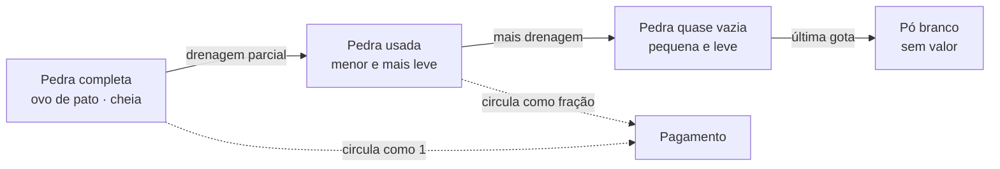

---
tags:
  - economia
  - economia/moeda
aliases:
  - Pedras Primevas
  - Primeval Stones
  - Pedras Primordiais
status: consolidado
fontes: ["cap. 4", "cap. 5", "cap. 8", "cap. 10", "cap. 11", "cap. 12", "cap. 17-18", "cap. 23", "cap. 28-29", "cap. 34", "cap. 39-45", "cap. 43", "cap. 50", "cap. 53", "cap. 64", "cap. 111-113", "cap. 126", "cap. 132-133", "cap. 156", "cap. 158", "cap. 161-163", "cap. 182", "cap. 197", "cap. 241", "cap. 259-263", "cap. 271", "cap. 277-282", "cap. 292-296", "cap. 302-309", "cap. 320", "cap. 330", "cap. 421", "cap. 422", "cap. 424", "cap. 427-428", "cap. 441", "cap. 448-450", "cap. 466", "cap. 477-481", "cap. 501", "cap. 517", "cap. 554-558", "cap. 1155", "cap. 1973", "cap. 2297"]
conhecimento: misto — a nota inteira é `comum` (material de manual do jogador), exceto o aviso "Só para o mestre: o que mais existe dentro da pedra", que é `segredo`
---

# Pedras Primordiais

**Em uma frase:** a ==pedra primordial== é uma pedra do tamanho de um ovo de pato que serve
ao mesmo tempo como dinheiro e como combustível mágico — e é essa coincidência que
organiza toda a economia e boa parte da política do mundo.[^1]

## Como funciona

Um Mestre Gu opera com uma reserva de energia interna chamada **essência primordial**, que
gasta ao usar seus Gu e ao cultivar. Essa reserva se recupera sozinha, mas devagar. A pedra
primordial é a solução: ela **contém essência primordial em forma sólida** e pode ser drenada
diretamente para dentro do corpo.

Ao mesmo tempo, ela é a moeda universal do mundo mortal. Compra-se pão, hospedagem, Gu,
informação e vidas com pedras primordiais.

Essas duas funções não são separadas nem convertíveis uma na outra: **é literalmente o
mesmo objeto**. Quando um Mestre Gu paga uma conta, está entregando o combustível com que
ficaria mais forte. Quando ele acelera o próprio cultivo, está queimando dinheiro. Toda
decisão econômica do mundo é, por construção, uma decisão de progressão.

Detalhe físico útil para descrever em mesa: a pedra **encolhe visivelmente** conforme é
drenada. Não existe carteira cheia disfarçando pobreza — dá para estimar a riqueza de
alguém olhando as pedras dele. A descrição completa do objeto — tamanho, cor, peso, como se
faz troco, como se confere, como se consome — está na seção **A pedra na mão**, logo abaixo.

Um comentário que a própria obra faz, e que economiza uma página de explicação para a
designer: a pedra primordial é descrita **explicitamente como o padrão-ouro deste mundo**,
com a diferença de que o poder de compra dela é muito maior que o do ouro terrestre — e de
que, ao contrário do ouro, ela se **gasta**.

> [!note] Para o design
> Se você adotar uma única coisa deste cenário, adote esta. Unir moeda e recurso de
> progressão num só item cria um dilema permanente — "gasto para viver ou gasto para
> subir?" — que não exige nenhuma regra adicional, não precisa de contabilidade extra, e
> transforma cada recompensa em dinheiro numa decisão interessante em vez de um número.

## A pedra na mão

Esta é a seção que responde "mas como é a coisa, fisicamente?". Tudo aqui vem de cenas
descritas na obra, exceto o que estiver marcado.

> [!info] Convenção de confiabilidade desta seção
> Texto sem marca = **a obra afirma**. `(ded.)` = **dedução nossa** a partir de algo que a
> obra afirma. `*` = **invenção nossa**, sem base no texto. Onde a obra simplesmente não
> informa, está escrito que ela não informa — e isso é um convite: ali a designer pode
> desenhar como quiser. **Apagar tudo marcado com `*` devolve esta seção a cem por cento
> canônico.**

### Tamanho, forma e cor

Uma pedra primordial **completa** — isto é, cheia, nunca usada — tem o **tamanho de um ovo
de pata** e o **formato elipsoide**. É, literalmente, um ovo de pedra.

Duas descrições do texto, que se completam: ela é **cinza translúcida** e ela é
**cinza-esbranquiçada**. Não é opaca como um seixo de rio nem transparente como vidro; é o
cinza leitoso de um quartzo fosco, com alguma luz atravessando.

O detalhe mais importante para um sistema de jogo vem em seguida: as pedras que saem de uma
mesma nascente têm **volumes iguais entre si**. Não é minério bruto de tamanho variado — é
uma unidade padronizada que a natureza produz já pronta para servir de moeda. Ninguém
precisa cunhar, pesar em balança ou certificar nada.

**A obra não informa** se a pedra brilha, se é quente ou fria ao toque, nem qual é a textura
da superfície. Procuramos: não há passagem alguma sobre isso. É espaço livre para a
designer preencher como preferir.

### Na mão, no bolso, na bolsa

| Quantidade | Como aparece em cena |
|---|---|
| 1 pedra | pinçada entre o polegar e o indicador; ou fechada dentro do punho, que é a posição de consumo |
| 3 ou 4 | seguradas juntas na palma da mão aberta |
| 5 ou 6 | levadas soltas "no seio da veste" — o bolso do peito do roupão, apalpado por fora para conferir |
| ~100 | **uma bolsa de dinheiro cheia até a boca**. É a unidade de embalagem do mundo: pagamentos grandes são entregues como "cinco bolsas de cem" |
| 300 | uma bolsa que se segura **com as duas mãos** |
| milhares | várias bolsas trazidas por um mordomo, ou **caixas** carregadas uma por servo |
| dezenas de milhares | só com Gu de armazenamento, ou com animal de carga (existe um cavalo de estômago grande usado exatamente como substituto de Gu de armazenamento por quem não tem um) |

E a frase que fecha o assunto, dita dentro da obra por alguém decidindo o que levar numa
viagem: as pedras primordiais **"são pesadas e um estorvo de carregar"**. Dinheiro tem
volume e tem peso neste mundo, e isso é uma restrição real de personagem, não cor local.

> [!note] Para o design
> Esse limite físico é o que dá função ao Gu de armazenamento e o que torna um assalto
> possível. Se o dinheiro fosse abstrato, roubar seria impossível e transportar seria
> grátis. Aqui, **mover uma fortuna é uma operação logística** — e portanto uma cena.

### Quanto pesa e quanto ocupa

A obra nunca dá gramas nem litros. Mas dá o tamanho (ovo de pato) e o comportamento
(pesadas, cem por bolsa), e daí sai uma tabela utilizável. **Os números das duas colunas da
direita são aritmética nossa** — trate-os como sugestão calibrada, não como cânone.

| Ordem de grandeza | Peso `*` | Volume `*` | Como se move |
|---|---|---|---|
| 1 pedra | ~120 g | ~70 cm³ | na mão |
| 10 pedras | ~1,2 kg | menos de um litro | no bolso do peito |
| 100 pedras | ~12 kg | ~7 litros | uma bolsa cheia, pesada mas carregável num ombro |
| 1.000 pedras | ~120 kg | ~70 litros | dez bolsas: dois carregadores, ou um Gu de armazenamento |
| 10.000 pedras | ~1,2 tonelada | ~700 litros | **uma carroça inteira** |
| 100.000 pedras | ~12 toneladas | ~7 m³ | inviável sem Gu de armazenamento |

`*` A conta parte de um ovo de pato (cerca de 70 cm³) preenchido por um mineral translúcido
de densidade média. Se a sua mesa preferir pedras mais leves, divida tudo por dois — o que
importa é a ordem de grandeza e a conclusão que ela impõe.

E a conclusão é forte: **dez mil pedras primordiais são uma carroça**. É por isso que os Gu
de armazenamento não são conveniência, são infraestrutura financeira. O Gu de armazenamento
comum de rank 3 guarda 30.000 pedras — três carroças no bolso. O Gu especializado em
dinheiro guarda um milhão.

> [!note] Para o design
> Aqui está um limite de campanha que se explica sozinho: **um personagem sem Gu de
> armazenamento não pode ser rico**. Ele pode ganhar muito, mas não pode *guardar* muito nem
> *viajar* com muito. Comprar o primeiro Gu de armazenamento é, mecanicamente, o momento em
> que um aventureiro deixa de ser um andarilho e vira um agente econômico. É um marco de
> progressão melhor do que qualquer nível.

### Como ela encolhe, e por que isso é o sistema monetário inteiro

Este é o traço que muda tudo, e vale ler devagar.

A pedra **não é uma ficha que se entrega**: é um **recipiente que se esvazia**. Conforme a
essência natural dentro dela é drenada, **o tamanho diminui e o peso diminui junto**. Uma
pedra da qual se extraiu metade da essência é descrita como "um círculo inteiro menor" e
"menor pela metade" que uma pedra normal. Quando a última gota é retirada, o que sobra na
mão é **um punhado de pó branco**, que se joga fora.

*O diagrama acima é leitura nossa: a obra descreve os quatro estados em cenas separadas e
nunca os desenha como uma sequência.*

Três consequências que a designer vai querer usar:

1. **Não existe carteira cheia disfarçando pobreza.** O saldo de uma pessoa é visível no
   tamanho das pedras dela. Há uma cena em que alguém abre uma bolsa recebida, vê que uma
   das seis pedras está pela metade, e deduz na hora o que o dono andou fazendo — que ele
   gastou essência acelerando um refino. **Dinheiro usado é dinheiro que conta a sua
   história.** Nenhum outro cenário de fantasia tem isso.
2. **A moeda tem prazo de validade unidirecional.** Ninguém "recarrega" uma pedra: a única
   coisa que produz pedras é uma nascente espiritual. Toda pedra do mundo está numa viagem
   de mão única do ovo cheio até o pó — e a economia inteira depende de as nascentes
   reporem o estoque mais depressa do que os cultivadores o queimam.
3. **É por isso que dá para fazer troco.** Ver a seção seguinte.

### Como se faz troco num mundo sem moeda menor

Não existe moeda menor que a pedra primordial. Não há cobre, prata, centavo nem
fracionária: a pedra é a unidade e ponto final. E, no entanto, o mundo cobra **meia
pedra** por várias coisas — meia pedra por uma noite de hospedagem, meia pedra por um javali
inteiro, meia pedra de aumento mensal para um chefe de guarda de vila, dois e meia por um
serviço, cinco e meia por uma conta de taberna.

A obra mostra **três** soluções, e todas funcionam em mesa:

**1. A pedra parcialmente drenada circula como fração.** Como uma pedra pela metade é
visivelmente menor e mensuravelmente mais leve, ela vale menos e todo mundo sabe disso. Não
se quebra a pedra; **gasta-se** parte dela. `(ded.)` — a obra afirma cada peça
separadamente (que preços em meia pedra existem, que pedras meio-drenadas circulam de mão em
mão, que elas são menores e mais leves, e que comerciantes verificam pelo peso); a costura
das três é nossa, mas é a única leitura que faz o sistema fechar.

**2. Dá-se troco.** Há cena de um hóspede entregando duas pedras cheias e dizendo
literalmente ao estalajadeiro: *"me devolva o que sobrar"*. Portanto o comerciante mantém um
caixa de pedras parciais e devolve o excedente nelas.

**3. Fia-se, e acerta-se no fim do mês.** A solução mais elegante e a mais usada: o cliente
paga a mais, o comerciante anota o crédito, e quando o saldo acumulado chega a **uma pedra
inteira**, abate-se da conta. A fala é do texto: *"não precisa me dar o troco, deixe aqui;
no fim do mês, quando der uma pedra, você desconta da minha conta."* Uma vila inteira roda
assim, em conta corrente informal, e é isso que dispensa a moeda fracionária.

> [!note] Para o design
> Se a sua mesa quer uma economia sem contabilidade de trocados, adote a regra 3 e pronto:
> **compras pequenas viram conta em aberto, e a conta se fecha quando chega a uma unidade
> inteira.** Some-se a isso que a moeda encolhe com o uso, e você tem um sistema monetário
> com personalidade própria que cabe em dois parágrafos de manual.

### Como se verifica se uma pedra é boa

O teste é o **peso na mão**, e a obra mostra o gesto: um taberneiro recebe as pedras no
balcão, varre-as para a palma, **balança a mão para cima e para baixo** sentindo o peso, e
só então sorri e serve. Não há balança, não há toque de pedra-de-toque, não há mordida: o
comerciante experiente pesa a olho e sente se aquilo é pedra cheia ou pedra já chupada.

Faz sentido, dado o resto do sistema: como o peso é proporcional à essência que resta
dentro, **pesar é literalmente medir o valor**. `(ded.)` a obra descreve o gesto e descreve a
relação peso-essência, mas não junta as duas coisas numa frase.

A segunda verificação é a **contagem**, e ela é feita mesmo entre pessoas que confiam uma na
outra. Quem recebe uma bolsa abre, conta e confere — há cena de alguém contando trinta
pedras uma a uma, "nem uma a menos", antes de guardar. A fórmula social de entrega é
"estas são as pedras, **por favor confira**", dita pelo próprio pagador. Conferir não é
ofensa; é etiqueta.

**Falsificação de pedra primordial: a obra não registra nenhum caso.** Isso é notável, e
vale dizer à designer o que a obra registra no lugar: falsifica-se **Gu** (há um caso de
alguém vender um verme comum como se fosse um Gu valioso) e falsificam-se **fósseis de
aposta** (uma onda de falsificação em massa derrubou o preço de uma categoria inteira numa
região). Mas ninguém falsifica dinheiro. `(ded.)` a razão provável é que a pedra é
verificável em um segundo e por qualquer pessoa — basta pesá-la na mão, e uma imitação sem
essência dentro não passaria no teste que o taberneiro faz de graça, de olhos fechados,
cinquenta vezes por dia.

### O gesto de consumir

Gastar uma pedra como combustível é uma cena, e a obra a descreve mais de uma vez:

O cultivador **senta-se de pernas cruzadas**, toma uma pedra completa da bolsa e **fecha o
punho direito em volta dela**. Fecha os olhos. A essência natural atravessa da pedra para o
corpo e o nível da reserva interna **sobe a olho nu, continuamente**. Quando termina, ele
abre a mão e **espalha no chão um punhado de pó branco** — e, se ficou muito tempo assim,
percebe que **as duas pernas estão dormentes**.

Quatro regras práticas saem dessa cena:

- **Consumir exige concentração.** Um Mestre Gu comum **não consegue** absorver pedras
  enquanto luta: absorver ocupa parte da mente, e dividir a mente em combate é uma perícia
  rara que exige "vontade muito forte, paciência e anos de experiência". Quem consegue fazer
  as duas coisas ao mesmo tempo tem o controle dos próprios Gu **reduzido** durante o
  período. Este é provavelmente o dado mais jogável desta nota inteira.
- **Leva tempo, e o tempo é longo.** A obra mede o consumo em dias e em dezenas de pedras —
  "dois dias e duas noites, descansando duas horas por dia, doze pedras gastas". Uma sessão
  de recarga é uma cena de reclusão, não uma ação de turno.
- **Existe alternativa exótica.** Um cultivador de rank altíssimo é descrito **mastigando e
  triturando** pedras primordiais aos montes em vez de absorvê-las com a mão; e há uma
  entidade de pedra que **mói pedras primordiais entre os dentes** até virar pó. A boca
  funciona; a mão é só o método padrão.
- **A pedra também alimenta Gu e refinos.** No refino, o cultivador **atira as pedras uma a
  uma dentro da esfera de luz** do processo, como quem alimenta uma fornalha. E certos Gu
  raríssimos comem pedras primordiais diretamente.

> [!note] Para o design
> "Você não pode recarregar durante o combate" é a única regra que este cenário precisa para
> tornar a gestão de recursos tensa. O dinheiro-combustível só entra no corpo quando o
> personagem está **sentado, imóvel e vulnerável**, por horas. Toda a tática do mundo — a
> emboscada, a fuga, a guerra de desgaste, o valor de um esconderijo seguro — decorre disso.

### De onde a pedra sai, fisicamente

A nascente espiritual não é uma mina: é uma **fonte de água**, quase sempre no fundo de uma
**caverna subterrânea**. A energia em volta dela é tão densa que se sente como **pressão
física** sobre o corpo de quem entra. A água gira em **redemoinhos** enquanto a nascente está
viva; quando ela morre, o texto diz que vira "uma poça de água parada, sem nenhum sinal de
vida".

As pedras são descritas como a **cristalização da nascente**: a essência natural se condensa
e forma a pedra. **A obra não descreve a colheita** — ninguém é mostrado recolhendo pedras da
água, e não se diz se elas se formam no fundo, boiam ou precisam ser garimpadas. É uma
lacuna, e uma bonita para a designer preencher.

Como a energia em volta é densa, feras e Gu selvagens poderosos se instalam perto das
nascentes; fundar um povoado sobre uma nascente nova exige, primeiro, uma campanha militar
para limpar a área. É por isso que toda vila deste mundo está construída em cima de um
campo de batalha antigo.

## De onde vêm

Pedras primordiais não são mineradas nem cunhadas: são **produzidas** por **nascentes
espirituais** (*spirit springs*), fontes que as geram continuamente ao longo de séculos.

Isso faz da nascente espiritual o ativo mais importante do mundo mortal, e explica a
geografia política inteira: **todo clã está construído em cima de uma nascente**. Um clã
sem nascente definha em uma geração — e por isso a informação de que a nascente de uma
organização está secando é segredo de Estado, e já valeu extorsões da ordem dos milhões.

Duas notas técnicas com consequências grandes:

- **Existe uma versão portátil.** Um Gu raríssimo condensa uma nascente inteira em algo
  transportável — mas extraí-lo **mata a nascente para sempre**. É a decisão de trocar a
  renda perpétua de uma comunidade por um ativo único e móvel, e o precedente documentado
  destruiu a base econômica de uma região.
- **Existe uma versão plantável.** Um Gu de rank alto, obtido de certa raça variante,
  quando plantado **gera** uma nascente nova. Uma nascente pequena dura de cinquenta a
  sessenta anos e produz mais de cem milhões de pedras ao longo da vida útil; as médias
  passam de um século; as grandes duram séculos. Ativar o Gu exige a energia de um
  cultivador de rank 5.

> [!note] Para o design
> "Plantar uma nascente" é um objetivo de campanha perfeito para um grupo de nível médio:
> caro, demorado, permanente, e transforma os personagens de aventureiros em **donos de
> algo**. E "a nascente está secando" é o melhor gancho de crise que um clã pode ter — é
> ao mesmo tempo um problema técnico, um segredo político e uma contagem regressiva.

## O que uma pedra compra

> [!warning] Leia isto antes das tabelas: são **duas** economias, não uma
> Este é o mal-entendido mais caro que se pode ter com este material, então vale a
> interrupção. Se você somar os números das tabelas abaixo sem separá-los, chega a
> absurdos: uma xícara de chá custando cinco meses do sustento de uma família, ninguém
> jamais conseguindo pagar a entrada de uma cidade, um aluguel "modesto" valendo vinte
> vezes o que uma família inteira consome.
>
> Nada disso está errado. O que acontece é que **quase todos os preços registrados na obra
> são preços de Mestre Gu**, e o mortal comum simplesmente **não participa da economia
> monetária**. Ele não compra chá em casa de chá, não assiste a lutas de arena, não aluga
> imóvel e não entra em cidade grande. Ele vive de lavoura, troca e serviço dentro de um
> clã que o abriga, e a pedra primordial passa pela vida dele umas poucas vezes — em impostos,
> em multas e no dia da cerimônia de despertar do filho.
>
> A coluna **Público** nas tabelas desta nota diz, para cada linha, de qual das duas
> economias aquele preço veio. Use só as linhas do público certo e as contradições somem.
>
> `inferido · conferido pelo autor` — a obra mostra os preços em cena e nunca enuncia essa separação em duas
> economias; a leitura acima é deste vault. Mas ela é a única que faz os números fecharem,
> e é coerente com a regra social de que a vida de um mortal quase não tem valor legal.

A referência mais útil para calibrar tudo o mais:

| Referência | Valor | Público |
|---|---|---|
| Cinco meses de vida de uma família mortal de três pessoas | 5 pedras | mortal |
| Um javali de caça | meia pedra | mortal |
| Um jarro do melhor vinho da região | 2 pedras (= 2 meses de despesas de uma família mortal) | mortal |
| Entrada numa cidade, por pessoa | 1 pedra numa cidade pequena; 10 no anel externo de uma cidade grande; 100, 200 e 600 nos anéis internos | Mestre Gu (para o mortal, é uma barreira, não um preço) |
| Aluguel de um imóvel modesto | 8 a 25 pedras por mês | Mestre Gu |
| Mensalidade de uma "pensão" de Gu | 80 pedras | Mestre Gu |
| Um dia de vida de um Mestre Gu iniciante | 3 a 5 pedras | Mestre Gu |
| Salário semanal de um ancião de clã | 100 pedras (300 em crise) | Mestre Gu |
| Reserva mínima de um itinerante independente | ~10.000 pedras | Mestre Gu |

A conversão entre as duas colunas é a única conta que você precisa guardar: **1 pedra ≈ 1
mês de sustento de uma família mortal de três pessoas** e, ao mesmo tempo, **3 a 5 pedras ≈
1 dia de vida de um Mestre Gu iniciante**. Ou seja, o piso da existência de um cultivador
novato — o mais pobre e desprezado dos Mestres Gu — consome, por dia, cerca de **cem vezes**
o que uma família de mortais consome. Ele ainda assim é considerado pobre pelos pares, e o
consumo cresce com o rank: nunca há alívio, ficar mais forte é assumir uma conta maior.

> [!note] Para o design
> Essa razão de cem para um não é um detalhe de ambientação: é a régua moral do cenário
> inteiro, e ela explica sozinha por que a vida de um mortal "não vale nada" sem que
> ninguém precise ser retratado como cruel. Um Mestre Gu de rank 1 que gasta um dia
> comum já queimou o orçamento anual de uma família. A crueldade do mundo é aritmética
> antes de ser moral — e é por isso que a personagem que **se recusa** a tratar mortais
> como descartáveis está pagando um preço mecânico real, não fazendo um gesto barato.

### Quanto custa machucar um mortal

Os valores de multa que a obra registra parecem incoerentes até se perceber que **eles não
medem o dano à vítima, e sim a quem a vítima pertencia**. Um mortal do mundo não é uma
categoria só; ele ocupa uma de três posições jurídicas, e é a posição — não o ferimento —
que define o preço:

| Categoria do mortal | Quem é | O que custa ofendê-lo |
|---|---|---|
| **Cidadão comum** | mortal livre, morador de uma cidade ou vila sob jurisdição declarada | multa tabelada pela autoridade local: **cerca de 49 pedras** por ferir um |
| **Servo** | mortal preso a um clã por vínculo de serviço | resolvido no conselho interno do clã: **algumas dezenas de pedras** por matar vários |
| **Escravo** | mortal que é propriedade transferível | nenhuma multa: é dano ao patrimônio do dono, e vale o preço de reposição (ver a seção seguinte) |

Repare no que isso produz: **ferir um cidadão livre custa mais caro que matar vários
servos**. Não é um erro de contabilidade do mundo — é a lógica dele funcionando. O cidadão
livre está sob uma jurisdição que cobra imposto e precisa manter autoridade; o servo está
dentro de um clã, e o clã é ao mesmo tempo dono, vítima e juiz. Ninguém indeniza a si
mesmo pelo valor cheio.

> [!warning] Isto é reconstrução, não citação
> `inferido · conferido pelo autor` — a obra mostra multas avulsas em cenas diferentes e **nunca enuncia um código
> com essas três categorias**. Os dois valores em negrito acima são do texto; a moldura que
> os organiza é deste vault. Se a sua mesa precisa de uma tabela de consequências, esta
> funciona e é coerente com tudo o mais; só não a apresente como regra citável da obra.
> Ver também [[02 - Clãs|Clãs]] e [[10 - Vida Cotidiana|Vida Cotidiana]].

## Preço de Gu por rank

A tabela que define as ordens de grandeza do mundo mortal:

| Rank do Gu | Faixa de preço |
|---|---|
| 1 | ~500 pedras |
| 2 | 500 a 1.000 |
| 3 | 1.000 a 10.000 |
| 4 | 10.000 a 100.000 |
| 5 | 100.000 a 1.000.000 |
| 6+ | Nunca à venda |

Três observações que valem mais que a tabela:

1. **A regra do ×10 por rank só vale a partir do rank 3** — e o desvio nos dois primeiros
   ranks é informação, não ruído. Confira na tabela: do rank 1 para o 2 o preço mal dobra;
   do 2 para o 3 ele varia entre dobrar e decuplicar; só do rank 3 em diante cada degrau
   multiplica por dez de forma limpa.

   O motivo é econômico e vale para a sua mesa: **nos ranks baixos o preço não é ditado
   pelo custo de refinar, e sim pelo custo de capturar**. Gu de rank 1 e 2 são abundantes,
   qualquer clã produz os seus, e o mercado tem um piso — ninguém vende abaixo do trabalho
   de sair e pegar o bicho. A partir do rank 3, a raridade e a dificuldade de refino passam
   a mandar, e aí a escala logarítmica se instala. Na prática: **use ×10 do rank 3 para
   cima e a tabela acima nos ranks 1 e 2**, que é justamente onde os personagens começam e
   onde errar a ordem de grandeza estraga a economia da campanha inteira.

   `inferido · conferido pelo autor` — a explicação do piso de captura é deste vault; as faixas de preço são da
   obra.
2. **Um Gu raro de rank baixo custa como um Gu comum de rank alto.** Raridade e potência
   são eixos independentes.
3. **Certas categorias saltam no rank 4.** Gu de categorias difíceis de refinar disparam de
   preço ali, enquanto Gu de rank 4 fáceis de produzir continuam baratos. O custo de
   produção, não o rank, é o que precifica de fato.

E acima de tudo isso: **receita vale mais que exemplar**. Saber produzir um Gu vale ordens
de magnitude mais que possuir um pronto — o recorde histórico de leilão de uma
cidade-mercado inteira foi uma receita, não um item. Ver [[06 - Mercados e Leilões|Mercados e Leilões]].

## Preços de referência para uma mesa

> [!note] Onde moram os preços do vault
> Esta nota guarda as **âncoras** — a dúzia de números que calibram todo o resto. O
> **catálogo completo**, com mais de cem preços organizados por categoria, as tabelas de
> renda, a curva de inflação de um insumo durante uma crise e o custo de vida por
> patamar, está em [[03 - Preços, Renda e Custo de Vida|Preços, Renda e Custo de Vida]] — é lá que você vai quando precisar
> montar uma planilha, e as duas notas não se contradizem porque a de lá foi montada a
> partir desta.
>
> Onde qualquer nota da pasta divergir de [[03 - Preços, Renda e Custo de Vida|Preços, Renda e Custo de Vida]], **a de lá vence**, por
> ser a mais completa e a mais recentemente conferida contra o texto. Para os números do
> sistema de cultivo (aptidão, ranks, dao marks, refino), a soberana é outra:
> [[02 - Tabelas de Referência Rápida|Tabelas de Referência Rápida]].

> [!warning] Preço de compra e preço de venda não são o mesmo número
> A confusão mais fácil de cometer com os números da obra. Uma loja **compra** um Gu comum
> de rank 1 por cerca de 250 pedras e o **revende** por cerca de 500. Os dois valores estão
> no texto e não se contradizem: são as duas pontas do mesmo balcão, e o comerciante vive
> da diferença.
>
> Regra prática: todas as tabelas desta pasta são **preços de varejo**, o que o personagem
> paga. Quando ele for vender numa loja, use metade. `(ded.)` a generalização da metade
> para todas as categorias é nossa; o par 250/500 é da obra.

Alguns números documentados, úteis como âncoras ao improvisar. **Todos os preços desta
tabela são da economia de Mestre Gu** — nenhum mortal comum compra nada disto:

| Item ou serviço | Preço |
|---|---|
| Chá comum, numa casa de chá | 5 pedras |
| Ingresso de arena, como espectador | 20 |
| Hospedagem em bairro nobre | 30 a 100 por dia |
| Folha medicinal cultivada (unidade) | 55 a 80 (o topo da faixa é inflação de crise) |
| Inscrição em arena profissional | 500 |
| Gravação comprometedora (chantagem) | 2.000 |
| Gu de rank 3 de boa qualidade | 28.000 a 45.000 |
| Tratamento de dano permanente por um rank 5 | ~100.000 |
| Custo de refino de um Gu raro sob encomenda | ~200.000 |
| Gu de rank 4 de topo, em leilão | 250.000 a 500.000 |
| Espólio completo de uma tribo média | 634.000 pedras mais Gu e prisioneiros |
| Receita exclusiva (recorde de leilão) | 670.000 |
| Extorsão por um segredo existencial de clã | 3.000.000 |

## Regras e limites

- **O ouro não é dinheiro.** É apenas mais um material de refino. Meia tonelada de ouro,
  "uma fortuna imensa" pelos padrões terrenos, é aqui um lote de matéria-prima comum. Toda
  a intuição econômica que um jogador traz de outros cenários se desfaz nesse detalhe.
- **Escravos são baratos — e o número documentado é um piso, não uma média.** A obra
  registra uma cena em que **cinco homens mortais escravizados custam cerca de meia pedra
  primordial**: um décimo de pedra por pessoa, o mesmo que um javali vale inteiro. É a
  estatística que mede, com mais crueldade que qualquer discurso, o valor da vida mortal
  neste mundo. Mas ela precisa de uma ressalva antes de virar regra de mesa — ver o aviso
  abaixo.

  > [!warning] Não precifique o tráfico inteiro por esse número
  > A meio décimo de pedra por cabeça, um escravo custa menos que duas semanas da própria
  > comida dele, e o "negócio mais próspero das Planícies do Norte", movimentando cativos
  > aos milhões, faturaria menos que um punhado de Gu de rank 3. Isso não fecha com nada do
  > que a obra diz sobre a escala do tráfico.
  >
  > O que a obra dá: **um preço, numa cena, para um lote de cativos comuns na ponta mais
  > barata do mercado**. O que ela não dá: uma tabela de preços do tráfico. Ela deixa
  > claro, porém, que existe precificação sofisticada acima desse piso — cativos de raças
  > variantes custam **mais** que humanos, e o critério declarado é a "controlabilidade".
  >
  > `inferido · conferido pelo autor`, para uso em mesa: trate a meia pedra como **preço de saldo na boca do
  > campo de batalha**, logo depois de uma razia, quando o vencedor tem mais prisioneiros
  > do que consegue transportar. O preço de varejo — depois do transporte, da seleção e do
  > adestramento, que são onde o lucro do tráfico realmente está — é de uma a duas ordens
  > de grandeza acima, e um cativo com habilidade útil ou uma raça variante controlável vai
  > além disso. Se você precisa de um número para um resgate, uma indenização ou um NPC
  > capturado, use a faixa de varejo e não o piso.
- **Dinheiro tem volume, e isso limita o que se pode carregar.** Cada pedra tem o tamanho
  de um ovo de pato; um saco de mão comporta cerca de cem, e dez mil pedras são carga para
  vários carregadores. Por isso a capacidade do Gu de armazenamento é, na prática, o teto
  de quanto um personagem consegue movimentar: um Gu de armazenamento comum de rank 3
  guarda **30.000 pedras**, e o Gu especializado em dinheiro — uma esfera translúcida com
  a imagem de um velho feito de nuvens dentro, cuja **expressão muda conforme o saldo** —
  guarda **um milhão** e custa cerca de 6.600 em leilão. É o extrato bancário mais bonito
  que um cenário de fantasia já teve.
- **Crises monetizam-se sozinhas.** Quando uma emergência força todo mundo a cultivar ao
  mesmo tempo, as pedras somem de circulação — a demanda por combustível engole a oferta de
  moeda. As organizações então emitem **pontos de mérito** como substituto, com câmbio
  oficial (uma pedra primordial valendo algumas dezenas de pontos), quadro público de saldos e
  conversão em bens. Dentro do mundo, a comparação com papel-moeda de guerra é feita
  explicitamente, inclusive a previsão de depressão no pós-crise.
- **Espólio é institucionalizado.** Nas economias de guerra, os Gu recolhidos de mortos
  valem centenas ou milhares de pontos — um incentivo estrutural, deliberado, para que os
  campos de batalha sejam "limpos".
- **Exibir essência funciona como credencial.** Em estabelecimentos sofisticados, mostrar a
  própria energia interna dá acesso a andares, descontos crescentes por rank e até
  gratuidade no topo. O dinheiro que você **é** vale tanto quanto o dinheiro que você tem.
- **A pedra também é o dinheiro dos outros ranks — mas muda de matéria.** A moeda da camada
  imortal, a **pedra de essência imortal**, tem exatamente o **mesmo tamanho de ovo de
  pata**, mas não é elipsoide: é **redonda como uma pérola**, de corpo inteiramente lustroso,
  translúcida e cintilante — parece cristal, mas com o brilho do jade. Lado a lado, a
  diferença é imediata mesmo para um leigo: a cinza fosca é dinheiro de mortal, a pérola
  brilhante é dinheiro de imortal. Duas delas valem mais que duzentos milhões de pedras
  primordiais.
- **Acima do rank 6, esta moeda deixa de importar.** Um cultivador imortal pode ter bilhões
  de pedras primordiais e ainda assim não comprar nada de que precise, porque a camada imortal
  usa outra moeda inteiramente. Ver [[15 - Economia Imortal|Economia Imortal]].

> [!example] Caso mecânico
> Um clã descobre que sua nascente espiritual está secando e mantém o fato em segredo
> absoluto — a informação, sozinha, destruiria o crédito, as alianças e o preço das terras
> do clã. Um forasteiro que descobre isso, cercado por membros hostis, inverte a situação
> apenas **anunciando que sabe**: os cercadores viram reféns da informação, porque a
> sobrevivência do clã passa a depender do silêncio dele. O acerto foi de três milhões de
> pedras, com juramento vinculante como garantia. É a demonstração mais limpa de que, neste
> mundo, informação existencial supera superioridade numérica.

> [!warning] Só para o mestre: o que mais existe dentro da pedra
> Este fato é `segredo` no mundo — pouquíssimos o conhecem, e ele só é enunciado no fim da
> obra. **Não conte aos jogadores.**
>
> As pedras primordiais produzidas pelas nascentes espirituais não são apenas essência
> concentrada: são essência **reforçada, contendo vontade do céu** — a mesma força
> impessoal que governa o destino do mundo. A quantidade em cada pedra é pequena a ponto de
> ser rotineiramente ignorada. Mas ela está lá, e enquanto o cultivador absorve a pedra, de
> punho fechado e mente aberta, essa vontade **se infiltra nos pensamentos dele e influencia
> o que ele quer**. É apontado dentro da obra como um dos mecanismos pelos quais o céu
> controla os cultivadores.
>
> Traduzido para uma mesa: **o dinheiro deste mundo tem opinião**, e todo mundo o injeta na
> própria cabeça várias vezes por semana. É o gancho de horror cósmico mais barato e mais
> devastador do cenário — e não exige nenhuma regra nova, só que o mestre saiba disso e os
> jogadores não. Ver [[15 - Vontade dos Céus|Vontade dos Céus]].

## Relações

- [[01 - Visão Geral da Economia|Visão Geral da Economia]] — o quadro geral em que esta moeda opera.
- [[03 - Preços, Renda e Custo de Vida|Preços, Renda e Custo de Vida]] — o catálogo completo de preços, a renda e o custo de vida.
- [[04 - Como um Mestre Gu Ganha a Vida|Como um Mestre Gu Ganha a Vida]] — como se conseguem essas pedras.
- [[06 - Mercados e Leilões|Mercados e Leilões]] — onde elas mudam de mãos.
- [[15 - Economia Imortal|Economia Imortal]] — a moeda que substitui esta a partir do rank 6.
- [[02 - Clãs|Clãs]] — a nascente espiritual como base territorial de toda organização.
- [[10 - Vida Cotidiana|Vida Cotidiana]] — o que essas quantias significam para quem não cultiva.
- [[02 - A Filosofia do Mundo|A Filosofia do Mundo]] — por que uma moeda que também é combustível de cultivo faz do
  recurso escasso o motor de todos os conflitos do cenário.
- [[15 - Vontade dos Céus|Vontade dos Céus]] — o que vem de carona dentro de cada pedra absorvida (leitura de
  mestre).

[^1]: A tradução brasileira publicada da obra usa **"pedra primordial"** para
    *primeval stone*. Adotamos "pedra primordial" nesta base por consistência com "essência
    primordial", mas os dois termos designam exatamente o mesmo objeto — vale conhecer os dois
    se a designer for consultar a tradução em português.
