---
tags:
  - pipeline/dados
  - gu/evolucao
  - gu/fusao
  - gu/compatibilidade
status: verificado-no-texto
fontes: ["cap. 17", "cap. 47", "cap. 62", "cap. 64", "cap. 76", "cap. 98", "cap. 104", "cap. 105", "cap. 106", "cap. 107", "cap. 109", "cap. 111", "cap. 121", "cap. 123", "cap. 126", "cap. 129", "cap. 150", "cap. 152", "cap. 155", "cap. 156", "cap. 157", "cap. 162", "cap. 163", "cap. 165", "cap. 166", "cap. 183", "cap. 185", "cap. 187", "cap. 192", "cap. 194", "cap. 222", "cap. 230", "cap. 266", "cap. 275", "cap. 280", "cap. 289", "cap. 290", "cap. 291", "cap. 292", "cap. 298", "cap. 301", "cap. 307", "cap. 308", "cap. 315", "cap. 316", "cap. 320", "cap. 321", "cap. 326", "cap. 343", "cap. 345", "cap. 353", "cap. 354", "cap. 355", "cap. 363", "cap. 368", "cap. 374", "cap. 412", "cap. 428", "cap. 431", "cap. 441", "cap. 442", "cap. 443", "cap. 452", "cap. 454", "cap. 457", "cap. 463", "cap. 475", "cap. 504", "cap. 507", "cap. 522", "cap. 526", "cap. 544", "cap. 548", "cap. 558", "cap. 560", "cap. 568", "cap. 569", "cap. 570", "cap. 573", "cap. 574", "cap. 579", "cap. 652", "cap. 672", "cap. 678", "cap. 679", "cap. 734", "cap. 746", "cap. 758", "cap. 831", "cap. 853", "cap. 854", "cap. 855", "cap. 1027", "cap. 1028", "cap. 1041", "cap. 1058", "cap. 1061", "cap. 1064", "cap. 1065", "cap. 1066", "cap. 1069", "cap. 1071", "cap. 1097", "cap. 1200", "cap. 1288", "cap. 1444", "cap. 1540", "cap. 1561", "cap. 1562", "cap. 1571", "cap. 1578", "cap. 1680", "cap. 1767", "cap. 1852", "cap. 2072", "cap. 2081", "cap. 2108", "cap. 2140", "cap. 2227", "cap. 2231", "cap. 2235", "cap. 2247", "cap. 2250", "cap. 2252", "cap. 2253", "cap. 2298", "cap. 2311", "cap. 2312"]
---

# Árvores de evolução, séries de rank e interações entre Gu

**Este arquivo não é uma nota para a designer.** É o **conjunto de dados** de que os
agentes que reescrevem os catálogos por rank vão se alimentar. Cada aresta aqui foi
conferida no texto-fonte e traz o capítulo. Uma aresta errada se propaga para seis
catálogos — então, onde a obra não confirma, este arquivo **diz que não confirma** em
vez de completar a figura.

## Como este arquivo foi feito

### Fontes e método

1. Ponto de partida: `11 - Apendices/06 - Catálogo de Receitas.md`,
   `11 - Apendices/04 - Catálogo de Gu - Mortais.md` e
   `11 - Apendices/05 - Catálogo de Gu - Imortais.md`.
2. Verificação no texto-fonte (`Reverend-Insanity-fonte/texto/Volume_*.txt`), sempre com
   busca **insensível a maiúsculas** — a obra grafa nomes de Gu em minúsculas
   ("brave fight Gu", "moonglow Gu"), e busca sensível perde a maior parte das ocorrências.
3. Construções que se mostraram produtivas: `fuse … to form`, `refined from`,
   `advancement of the rank`, `advancement route`, `advancement path`, `series Gu`,
   `rank … version`, `main material`, `reverse refine`, `interfere`.
4. Cada afirmação do catálogo que **não** encontrou respaldo no texto está registrada
   abaixo, na seção de correções, em vez de ser silenciosamente reproduzida.

### Convenção de confiabilidade (a mesma do vault)

| Marca | Significa |
|---|---|
| texto simples | a obra afirma, e o capítulo está na aresta |
| `(ded.)` | dedução segura a partir de algo que a obra afirma |
| `*` | invenção ou indução nossa, **sem base textual** |
| `—` | a obra não informa e nada foi preenchido |

Apagar tudo marcado com `*` devolve este arquivo a cem por cento canônico. Neste
documento o `*` aparece **duas vezes**, ambas sinalizadas no ponto em que ocorrem.

### As três coisas distintas que este arquivo separa

Confundi-las é o erro mais fácil de cometer ao ler os catálogos, e a fonte de metade
das imprecisões que corrigi:

1. **Evolução (árvore).** Um Gu de rank N é **consumido** para produzir um Gu de rank
   N+1 com **nome diferente**. É a árvore propriamente dita. Ex.: Moonlight → Moonglow.
2. **Série (linha de produto).** Vários Gu de ranks diferentes com **nomes diferentes**
   que *não* se transformam uns nos outros — cada um tem receita própria e se compra
   separado. Ex.: jin strength Gu / strength of ten jin Gu / jun strength Gu; a série
   dos Relic Gu. **Não é árvore**, e tratá-la como árvore é erro.
3. **Mesmo Gu em ranks diferentes.** O **mesmo nome** cobre dois ou mais ranks, às vezes
   com efeitos diferentes. Ex.: bronze skin Gu (ranks 1–3), Spring Autumn Cicada
   (já foi rank 9, hoje é rank 6). Está na seção *Pares de rank sem nome próprio*.

Há ainda um caso híbrido, e a obra o descreve com todas as letras: uma **série cujos
degraus são material um do outro** — cada rank tem nome e receita próprios, e a receita
do rank N+1 exige o rank N como material principal. É o caso da linhagem do fogo
(charcoal → stove → hut → tower → pagoda). Tratei essas como árvore, porque
funcionalmente são.

### Regra geral do mundo que rege as árvores

- **A fusão herda uma só habilidade.** O Gu novo pega **uma** das habilidades dos
  componentes e perde as demais — é por isso que White Boar + Jade Skin dá um Gu de
  defesa pura, e a força se perde (cap. 105).
- **A fusão consome os componentes.** Escolher um galho queima os outros.
- **A fusão pode falhar**, e a falha fere ou mata os componentes; um Gu ferido perde
  brilho e tem chance de sucesso muito menor até se recuperar (cap. 106).
- **O Gu vital nunca morre numa falha de fusão** — no pior caso fica quase morto e se
  recupera (cap. 106).
- **Um Gu pode regredir de rank por fome.** Um Liquor worm de rank 5 caiu a rank 1 por
  décadas de subalimentação (cap. 17); um Mist Perspiring Butterfly reverteu a Liquor
  worm pelo mesmo motivo, depois que o dono morreu (cap. 105). A árvore corre nos dois
  sentidos, e o sentido descendente é gratuito e involuntário.
- **Para subir um Gu Imortal de rank, a versão inferior é consumida como material
  principal** (cap. 1444, sobre o Cleanse Soul rank 6 → rank 7).
- **Acima do rank 6 o nome do Gu Imortal não muda ao subir de rank** (cap. 463) — a
  razão pela qual tantos Gu Imortais aparecem em dois ou três ranks com o mesmo nome.

---

# Árvores de evolução

## 1. Linhagem lunar — o clã Gu Yue

A árvore mais documentada da obra inteira, e a única em que ela mostra **o mesmo Gu-raiz
abrindo quatro rotas de rank 2 com perfis declaradamente diferentes**, e diz em voz alta
qual é o critério da escolha: *ampliar poder OU alcance OU trajetória OU função*.

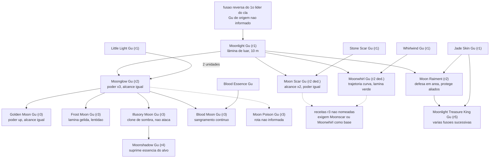

### Arestas

| De | Para | Ingredientes | A obra dá | Cap. |
|---|---|---|---|---|
| — | **Moonlight Gu** (r1) | **fusão reversa** executada pelo primeiro líder do clã. O Gu superior de origem **não é informado**. A receita reversa é guardada pelo líder do clã e vale mais que as receitas de rank 4 e 5 do clã. | só a origem | 156 |
| Moonlight + 2× **Little Light Gu** | **Moonglow Gu** (r2) | dois Little Light. O efeito **não é aditivo**: um Little Light dobra o poder da lâmina, dois também dobram — mas o Gu fundido resultante triplica o poder do Moonlight. | receita fechada + o número | 98, 106 |
| Moonlight + **Stone Scar Gu** | **Moon Scar Gu** (r2 ded.) | Grafado também **Scar Rock Gu** e **Moonscar Gu**. Poder inalterado, alcance dobra (10 m → 20 m). **Catalisadores canônicos:** acrescentar rocha de jade ao refino, **ou** refinar numa noite de luar abundante e sob exposição a ele — qualquer um dos dois eleva a chance de sucesso. Ponto fraco declarado: ataque "subpar". | receita fechada + catalisadores | 106, 156 |
| Moonlight + **Whirlwind Gu** | **Moonwhirl Gu** (r2 ded.) | Lâmina passa de azul a verde; trajetória deixa de ser retilínea e vira curva. Chamada de "rota comum". | receita fechada | 106 |
| Moonlight + **Jade Skin Gu** | **Moon Raiment** (r2) | Grafado também **Moonveil Gu** (cap. 105) — é o mesmo Gu. Defesa ligeiramente inferior à do White Jade, mas **assiste terceiros na defesa**, o que a torna superior em combate de grupo. Rota **rara**, com teto declarado em rank 5. | receita fechada | 98, 104, 105, 106 |
| Moonglow | **Golden Moon Gu** (r3) | Segundo componente **não informado**. Mesmos dez passos de alcance, poder aumenta de novo; crescente dourado de quase meia altura humana. | só o Gu-base | 156 |
| Moonglow | **Frost Moon Gu** (r3) | Segundo componente **não informado**. Lâmina branca e gélida; o ferido é invadido pelo frio e passa a se mover devagar. | só o Gu-base | 156 |
| Moonglow | **Illusory Moon Gu** (r3) | Segundo componente **não informado**. Não ataca: cria um clone de sombra para atrair ataques e confundir. | só o Gu-base | 156 |
| Moonglow + **Blood Essence Gu** | **Blood Moon Gu** (r3) | Receita fechada e memorizada em cena. Rota escolhida por logística, não por poder: troca a dieta de pétalas de orquídea-lua (caras e perecíveis) por sangue. Preço: alguns dias por mês em que "sangra" e perde força. A ficha de receita tem só alguns milhares de palavras contra as ~cem mil das três rotas clássicas — sinal de que quase ninguém a escolhe. | receita fechada | 156, 157 |
| Illusory Moon | **Moonshadow Gu** (r4) | Segundo componente **não informado**. Efeito: implantado na abertura da vítima, suprime **60%** da essência de um rank 3, **30%** de um rank 4 e **15%** de um rank 5. | só o Gu-base | 156 |
| Moon Raiment (+ várias fusões) | **Moonlight Treasure King Gu** (r5) | A obra diz que a rota parte de **Jade Skin + Moonlight** e atravessa **múltiplas fusões sucessivas**; nenhum degrau intermediário é nomeado. É uma das **duas** receitas de rank 5 que o clã possui. | só as pontas | 98, 106 |
| Moonglow (ded.) | **Moon Poison Gu** (r3) | A obra cita o Gu uma única vez, pelo nome e pelo rank. Rota e materiais **não informados**. | só a existência | 150 |
| Moon Scar **ou** Moonwhirl | *(receitas de rank 3 sem nome)* | A obra afirma que **várias receitas de rank 3 do clã exigem Moonscar Gu ou Moonwhirl Gu como Gu de partida** — e não nomeia nenhuma delas. É um galho inteiro conhecido de existência e desconhecido de conteúdo. | só a existência do galho | 156 |

**Fatos de linhagem que valem para os catálogos:**

- Os Gu que fundem com o Moonlight e que a obra nomeia explicitamente numa vitrine de
  mercado são **Jade Skin Gu, Whirlwind Gu e Scar Stone Gu** (cap. 109).
- **Golden Moon, Frost Moon e Illusory Moon consomem grandes quantidades de pétalas de
  orquídea-lua**, insumo que só dura poucos dias — o que torna essas três rotas inviáveis
  para quem viaja (cap. 156).
- Cada uma das três rotas clássicas tem cerca de **cem mil palavras de experiência
  acumulada** anexadas à receita; a rota do Blood Moon tem alguns milhares (cap. 156).
- Ter a receita de rank 5 **não** significa poder produzir o Gu de rank 5: é condição
  necessária, não suficiente (cap. 98).

## 2. Liquor worm — três rotas a partir do mesmo Gu de rank 1

A única linhagem em que a obra **compara rotas explicitamente** e declara uma delas ruim.

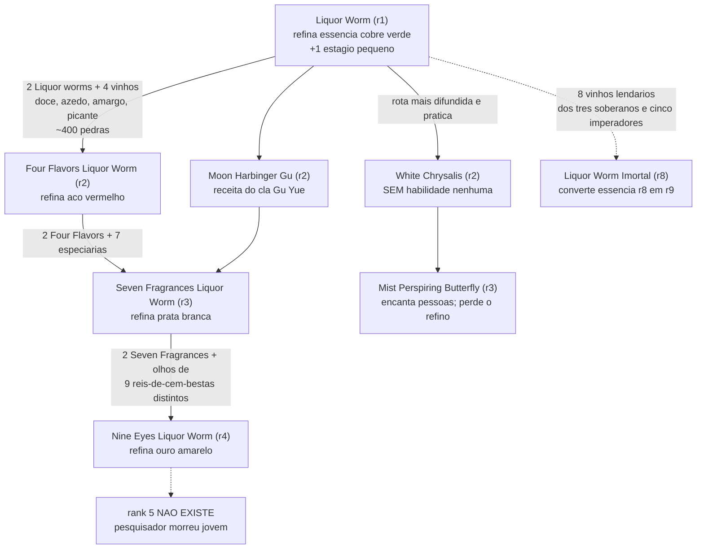

### Arestas

| De | Para | Ingredientes | A obra dá | Cap. |
|---|---|---|---|---|
| 2× Liquor worm + 4 vinhos | **Four Flavors Liquor Worm** (r2) | Os quatro vinhos são **doce, azedo, amargo e picante**, cada um com bebida específica. O procedimento é em quatro etapas: os dois vermes num pote com um dos licores, ~100 pedras primordiais jogadas até a esfera de fusão encolher ao tamanho de um punho; troca-se o licor e repete-se. Total ~400 pedras. | receita completa | 105, 326 |
| 2× Four Flavors + 7 especiarias | **Seven Fragrances Liquor Worm** (r3) | Mesma estrutura: dobra-se o Gu do degrau abaixo e acrescenta-se um conjunto de insumos cujo **número bate com o nome**. | receita completa | 326 |
| 2× Seven Fragrances + 9 globos oculares | **Nine Eyes Liquor Worm** (r4) | Os olhos precisam ser de **nove reis-de-cem-bestas de espécies diferentes** — o insumo deixa de ser comprável e vira nove caçadas. Custo registrado de uma execução: quase duzentas mil pedras. | receita completa | 326 |
| — | *versão rank 5* | **Não existe.** O grão-mestre de receitas que pesquisava a linhagem tinha talento excepcional e foi **morto por inimigos ainda jovem**; a pesquisa parou. Registre-se, porém, a tensão canônica com o cap. 17 (ver abaixo). | a ausência é o fato | 326 |
| Liquor worm | **White Chrysalis** (r2) → **Mist Perspiring Butterfly** (r3) | A rota **mais difundida e mais prática** do mundo, e ainda assim a ruim: o White Chrysalis **não tem habilidade nenhuma** e só come; a habilidade de refinar essência se perde já no primeiro passo. O Mist Perspiring Butterfly é bom por si (foi usado para encantar mulheres), mas a linhagem deixa de ser de cultivo. | a cadeia e a perda | 105 |
| Liquor worm | **Moon Harbinger Gu** (r2) → **Seven Fragrances** (r3) | Receita **do clã Gu Yue** — terceira rota, e ela **reconverge** no Seven Fragrances, preservando o refino de essência. É a única reconvergência de rota explicitamente afirmada em toda a obra. | a cadeia | 105 |
| 8 vinhos lendários | **Liquor Worm Imortal** (r8) | Converte essência imortal de rank 8 em rank 9. Não se refina por receita comum: refina-se **juntando os oito "vinhos dos três soberanos e cinco imperadores"**. Os oito estão espalhados pelo mundo; um deles, o "vinho do imperador vermelho", foi perdido numa aposta de refino há trezentos mil anos. O mundo já vai no 137º herdeiro da receita e ninguém completou a coleção. Ecoa exatamente a estrutura da receita mortal de rank 2 — quatro vinhos ali, oito aqui. | os materiais | 652 |

> [!warning] Divergência interna da obra sobre o rank 5
> O cap. 326 afirma sem rodeios: **"Rank five liquor worm, however, did not exist"**. Mas
> o cap. 17 diz que o Liquor worm encontrado no início da história **era originalmente
> rank 5**, por ser o Gu vital de um mestre de rank 5, e que caiu a rank 1 por décadas de
> fome. A leitura que concilia os dois — e é **dedução nossa**, a obra não a enuncia — é
> que a linhagem não tem *receita* de rank 5, mas um **Gu vital** sobe de rank junto com
> o dono sem precisar de receita nenhuma. Registre a divergência; não a apague.

## 3. Fogo — a linhagem das aberturas (a mais completa da obra)

Cinco degraus, cinco receitas separadas, cada uma consumindo o degrau anterior como
material principal, e a obra dá **todos os nomes e todos os ranks**. É a árvore mais
completa que existe no texto e o melhor modelo de escada de artesanato.

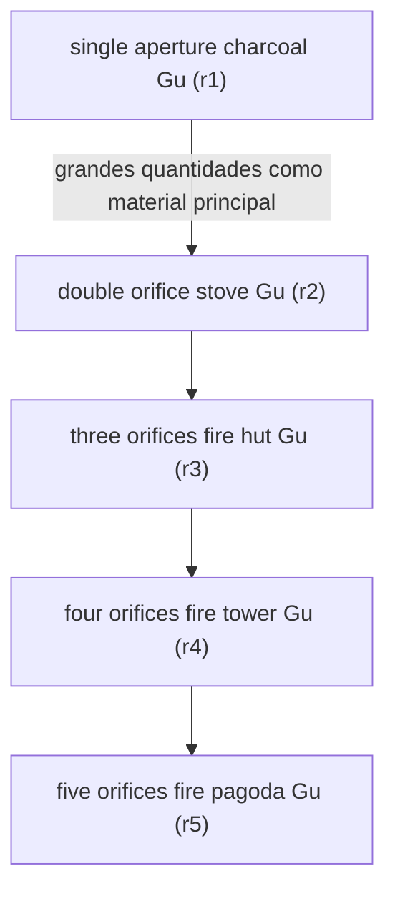

### Arestas

| De | Para | Ingredientes | A obra dá | Cap. |
|---|---|---|---|---|
| — | **single aperture charcoal Gu** (r1) | Grafado também *single orifice*. Refinado a partir de materiais brutos: numa competição, os organizadores forneceram **cerca de mil tipos de material** — ervas, flores, pedras, ossos — e **nenhum Gu**. | o passo e a escala | 853, 854 |
| charcoal (r1), em grande número | **double orifice stove Gu** (r2) | "usando o single orifice charcoal Gu como **materiais principais**". | a cadeia e o material principal | 853, 855 |
| stove (r2) | **three orifices fire hut Gu** (r3) | Mesmo padrão. | a cadeia | 853 |
| fire hut (r3) | **four orifices fire tower Gu** (r4) | Mesmo padrão. | a cadeia | 853 |
| fire tower (r4) | **five orifices fire pagoda Gu** (r5) | Mesmo padrão. São **cinco receitas ao todo**, uma por rank. Um refinador com patamar de sabedoria alto consegue **cortar etapas** e refinar o rank 5 direto a partir dos materiais brutos, pulando a escada. | a cadeia inteira + o atalho | 853 |

> [!note] Para os catálogos
> Esta é a única linhagem em que a obra nomeia **os cinco degraus**, dá **os cinco ranks**
> e afirma que cada degrau é material do seguinte. Onde um catálogo precisar de um
> exemplo canônico de escada de artesanato completa, é esta.

## 4. Defesa branca — javali e jade

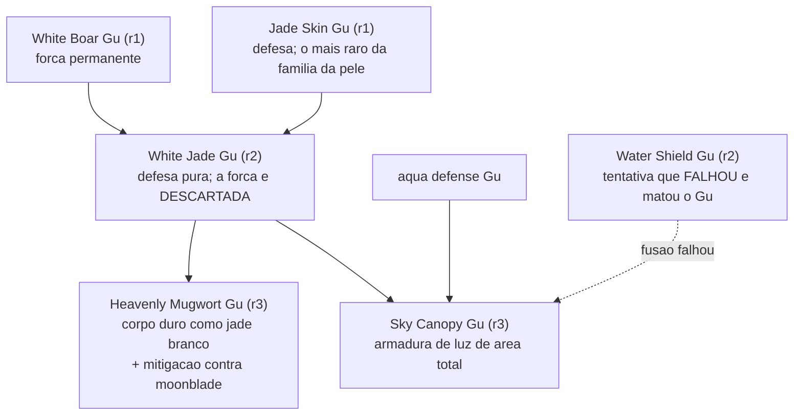

| De | Para | Ingredientes | A obra dá | Cap. |
|---|---|---|---|---|
| White Boar + Jade Skin | **White Jade Gu** (r2) | O White Boar é "**mais compatível**" com o Jade Skin do que com qualquer outro. A fusão **descarta a força** e conserva só a defesa — o exemplo didático canônico da regra de que a fusão herda uma habilidade só. **Catalisador fora da receita oficial:** uma presa de rei-javali eleva a chance de sucesso em cerca de **vinte pontos percentuais**; funcionava havia séculos antes de entrar na receita escrita. A dieta muda: passa a exigir mais jade, em intervalos maiores. | receita fechada + catalisador | 64, 98, 105 |
| White Jade | **Heavenly Mugwort Gu** (r3) | Segundo componente **não informado**. Efeito: corpo duro como jade branco **mais** mitigação específica contra ataques do tipo moonblade. É a contraparte "defensiva pura" do Steel Mane, que sai da mesma raiz de Gu de javali mas soma ataque. | só o Gu-base | 64 |
| White Jade + **aqua defense Gu** | **Sky Canopy Gu** (r3) | Receita fechada. **Caso mecânico registrado:** a primeira tentativa usou um **Water Shield Gu** no lugar do aqua defense — a fusão **falhou e matou o Water Shield**. O aqua defense da segunda tentativa foi obtido trocando méritos de batalha do clã. | receita fechada + a falha | 155 |

## 5. Pele de bronze — o caso do mesmo nome em três ranks

O caso que o usuário já decidiu: mesmo nome, ranks diferentes, **efeitos diferentes**.
A obra é explícita.

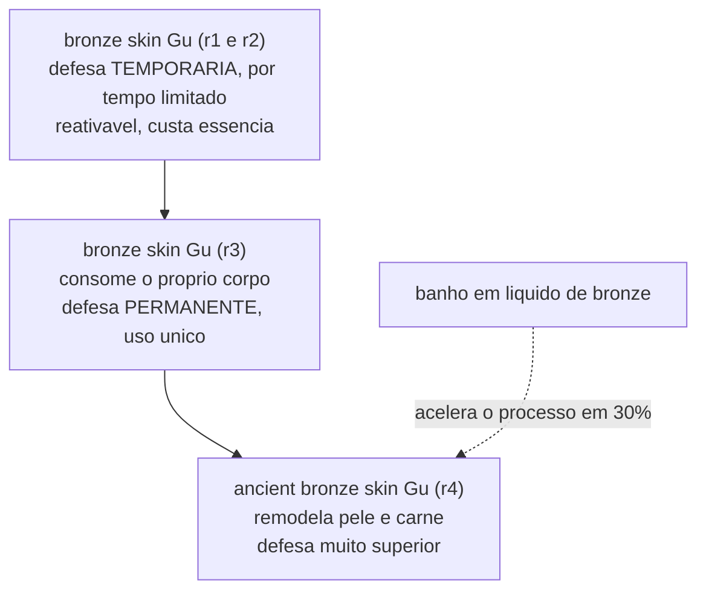

| Degrau | Rank | Efeito declarado | Cap. |
|---|---|---|---|
| **bronze skin Gu** | 1 a 3 (**"a series Gu from rank one to rank three"**) | No **rank 2**: dá à pele defesa aumentada **por um período limitado** — é acionável e temporário. No **rank 3**: **usa o próprio corpo do usuário** e concede a defesa **permanentemente**. Mesmo nome, mecânica de outro gênero. | 301, 354 |
| **ancient bronze skin Gu** | 4 | O nome só muda ao chegar ao rank 4. Remodela pele e carne do Mestre Gu em "pele de bronze antigo", com poder defensivo **muito superior** ao do rank 3. Levava mais de um mês de uso contínuo. **Otimização canônica:** usá-lo com o corpo submerso em **líquido de bronze** acelera o processo em **trinta por cento** — detalhe conhecido de poucos, e que um mercador demoníaco experiente desconhecia. | 354, 355 |

**Como o catálogo deve tratar:** duas fichas distintas para o bronze skin Gu — uma
cobrindo ranks 1–2 (temporário) e outra o rank 3 (permanente, uso único, corpo
consumido) —, com a de rank 3 listada como evolução da de rank 2 e o ancient bronze
skin Gu (r4) listado como evolução da de rank 3.

## 6. Cabelo e juba

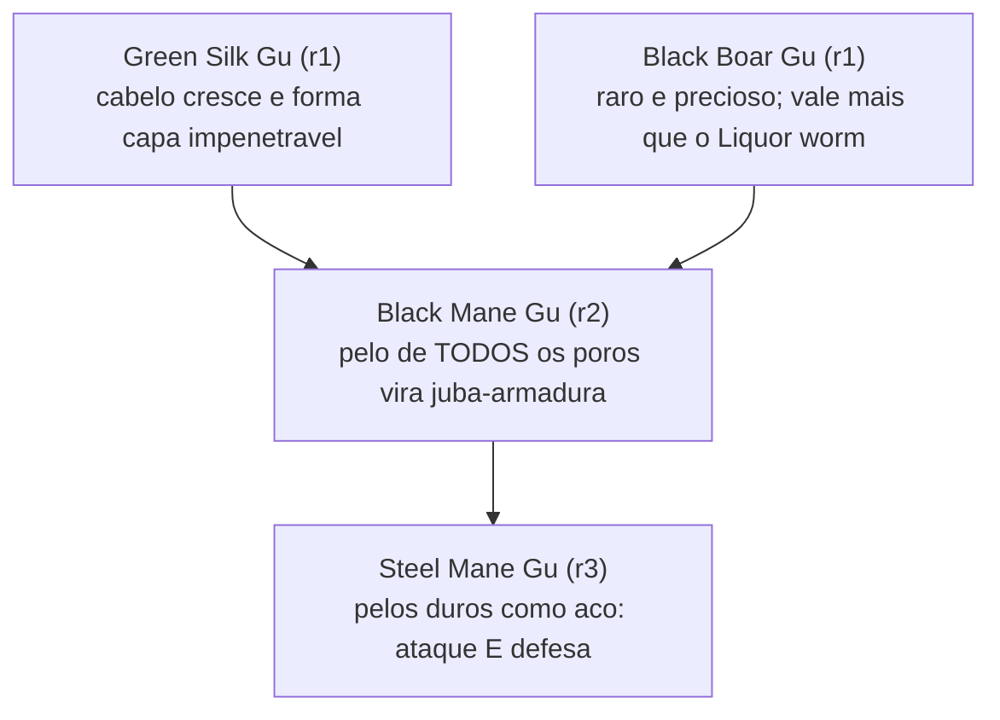

| De | Para | Ingredientes | A obra dá | Cap. |
|---|---|---|---|---|
| Green Silk + Black Boar | **Black Mane Gu** (r2) | Ambos rank 1. O Black Boar é raro e precioso, com valor de mercado **acima do Liquor worm** — o que torna esta uma fusão cara para um Gu de rank 2. | receita fechada | 47 |
| Black Mane | **Steel Mane Gu** (r3) | Segundo componente **não informado**. A obra declara o Steel Mane como a **"melhor rota de avanço" do Black Boar Gu** — ou seja, nomeia a rota pelo destino, não pelos passos. | só o Gu-base | 47, 123 |

## 7. Escamas de peixe — um material, duas receitas separadas por dois séculos

O caso didático mais limpo da obra sobre **conhecimento de receita como vantagem
estratégica**: o mesmo material tem receitas diferentes disponíveis em épocas diferentes.

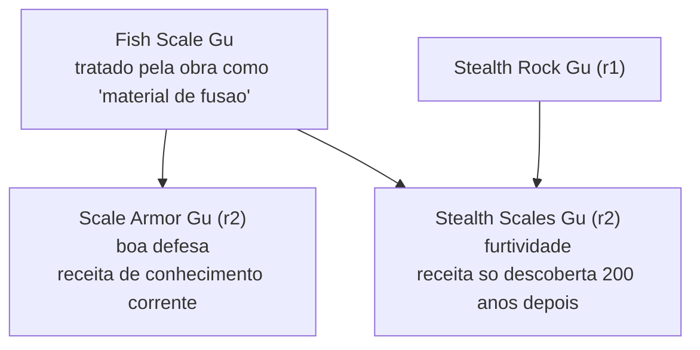

| De | Para | Ingredientes | A obra dá | Cap. |
|---|---|---|---|---|
| Fish Scale | **Scale Armor Gu** (r2) | Receita de **conhecimento corrente**: qualquer Mestre Gu razoavelmente instruído da época sabe indicá-la a quem não tem Gu defensivo. | os componentes | 123 |
| Stealth Rock + Fish Scale | **Stealth Scales Gu** (r2) | A obra registra que essa combinação **só seria descoberta publicamente cerca de duzentos anos depois** — é conhecimento adiantado, não corrente. | os componentes + a datação | 121, 123 |

## 8. Zumbis — a escada mais difundida do mundo

Espalhada pelas **cinco regiões**; não é patrimônio local de ninguém. O motivo de existir
é econômico e desesperado: Mestres Gu com pouco tempo de vida e sem dinheiro para um Gu
de longevidade viram zumbis **para prolongar a vida**.

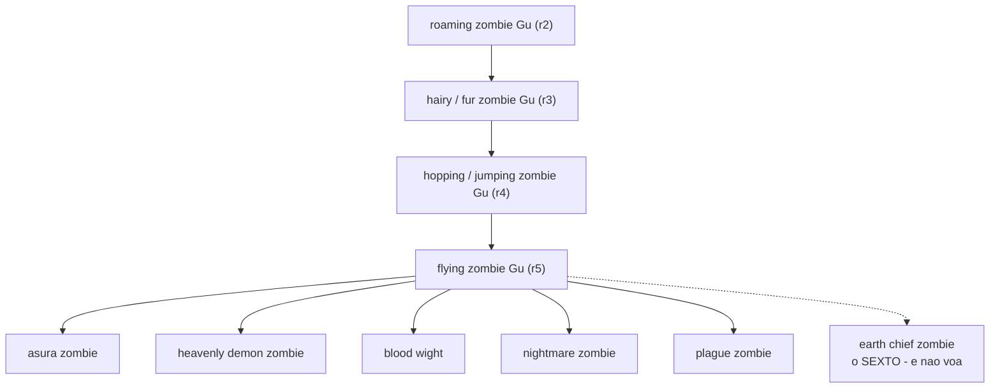

| De | Para | Ingredientes | A obra dá | Cap. |
|---|---|---|---|---|
| roaming zombie (r2) | hairy/fur zombie (r3) | Nenhum componente informado em nenhum degrau da escada. Traduções variam: *fur zombie* e *hairy zombie* são o mesmo; *jumping* e *hopping* também. | só a cadeia | 192, 526 |
| hairy zombie (r3) | hopping zombie (r4) | — | só a cadeia | 192, 526 |
| hopping zombie (r4) | flying zombie (r5) | — | só a cadeia | 192, 526 |
| roaming zombie | **Blood Wight Gu** (r5) | A obra chama o Blood Wight de "**uma grande rota de avanço de rank 5 do Roaming Zombie Gu**" — o que confirma que a escada é lida de ponta a ponta como uma rota só. | a rota | 185 |
| flying zombie (r5) | os **cinco grandes zumbis voadores** | **asura zombie, heavenly demon zombie, blood wight, nightmare zombie, plague zombie**. Nenhum componente informado. É a bifurcação mais larga registrada numa cadeia mortal. | os cinco nomes | 185, 526 |
| — | **earth chief zombie Gu** (r5) | O **sexto** zumbi voador, e uma anomalia declarada: **não voa**. É o **único da série cuja receita completa a obra descreve**: matar uma fera *earth chief* e usar sua **pele e tendões** como material base; combinar **dezenas de outros Gu**; acrescentar **terra yin retirada a novecentos li de profundidade**, **grama-suga-montanha centenária** e **flores da maré escura**. Existe uma **variante da receita**, criada por uma especialista em refino, que dá ao zumbi a capacidade de aproveitar o campo magnético natural e **voar sem asas** — prova textual de que uma receita pode ser reescrita para acrescentar uma capacidade que o Gu original não tinha. | receita completa + variante | 570, 573, 579 |

## 9. Fogo-fantasma — caminho da alma, não do fogo

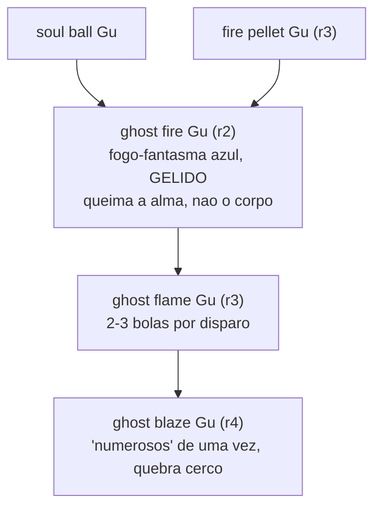

| De | Para | Ingredientes | A obra dá | Cap. |
|---|---|---|---|---|
| soul ball Gu + fire pellet Gu, dentro de fogo de alma | **ghost fire Gu** (r2) | "os dois Gu se fundiram no fogo, combinaram-se em um e criaram um ghost fire Gu **incompleto**". O ghost fire é **ao mesmo tempo do caminho do fogo e do caminho da alma**, e é por isso que os passos são complicados: refiná-lo é tarefa de convenção de refinadores, e mesmo um mestre erra por azar puro. | receita + a dificuldade | 831 |
| ghost fire (r2) | **ghost flame Gu** (r3) | "Ghost fire Gu era um Gu de caminho da alma de rank dois. Ao avançar, seria o ghost flame Gu de rank três." Componentes **não informados**. | a cadeia | 457 |
| ghost flame (r3) | **ghost blaze Gu** (r4) | Componentes **não informados**. Contra ele há um contra direto e canônico: o **swallow fire Gu (r4)**, com o qual um chefe de tribo simplesmente **engoliu todo o fogo-fantasma**. | a cadeia | 457 |

## 10. Lótus da essência — a única cadeia que vai do rank 3 ao rank 9

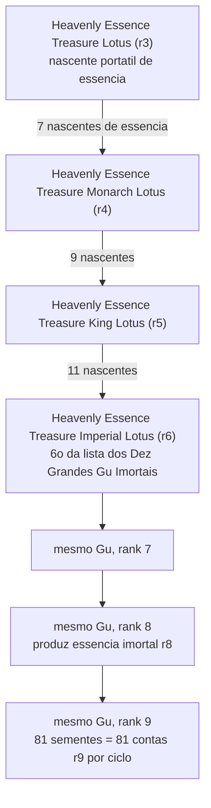

| De | Para | Ingredientes | A obra dá | Cap. |
|---|---|---|---|---|
| — | **Heavenly Essence Treasure Lotus** (r3) | Não é natural: a receita foi **criada pelo Venerável Gênese do Lótus** há milênios. Exige uma **nascente natural de essência** cheia e não exaurida; refiná-lo **destrói a nascente por completo**. O Gu precisa ter **nove folhas completas** para ser colhido, e cresce se alimentado com pedras primordiais. O processo aparece "do nada", transitando entre estado astral e físico, e **só é visível através de cristal**. | condição e processo | 163 |
| lótus r3 (consumido) + **7 nascentes** | **Monarch Lotus** (r4) | A receita de rank 4 exige a versão rank 3 como ingrediente e **sete nascentes de essência**. A receita solta foi leiloada por **seiscentas e setenta mil pedras primordiais** — o recorde de leilão registrado na obra, mais caro que qualquer Gu vendido no mesmo circuito, e mais caro que o próprio Monarch Lotus. | a escada de custo | 163, 308, 309 |
| Monarch (r4) + **9 nascentes** | **King Lotus** (r5) | Mesma escada. | a escada de custo | 163 |
| King (r5) + **11 nascentes** | **Imperial Lotus** (r6) | Sexto colocado na lista dos Dez Grandes Gu Imortais; era o **Gu vital do Venerável Gênese do Lótus**, o Venerável mais rico da história em essência imortal. | a escada de custo | 163, 2235 |
| Imperial r6 | r7 → r8 → r9 | **O nome não muda** (regra do cap. 463). A subida de rank 8 para rank 9 custou **trinta por cento de todo o estoque de material imortal de rank 9 do caminho da madeira** do executor, e houve falhas antes. No rank 9, o Gu absorve energia primordial, condensa gotas de orvalho que escorrem pelas folhas até o botão; o botão passa de branco a rosa e a vermelho, e ao abrir revela uma vagem com **oitenta e uma sementes, cada uma uma conta de essência imortal de rank 9** — depois o ciclo recomeça. | o custo e o mecanismo | 463, 1200, 1767, 2081, 2227, 2235 |

## 11. Armazenamento do Mar Oriental

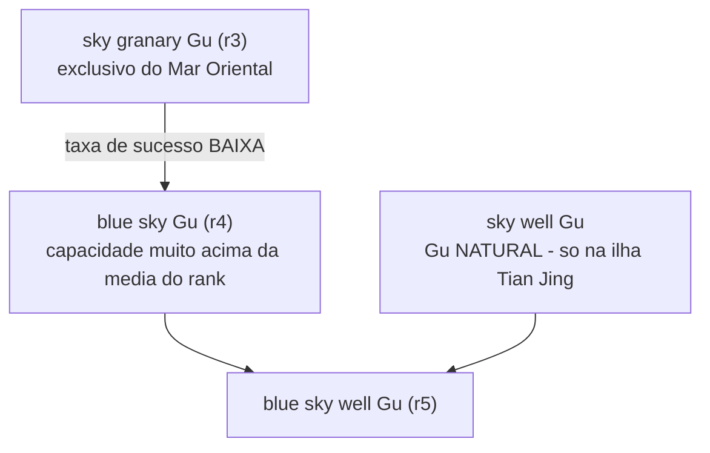

| De | Para | Ingredientes | A obra dá | Cap. |
|---|---|---|---|---|
| sky granary (r3) | **blue sky Gu** (r4) | Fusão de **taxa de sucesso baixa**, o que torna o blue sky raro **até dentro do Mar Oriental**. | a cadeia + a taxa qualitativa | 353 |
| blue sky (r4) + **sky well Gu** | **blue sky well Gu** (r5) | O sky well Gu é **natural** — não se refina, só se coleta — e ocorre em **um único lugar do mundo conhecido**, a ilha Tian Jing, no Mar do Leste. A obra chama essa fusão de "**o melhor método**" para subir o blue sky a rank 5, o que implica que há outros e não os nomeia. | a cadeia + a geografia | 353 |

## 12. Rastro de água — bifurca no rank 5

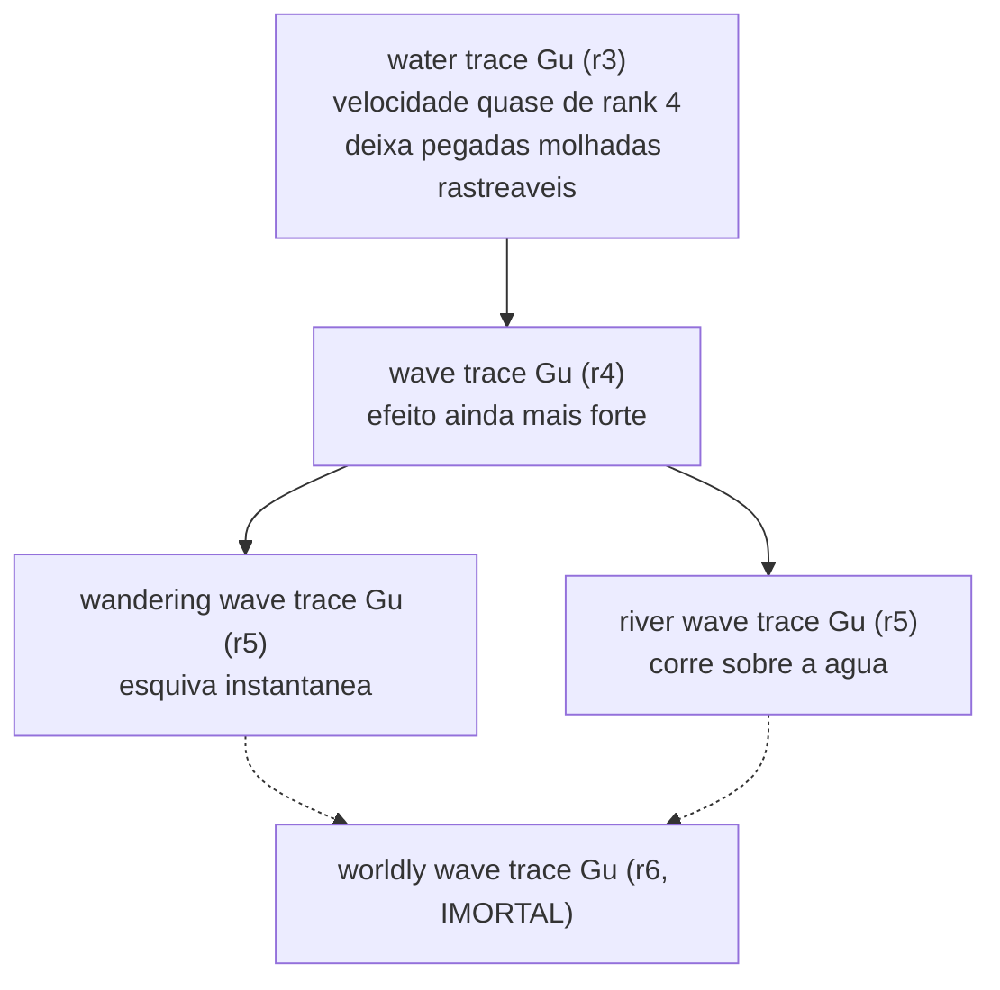

| De | Para | Ingredientes | A obra dá | Cap. |
|---|---|---|---|---|
| water trace (r3) | **wave trace Gu** (r4) | "Este Gu tinha potencial para ser nutrido. No rank quatro, podia tornar-se o wave trace Gu, que tinha efeito ainda mais forte." | a cadeia | 428 |
| wave trace (r4) | **wandering wave trace** (r5) *ou* **river wave trace** (r5) | "Para o rank cinco, tinha **duas direções de refino diferentes**": o wandering wave trace, com propriedades de **esquiva instantânea**; e o river wave trace, que permite **correr depressa sobre a superfície da água**. | a bifurcação | 428 |
| rank 5 (qual dos dois, **a obra não diz**) | **worldly wave trace Gu** (r6) | A frase da obra é apenas: "**No rank seis, seria o famosíssimo worldly wave trace Gu**". Ela **não afirma** que as duas rotas de rank 5 convergem nele — apenas nomeia um único rank 6 depois de nomear dois ranks 5. **Tratar a convergência como dedução, não como texto.** Alimentação do exemplar imortal: **dezenas de milhares de águas-vivas do submundo e milhares de enguias-relâmpago de mar profundo**. | as pontas, não a ligação | 428, 672, 679 |

## 13. Encanto de madeira — a rota mais extravagante do mundo

A obra a chama de "uma das rotas de avanço mais extravagantes" — e a razão é puramente
econômica: os componentes são **anos de vida**.

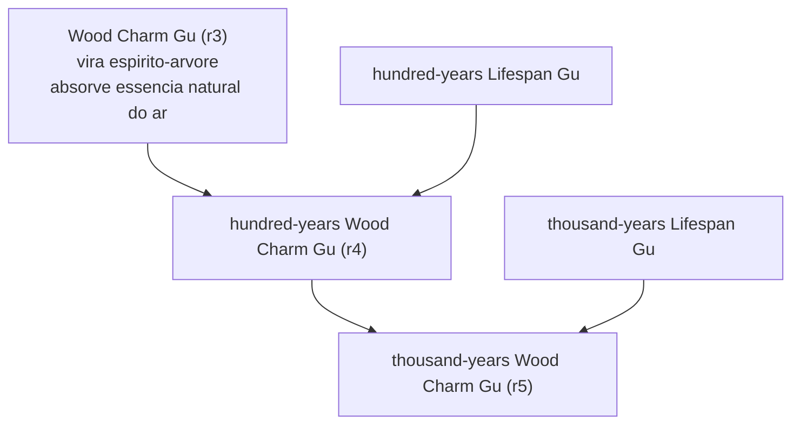

| De | Para | Ingredientes | A obra dá | Cap. |
|---|---|---|---|---|
| Wood Charm (r3) + **Lifespan Gu de cem anos** | **hundred-years Wood Charm Gu** (r4) | Receita fechada, de estrutura quase algébrica. | receita completa | 126 |
| hundred-years (r4) + **Lifespan Gu de mil anos** | **thousand-years Wood Charm Gu** (r5) | Idem. **"Todo mundo conhece essa rota de fusão, e Mestres Gu raramente a usam"** — porque quem acha um Lifespan Gu prefere engoli-lo para si. É a única rota que a obra descreve como universalmente conhecida e universalmente evitada. | receita completa + o motivo | 126 |

**Contrapartida do Gu-base, que o catálogo precisa carregar:** usar o Wood Charm por muito
tempo **converte o corpo em madeira**, até virar um cadáver de árvore, e a corrosão avança
até tomar a consciência. É poder de atrito quase infinito em troca de morte progressiva.

## 14. Centopeia-serra — um Gu selvagem com duas rotas

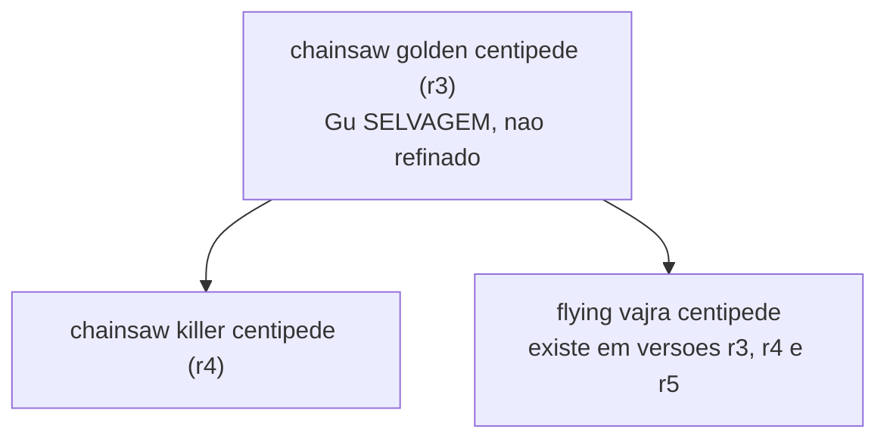

| De | Para | Ingredientes | A obra dá | Cap. |
|---|---|---|---|---|
| — | **chainsaw golden centipede** (r3) | Gu **selvagem**, subjugado, não refinado. Domina exércitos de centopeias pela aura. Subjugá-lo custa esforço até a um Mestre Gu de rank 4. Se um novo nascer no mesmo lugar, leva "mais de uma dúzia de anos". | a origem | 129, 162 |
| chainsaw golden centipede | **chainsaw killer centipede** (r4) | "uma das rotas de avanço do rank três chainsaw golden centipede". | a rota | 166 |
| chainsaw golden centipede | **flying vajra centipede** | A segunda das "**duas rotas principais de avanço**", e a obra dá o detalhe estrutural: ela **existe em versões de rank 3, 4 e 5** — ou seja, é um ramo com escada própria. | a rota + a escada | 2108 |

## 15. Força — o que é árvore e o que não é

Esta é a família em que os catálogos mais erram, porque ela mistura os três tipos.

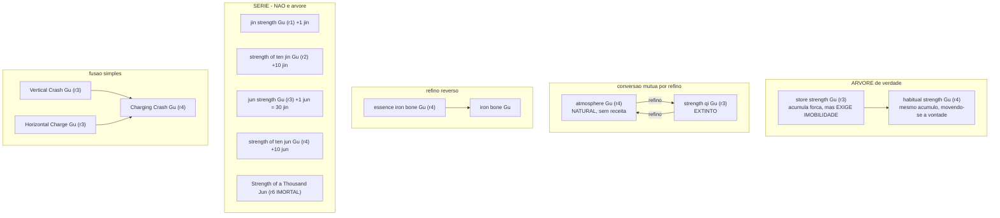

| De | Para | Ingredientes | A obra dá | Cap. |
|---|---|---|---|---|
| store strength (r3) | **habitual strength Gu** (r4) | "no rank quatro, depois que o store strength Gu se refina no habitual strength Gu, essa fraqueza é eliminada". A fraqueza eliminada é a **imobilidade total** durante a carga. A linha inteira foi **criada pelos Mestres Gu de força da era atual** para substituir o all-out effort Gu, praticamente extinto. | a cadeia + o motivo | 316, 317 |
| **atmosphere Gu** (r4) ↔ **strength qi Gu** (r3) | conversão mútua | "Atmosphere Gu e strength qi Gu eram ambos Gu do caminho do qi. As leis dentro deles eram semelhantes, portanto **podiam ser convertidos um no outro por refino**." O atmosphere Gu é **natural e sem receita**; o strength qi Gu é do antigo caminho do qi, tido como **extinto**. Esta é a única aresta da obra que corre nos **dois sentidos** e para um rank **inferior**. | a conversão e a direção | 320 |
| **essence iron bone Gu** (r4) | **iron bone Gu** | "Este era o essence iron bone Gu, um Gu de rank quatro; **pode-se obter o iron bone Gu refinando-o ao reverso**." Atenção: a direção é essa, e o `06 - Catálogo de Receitas.md` a inverte. | a direção | 355 |
| Vertical Crash (r3) + Horizontal Charge (r3) | **Charging Crash Gu** (r4) | Ambos comprados prontos no mercado. O resultado dobra o alcance e corta o tempo de recarga pela metade, ao custo de mais essência por uso. | os componentes | — (catálogo) |

### A série jin/jun **não é uma árvore**

A obra é clara e o ponto importa para os catálogos: `jin strength Gu` (r1, +1 jin),
`strength of ten jin Gu` (r2, +10 jin), `jun strength Gu` (r3, 1 jun = 30 jin),
`strength of ten jun Gu` (r4, +10 jun) são **produtos separados**, vendidos em loja com
preços tabelados (220 / 690 / 4.550 / 36.000 pedras), **consumíveis** — o strength of ten
jun se despedaça ao ser usado — e **empilháveis até o limite físico do corpo**. Ninguém
funde um no outro. A linha foi **inventada por Chu Du, "Imortal Dominação"**, um Gu
Imortal de rank 7 do Planalto Norte, que também refinou o **Strength of a Thousand Jun**
de rank 6 imortal, no topo da mesma família. Um mil jun equivale a trinta mil jin
(caps. 442, 443, 454).

## 16. Árvores curtas confirmadas no texto

| De | Para | O que a obra afirma | Cap. |
|---|---|---|---|
| **iceblade Gu** (r2) | **ice edge Gu** (r3) | "Ice edge Gu era o avanço do iceblade Gu de rank dois, tinha corpo mais resistente e lâmina mais afiada." | 298 |
| **clear wind wheel Gu** (r1) | **jade wind wheel Gu** (r2) | "o último era **uma das** possíveis rotas de avanço do clear wind wheel Gu" — a obra deixa explícito que há outras e não as nomeia. O r1 gera um ciclone sob cada pé (velocidade de deslocamento); o r2 gera um par de ciclones em torno dos braços, como braçadeiras (velocidade de soco). | 76, 2072 |
| **golden shield Gu** (r3) | **golden bell shield Gu** (r4) | "Fang Yuan planejava avançar o golden shield Gu de rank três para o golden bell shield Gu de rank quatro." | 343, 345 |
| **fire eye Gu** (r3) + **sight blow Gu** + materiais | **fire pupil Gu** (r4) | "o fire pupil Gu de rank quatro era avançado usando o fire eye Gu de rank três, junto com o sight blow Gu e alguns materiais de refino associados". Onde o usuário olha, o fogo queima. | 548 |
| **Digital Shade Gu** (r2) | **Photo-audio Gu** (r3) | "Digital Shade Gu era um Gu de gravação. **Apenas um passo adiante no avanço**, e seria o Photo-audio Gu de rank três" — que grava também **voz**, além de texto e imagem. Para receitas a voz é dispensável, e é por isso que os clãs param no rank 2. | 156 |
| **lizard house Gu** (r2) | **large lizard house Gu** (r3) | "Large lizard house Gu era rank três, avançado a partir do lizard house Gu de rank dois." | 507 |
| **Bone Spear Gu** | **Spiral Bone Spear Gu** | "Este Gu era **a evolução do Bone Spear Gu**, seu poder de ataque e força de penetração eram maiores." Ambos comem **leite** e ficam guardados numa tina de leite. O Bone Spear é o Gu fundacional da herança do Osso Branco, na mesma posição que o Moonlight ocupa no clã Gu Yue. A obra não dá o rank de nenhum dos dois; na cena, uma personagem lamenta não haver ali "nenhum Gu de rank três", o que os coloca em rank 1 e 2 `(ded.)`. | 222 |
| **Defecate Gu** (r2) + **Big Strength Gu** | **Big Strength Defecate Gu** (r3) | O resultado tem mesma função e mesma aparência, com efeito **três vezes mais forte** — e é **menos popular que a versão de rank 2**, porque come muito mais e o mesmo resultado sai usando o rank 2 várias vezes. A obra usa o par como exemplo canônico de que **rank maior não é melhor**. O próprio Defecate Gu é fusão: **rice bag grass Gu + smelly fart Gu**, acionados simultaneamente dentro de uma urna de lama podre de pântano com grãos de arroz. | — (catálogo) |
| **Blood Guillotine** (r5) | **Blood Deity** (r6, imortal) | "Especialmente quando este Blood Guillotine Gu **avança** para o aclamado Gu demoníaco de rank seis, o Blood Deity. Entre os Dez Grandes Gu Demoníacos do mundo, ele ocupa o 7º lugar." Uma das raras cadeias que atravessa a fronteira mortal→imortal. Refinar o Blood Deity, porém, é outro assunto: exige **matar um parente de sangue** e transformá-lo, e o parente precisa **não odiar** o refinador, ou o produto causa contragolpe. | 165, 1066 |
| **fire pellet Gu** + **soul ball Gu** | **ghost fire Gu** (r2) | Ver árvore 9. | 831 |

## 17. Árvores de Gu Imortais

Do rank 6 para cima muda a natureza do problema: cada Gu Imortal é **único no mundo**,
o que significa que uma receita imortal só pode ser executada com sucesso **uma vez na
história**. E para subir um Gu Imortal de rank, **a versão inferior é consumida como
material principal** — falhar destrói o exemplar (cap. 1444).

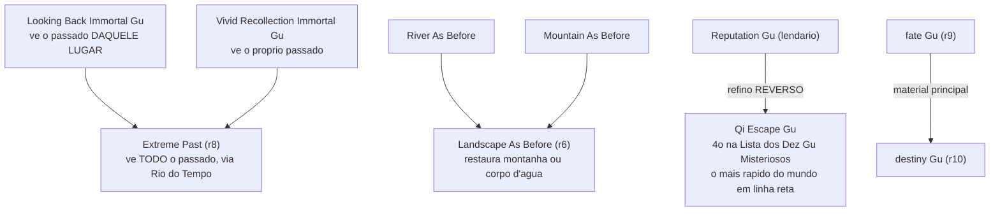

| De | Para | O que a obra afirma | Cap. |
|---|---|---|---|
| **Looking Back** + **Vivid Recollection** | **Extreme Past** (r8) | "**Refinando os dois Gu Imortais juntos**, obtém-se o Gu Imortal de rank oito Extreme Past." Cada componente tem uma limitação e o produto remove as duas: o Looking Back só vê o passado **de um lugar**; o Vivid Recollection só vê o passado **do próprio usuário**; o Extreme Past vê **todo** o passado, pelo Rio do Tempo. | 746 |
| **River As Before** + **Mountain As Before** | **Landscape As Before** (r6) | "era um Gu Imortal criado por Tai Bai Yun Sheng depois de ele se tornar Gu Imortal, **usando river as before e mountain as before como materiais principais**." Nota: o `06 - Catálogo de Receitas.md` descreve essa fusão como espontânea e acidental durante a ascensão; o cap. 544 a descreve como criação deliberada. Registrar as duas versões. | 544 |
| **Reputation Gu** (lendário) | **Qi Escape Gu** | "foi **refinado ao reverso** a partir do lendário Reputation Gu". Quarto colocado na Lista dos Dez Gu Misteriosos; em voo em linha reta é **o Gu mais rápido do mundo, sem páreo**. | 678 |
| **fate Gu** (r9) | **destiny Gu** (r10) | "um dos materiais principais para refinar o destiny Gu de rank dez era o fate Gu de rank nove". A única aresta de rank 10 do sistema. | 2140 |
| **Cleanse Soul** r6 | **Cleanse Soul** r7 | Mesmo nome. "refinar o cleanse soul Gu Imortal de rank sete era muito mais difícil que refinar o de rank seis. Além disso, **o de rank seis tinha de ser usado como material principal**." É o enunciado canônico da regra geral de subida de rank imortal. | 1444 |
| **advance refinement Gu** r8 | **advance refinement Gu** r9 | Elevado a partir do próprio exemplar de rank 8, que era o núcleo de uma formação de refino. Foi **notavelmente mais fácil** que outros refinos de rank 9 porque o Gu é composicionalmente **puro no caminho do refino** — pureza de caminho reduz a dificuldade. E o Gu resultante **facilita elevar os outros Gu Imortais de rank 8 do dono**: teria reduzido pela metade a dificuldade do refino do Imperial Lotus. Um Gu que acelera a própria árvore. | 2247, 2250, 2252 |

## 18. Séries e cadeias que atravessam a fronteira mortal → imortal

A obra afirma explicitamente, para vários Gu, que existe **versão mortal e versão
imortal do mesmo Gu**. Isso não é evolução por fusão — é o mesmo conceito instanciado em
duas escalas —, mas os catálogos precisam registrar o vínculo.

| Gu | Faixa mortal | Faixa imortal | Observação canônica |
|---|---|---|---|
| Liquor Worm | 1 → 4 | 8 | A obra chama o r8 de "a evolução final do mesmo Liquor Worm de rank 1 que um iniciante alimenta com vinho barato". |
| Strength Qi Gu | 3 a 5 (peça de colecionador) | 6 | O exemplar imortal é gasto para **fabricar em série** Gu mortais de rank 3 do mesmo nome. |
| Blood Guillotine → Blood Deity | 5 | 6 | Ver árvore 16. |
| Water/Wave Trace → Worldly Wave Trace | 3 a 5 | 6 | Ver árvore 12. |
| jin/jun strength | 1 a 4 | 6 (Strength of a Thousand Jun) | Série, não árvore. |
| Heavenly Essence Treasure Lotus | 3 a 5 | 6 a 9 | Ver árvore 10. |
| Blood Skull Gu | 4, e uma **versão de rank 5 desenvolvida depois** que atinge o mesmo fim exigindo apenas **extrair** sangue dos parentes em vez de matá-los | sim | Prova canônica de que uma receita pode ser reprojetada para **baratear o custo moral**. |
| Star Shoot, Grass Puppet, Territory, Gruel Mud, Slavery, Beast Enslavement, Man As Before, Expend Strength, Soul Search, Justice, Wealth, Pulling Water, Luck Inspection, Bone Spike, Star Thought, Vajra Thought, Sneak Attack, Year, Day, Month, Extreme Light, Blood Handprint, Dragon Scales, Accumulate Virtue | várias | várias | Todos com ficha nos dois catálogos. **Não são evolução**: são o mesmo Gu em duas escalas, e cada exemplar imortal é único. Um caso registrado mostra o vínculo prático: quem tem o Pulling Water imortal ainda precisa manter o mortal, porque para usar dois golpes que exigem Pulling Water ao mesmo tempo é preciso substituir o imortal por uma multidão de mortais num deles. |

---

# Gu com evolução citada mas incompleta

Casos em que a obra abre a porta e não mostra o quarto. São os pontos onde a designer
pode inventar **dentro** de um encaixe canônico, o que é diferente de inventar do zero.

## Diz que evolui, não diz no quê

| Gu | Rank | O que a obra diz | Cap. |
|---|---|---|---|
| **Beast Skin Gu** | 1 | É o mais comum e mais barato da família da pele — mais barato até que o Rock Skin — e **"tinha mais linhas evolutivas e podia se fundir com mais variedades de Gu"** que os irmãos. A obra afirma a abundância de rotas e **não nomeia nenhuma**. É o maior espaço em branco autorizado do catálogo mortal. | 62 |
| **Nine Leaf Vitality Grass** | 2 | "Para cura, a Nine Leaf Vitality Grass é fraca. Afinal é um Gu de rank dois, e **mesmo a opção de avanço não é satisfatória**." A rota existe, é conhecida do personagem, e não é nomeada nem descrita. | 157 |
| **Moon Scar Gu** e **Moonwhirl Gu** | 2 | **Várias receitas de rank 3** do clã Gu Yue exigem um dos dois como Gu de partida. Nenhuma é nomeada. | 156 |
| **Moonlight Gu** | 1 | "Existem muitas receitas diferentes para refinar o Moonlight Gu, e ele tem **muitas rotas de avanço**." As quatro nomeadas (Moonglow, Moon Scar, Moonwhirl, Moon Raiment) são explicitamente um subconjunto. | 106 |
| **clear wind wheel Gu** | 1 | O jade wind wheel é "**uma das** possíveis rotas de avanço" — as outras existem e não são nomeadas. | 2072 |
| **blue sky Gu** | 4 | Fundir com o sky well Gu é "**o melhor método**" para chegar ao rank 5 — o superlativo implica alternativas piores que a obra não lista. | 353 |
| **chainsaw golden centipede** | 3 | Tem "**duas rotas principais**" — o adjetivo "principais" implica secundárias não nomeadas. | 2108 |

## Diz de onde veio, não diz como

| Gu | Rank | O que a obra diz | Cap. |
|---|---|---|---|
| **Moonlight Gu** | 1 | Produto de **fusão reversa** feita pelo primeiro líder do clã. O Gu de rank superior que foi revertido **nunca é nomeado**. A receita reversa vale mais que as receitas de rank 4 e 5 juntas, e fica com o líder do clã. | 156 |
| **Stream Gu** | — | Gu-assinatura do clã Bai, também criado por **fusão reversa**, e a obra **nunca diz o que ele faz**. Citado ao lado do Moonlight (Gu Yue) e do Bear Strength Gu (clã Xiong) como exemplo de Gu exclusivo de clã. | 156 |
| **Bear Strength Gu** | — | Terceiro exemplo da mesma lista — Gu exclusivo de clã, criado por fusão reversa. Nenhum detalhe. | 156 |
| **Golden Moon / Frost Moon / Illusory Moon** | 3 | Sabe-se que saem do Moonglow. O **segundo componente de cada um** não é informado em nenhum dos três. | 156 |
| **Heavenly Mugwort Gu** | 3 | Sai do White Jade. Segundo componente não informado. | 64 |
| **Steel Mane Gu** | 3 | Sai do Black Mane. Segundo componente não informado. | 47 |
| **Moonshadow Gu** | 4 | Sai do Illusory Moon. Segundo componente não informado. | 156 |
| **Blood Curtain Skyflower Gu** | 5 | "Este é o Gu que eu **pessoalmente fundi**", diz o criador, e a obra o descreve como tendo **o mesmo efeito** do Water Curtain Skyflower Gu de rank 4, com a melhoria decisiva de deixar o dono sair. A obra **não afirma** que foi derivado do Water Curtain — só que faz a mesma coisa melhor. Tratar a derivação como dedução plausível, não como texto. | 194 |
| **Moonlight Treasure King Gu** | 5 | Sabe-se a raiz (Jade Skin + Moonlight) e a rota geral (Moon Raiment, "múltiplas fusões"). **Nenhum degrau intermediário é nomeado**, e a obra nunca descreve o que o Gu faz. | 98, 106 |
| **Airsac Gu** | 3 | Criado **do zero** para conter o Guts Gu fora do domínio onde ele se forma. Sabe-se a função e um insumo (energia de um Gu Imortal de força); não se sabe a receita nem se ele tem rotas. | — (catálogo) |
| **Space Thought Gu** | 5 | Obtido por **refino reverso** de um Gu implantado à força no crânio (um brain explosion Gu rank 4), que se decompôs em dois Gu de rank 3 mais o pensamento espacial. Sabe-se o método e o resultado; não se sabe se há rota adiante. | — (catálogo) |

## Correções a fazer nos catálogos existentes

Achados de verificação. Cada um destes é uma afirmação que hoje está num catálogo do
vault e que o texto-fonte **não sustenta na forma em que está escrita**.

| Onde está | O que diz hoje | O que o texto diz | Cap. |
|---|---|---|---|
| `06 - Receitas` | "**Essence Iron Bone Gu** (4) — obtido por refino reverso do Iron Bone Gu" | **A direção está invertida.** O essence iron bone Gu é o rank 4, e é dele que se obtém o iron bone Gu por refino reverso. | 355 |
| `06 - Receitas` | "**Emperor Yama** (8) — fusão de quatro Gu nomeados: Ghostly Concealment, Ghost Official Garment, Soul Beast Token e Myriad Self" | **Emperor Yama não é um Gu: é um golpe imortal de rank 8.** Seus "quatro componentes principais" são dois golpes (ghostly concealment, ghost official garment) e Gu Imortais (Soul Beast Token, Myriad Self). Pertence ao catálogo de golpes, não ao de Gu. | 1562, 1564 |
| `06 - Receitas` | "**Rastro de água** … bifurca no rank 5 e **volta a convergir** no rank 6. É a única cadeia documentada passo a passo que faz isso." | A obra nomeia dois ranks 5 e depois um rank 6, **sem afirmar a convergência**. A convergência é dedução. (A única reconvergência de rota **afirmada** na obra é outra: Liquor worm → Moon Harbinger → Seven Fragrances, que reencontra a rota do Four Flavors.) | 428, 105 |
| `06 - Receitas` | "**Força humana (jin e jun)** … cadeia … subindo por múltiplos de dez" listada entre as **cadeias de evolução** | **Não é cadeia**: são quatro produtos separados, comprados em loja com preços tabelados, consumíveis e empilháveis. Nenhum se funde no outro. | 442, 443, 454 |
| `04 - Mortais` | "Sword Shadow Gu (r3) — **evolui para o Multiple Sword Shadow Gu (rank 4)**" | O texto menciona os dois Gu, **nunca** afirma que um evolui do outro. Os nomes sugerem; a obra cala. Tratar como dedução ou remover. | 280, 504 |
| `04 - Mortais` | "Rock Skin Gu — no degrau seguinte da mesma linha está o **Monolith Gu, rank 2**" | O texto lista os dois lado a lado como Gu de uma mesma coleção ("na maioria eram rock skin Gu de rank um, monolith Gu de rank dois") e descreve o efeito de cada um, mas **nunca afirma avanço** de um para o outro. Dedução plausível; não é texto. | 412 |
| `06 - Receitas` | "Cadeia **Centopeia-serra**: Chainsaw Golden Centipede (3) → Chainsaw Killer Centipede (4). Só a cadeia." | Correto, mas **incompleto**: falta a segunda rota, o **flying vajra centipede**, com versões de rank 3, 4 e 5. | 166, 2108 |
| `06 - Receitas` | "Cadeia **Lótus de essência**: … (8) → Imperial Lotus (9)" | O Imperial Lotus **já é o rank 6** e continua com o mesmo nome até o rank 9. Os degraus nomeados são Treasure (3) → Monarch (4) → King (5) → Imperial (6→7→8→9). | 163, 463, 2235 |
| `06 - Receitas` | Nada sobre a linhagem do fogo | Falta uma das **duas cadeias mais completas da obra**: charcoal (1) → stove (2) → fire hut (3) → fire tower (4) → fire pagoda (5), com todos os nomes, todos os ranks e a regra de que cada degrau é material do seguinte. | 853 |

---

# Gu sem evolução citada

**Esta lista é informação, não lacuna.** É ela que autoriza a designer a inventar rotas
sem contradizer o cânone: se um Gu está aqui, a obra nunca disse em que ele se transforma
nem de que ele veio, e qualquer árvore que se desenhe a partir dele é invenção legítima e
inofensiva.

**Critério de montagem.** A lista foi gerada por diferença: todos os Gu com ficha em
`04 - Catálogo de Gu - Mortais.md` e `05 - Catálogo de Gu - Imortais.md`, **menos** os que
aparecem em alguma árvore, correção ou par de rank deste arquivo. Números exatos: os dois catálogos somam **968 linhas de ficha**; destas, **169 aparecem em
alguma aresta, série ou par de rank deste arquivo** (123 no catálogo mortal, 46 no
imortal) e **799 não aparecem em nenhuma**. A proporção é de aproximadamente **um para
seis**: para cada Gu com evolução citada, há seis sobre os quais a obra cala. **O silêncio
é a regra, não a exceção.**

**Regra de leitura para os agentes de catálogo:** *qualquer Gu que não apareça nas seções
"Árvores de evolução", "Gu com evolução citada mas incompleta" ou "Pares de rank sem nome
próprio" deste arquivo deve receber, na ficha, a linha* **"Evolução: não citada pela
obra."**

### Catálogo mortal

**Caminho da força** — Flower Boar Gu (r1); Pink Boar Gu (r1); Brute Force Longhorn Beetle Gu (r1); Yellow Camel Longhorn Beetle Gu (r1); Crocodile Strength Gu (r2); Galloping Horse Strength Gu (r3); All-out Effort Gu (r3); Bitter Strength Gu (r4); Dragon-elephant Huge Strength Gu (r4); Berserk Gu (r4); Brave Fight Gu (r4); Earth Overlord Gu (r5); Borrow Strength Gu (r5); Do or Die Gu (r5); Brown Bear Innate Strength Gu (r2); Grand Bear Gu (r2); Tyrant Strength Gu (r4); Group Strength Gu (r5); Water Strength Gu; Water Boar Gu (r2); Ironfist Grappling Gu (r5); Earth Strength Gu; Fire Strength Gu; Wind Overlord Gu (r5); Black Python Coiling Strength Gu (r3); Black and White Boar Gu (r1); Strength of Hundred Jun Gu (r5); Wind Strength Gu; Wolf Strength Gu; Stone Turtle Strength Gu; Sky Strength Gu; Turtle Tire Gu; Violent Strength Gu; Biao Strength Gu (r4); Kunlun Bull Strength Gu (r4); Green Bull Labor Gu (r3); Exert Strength Gu; Grand Chaotic Dance Gu (r5)

**Defesa e reforço corporal** — Carapace Gu (r2); Iron Thorn Thistle Gu (r3); Canopy Gu (r3); Ice Muscle Gu (r3); Jade Bone Gu (r3); Steel Tendon Gu; Golden Steel Tendon Gu; Ribcage Shield Gu (r3); Flying Bone Shield Gu (r3); Arm Bone Wings Gu (r3); Thunder Shield Gu (r3); Water Armor Gu; Ivory Armor Gu (r4); Hard Qi Gu (r4); Bone Wings Gu (r4); Liquid Metal Gu (r5); Turtle Jade Wolf Skin Gu (r5); Life-preserving Jade Burial Gu (r5); Fire Cloak Gu (r1); Azure Wolf Skin Gu (r4); Steel Shirt Gu (r3); Fox Skin Gu (r5); Five Element Bear Skin Gu (r5); Ice Muscles Gu (r3); Soft Bones Gu (r5); Iron Hand Gu (r3); Golden Lion Fur Gu (r5); Water Shell Gu (r2)

**Caminho da luz** — Flash Blink Gu (r1); One-stretch Golden Light Worm; Light Source Gu; Broadsword of Light Gu (r3); Sword Shadow Gu (r3); Rainbow Light Gu (r3); Therapy Light Gu (r3); Dazzling Light Gu (rmortal); River Under the Sun Gu (r5); Broadsword Light Gu (r3); Light Fences Gu (r3); Lightning Flash Gu (r5); Revealing Light Gu (r4)

**Caminhos do gelo e da água** — Stream Gu; Clear Water Gu (rmortal); Water Drill Gu (r2); Snowball Gu (r3); Icicle Gu (r2); Ice Explosion Gu (r3); Frost Breath Gu (r3); Blue Bird Ice Coffin Gu (r3); Frost Demon Gu (r3); Ice Crystal Gu (r3); Snow Fairy Gu (r3); Frost Arrow Gu (r4); Water Image Gu (r4); Water Prison Gu (r3); River Swallowing Toad (r5); White Form Immortal Snake Gu (r5); Water Arrow Gu (r1); Water Cage Gu; Waterfall Gu (r4); Spiral Water Arrow Gu (r3); Spring Rain Gu (r3); Fog Sparrow Gu (r3); Three Claw Water Dragon Gu (r3); Current Charge Gu (r5); Backwater Battle Gu (r5); Dried Pond Gu (r4); Water Walking Gu; Clam Gu; Frost Fish Gu; Water Spider Gu; Flying Snow Gu (r5); Snowy Plain Gu; Water Source Gu

**Caminho do fogo** — Fiery Claw Gu (r3); Fiery Snake Gu (r4); Flame Heart Gu (r3); Lava Explosion Gu (r3); Flame Stomach Gu (r3); Accumulating Ash Gu (r3); Oil Dragon Gu (r4); Fire Dragon Gu (r4); Human Torch Gu (r4); Swallow Fire Gu (r4); Fire Cape Gu (r5); Prairie Fire Gu (r5); Purple Smoke Cicada (r5); Double Orifice Stove Gu (r2); Firelight Gu; Pill Fire Gu; Kerosene Gu (r1)

**Caminho da madeira e das plantas** — Wine Sack Flower Gu (r1); Rice Pouch Grass Gu (r1); Green Vine Gu; Pine Needle Gu; Steel Vine Gu; Poison Flower Gu; Cactus Pointer (r3); Three Star Cave (r3); Umbrella Lotus Gu; Earth Treasury Flower Gu; Innocent Mushroom; Groundmat Grass Gu; Scarecrow Gu (r1); Charred Thunder Potato Mother Gu (r3); Three Step Fragrant Grass Gu (rmortal); Pin Needle Gu (rmortal); Pine Island Gu; Grass Tree Army Gu (r4); Afterlife Grass Gu; Wood Origin Gu; Mushroom Gu

**Caminho do sangue** — Corrosion Blood Grass Gu; Bladewing Blood Bat Gu (r3); Blood Frenzy Gu (r4); Kinship Bloodworm Gu (r5); Blood River Python (r5); Blood Rope Gu (rmortal); Iron Blood Gu; Failed Blood Demon Flower Gu; Blood Scar Gu

**Caminho do veneno** — Single Gate Poison Gu; Scorpion Faeces Gu (r2); Poison Scorpion Gu (r3); Love Life Separation Gu (r2); Tiger Poison Gu (r3); Poison Liquid Gu; Poison Heart Gu; Clearing Heat Gu (r2); Smelly Fart Fat Worm (r1); Poison Needle Gu (r2); Acid Gu (r2); Jade Sky Gu (r5); Snake Poison Gu; Love Separation Gu (r2); Dove Poison Gu; Bee Poison Gu

**Caminho da alma** — Small Soul Gu (r1); Big Soul Worm (r2); Guts Gu; Burial Soul Toad (r4); Refine Essence Spirit Gu (r4); Impermanence Bone Gu (r4); Coptis Rhizome Gu; Slow Slicing Gu; Soul Explosion Gu (r5); Hundred Ghost Night Travel Gu (r5); Soul Language Gu; White Lotus Giant Silkworm Gu; Soul Lantern Gu; Brain Explosion Gu (r4); Ghost Face Gu (r4); Vajra Stare Gu (r5); Divine Soul Gu (r3); Righteous Gu (r4); Ice Soul Gu (r3); Horse Soul Gu (r3); Heroic Soul Gu (r3); Qi Spirit Gu (r3); Body Spirit Gu (r3); Cloud Spirit Gu (r3); Wind Spirit Gu (r3); Tiger Spirit Gu (r3); Dragon Soul Gu (r3); Dream Soul Gu (r3); Moon Soul Gu (r3); General Soul Gu (r3); Grudge Soul Gu (r3); Poem Soul Gu (r3); Nauseous Crying Baby Gu (r4); Ghost Cry Gu (r3)

**Caminho da escravização** — Bear Enslavement Gu (r2); Onion Explosion Gu (r2); Multitask Gu (r2+); Estrus Gu; Wolf Howl Gu (r4); Wolf Care Gu; Wolf Smoke Gu (r4); Clear Mind Gu (r4); Wolf Totem Gu (r5); Crane Enslavement Gu (r5); Whale Enslavement Gu; Puppet Control Gu; Demon Suppression Iron Chain Gu; Problem Nipped in the Bud Gu (r4); Five Hole Jade Flute Gu (r5)

**Caminho da sabedoria** — Bookworm Gu (r1); Anxiety Accumulation Gu; Flash of Inspiration Gu (r3); Intuition Gu; East Window Gu (r4); Painting Idea Gu; Emotion Poetry Gu (r4); Space Thought Gu (r5); Self Will Gu (r5); Electric Brain Gu; Divine Sense Gu (r5); Sharp Intent Gu; Hostile Intent Gu; Awaken Cloud Gu (r4); Mind Reading Gu

**Caminho do tempo** — Instant Success Gu (r4); Backtrack Gu (r5); Third Watch Gu (r5); Fifteen Year Lifespan Gu; Return to Childhood Gu

**Caminhos do espaço e do movimento** — Dragonpill Cricket Gu (r1); Mudskin Toad (r2); Thunderwings Gu (r3); Footless Bird (r3); Blue Farm Slug Gu (r3); Chasing Wind Gu (r4); Eagle Rise Gu (r4); Dragon Travel Tiger Steps Gu (r4); Position Swap Gu (r3); Space Piercing Gu; Flash Bug Gu (r5); Warp Gu (r5); Treasure Brass Toad; Thousand Li Earthwolf Spider (r5); Hole Earth Gu (r5); Moving Perspective Cup Gu (r5); Stargate Gu (r5); Flying Smoke Gu (r5); Jumping Grass Gu (rmortal); Eagle Wings Gu (r3); Battle Space Gu (r5); Swallow Wings Gu (r4); Blitz Gu (r3); Swift Shadow Gu; Wolf Sprint Gu (r4); Flying Cloud Gu (r4); Swift Ghost Cloud Gu; Location Swap Gu (r4); Scarlet Pill Cricket Gu

**Caminho da informação e da investigação** — Signal Gu (r1); Swimword Gu (r1); Vine Information Gu (r1); Alert Bell Gu (rmortal); Heart Sound Gu (r2); Earth Communication Ear Grass (r2); Snake Tongue Gu (r2); Lightning Eye Gu (r3); Bamboo Gentleman (r4); Hints and Clues Gu (r5); True Sight Gu; Thread Trace Gu (r5); Footprint Gu; Chase Smoke Gu; Shared-sense Gu; Investigative Gu (r5); Poetry Gu (r5); Lightning Symbol Paper Crane Gu (r3); Flying Sword Letter Gu (r3); Letter Sending Green Bird Gu (r5); Rock Dissecting Gu (conjunto) (rmortal); Messenger Dove Gu (r5); Butterfly Letter Gu (r5); Star Letter Gu (r4); Snake Communication Gu; Beast Language Gu; Shadow Image Gu; Starshine Fake Eye Gu; Return Heart Gu; Life Tablet Gu; Water Text Gu

**Furtividade e disfarce** — Silent Step Gu; Smell Lock Gu; Breath Concealment Gu (r3); Aura Restraint Gu (r3); Bright Pearl Gu (r4); Sleep Lurk Gu (r4); Invisibility Gu (r5); Human Skin Gu; Blue Face Gu (r3); Old Removal Gu; Clothing Gu (rmortal); Shadow Bond Gu; Overlapping Shadow Gu (r4); Pitch Black Gu (r5); Quiet Steps Gu (r1)

**Caminhos do som e do raio** — Clairaudience Gu; Sound Amplification Gu; Plasma Gu (r2); Thunderclap Gu (r3); Yin Cloud Gu + Yang Cloud Gu (Yin Yang Dual Cloud Gu) (r3); Heaven Earth Magnificent Sound Gu (r5); Lightning Current Gu

**Caminho da terra** — Sandpit Gu (r1); Muddy Gu (rmortal); Swamp Gu; Bury Gu; Charred Thunder Potato Gu (r2); Earth Refinement Gu (r4); Giant Mountain Puppet Gu (r5); Fist Stone Gu; Earth Mound Gu (r2); Unprocessed Jade Gu; Small Swamp Gu; Earth Bacteria King Gu

**Caminho da transformação** — Running Corpse Gu (r2); Zombie Heart Gu (r3); Fur Zombie Gu (r3); Jumping Zombie Gu (r4); Turn Phantom Gu; Rainbow Transformation Gu (r4); Turn Gold Gu (r5); Raise Eyebrows & Exhale Gu

**Caminho do refinamento e do avanço de cultivo** — Relic Gu (green copper) (r1); Relic Gu (red steel) (r2); Relic Gu (white silver) (r3); Relic Gu (yellow gold) (r4); Relic Gu (purple crystal) (r5); Cleansing Water Gu; Stone Aperture Gu; Man-beast Life Burial Gu (r3); Yin Yang Rotation Gu (r4); Man Triumphing Heaven Gu (r5); Beast Strength Placenta Gu (r5); Undefeated Hundred Battles Gu (r5); Immediate Success Gu; Green Mountain Remains Gu (r4); Polished Gold Gu (rmortal); Careful Gu (r3); Revert Gu; Prodigal Son Gu; Unpredictable Gu; Butterfly Transformation Gu; Water Light Gu (r1); Reform Gu

**Caminho da sorte** — Wish Power Gu (rmortal)

**Caminho das estrelas** — A Bit of Star Gu (r1); Star Dart Gu (r1); Five Stars Aligned Gu (r5); Fixed Star Gu; Starlight Firefly Gu (r3); Star River Gu (r5); Star Arrow Gu (r2); Star Shield Gu; Bane Star Gu; Brilliance of Two Stars Gu (r2); Three Stars in the Sky Gu (r3); Four Stars Cube Gu (r4); Stellar Fire Gu; Falling Meteor Gu

**Caminho do roubo** — Plunder Gu; Open Door Gu (r5); Close Door Gu (r5)

**Caminho do homem** — Hope Gu; Doctor Gu (rMortal, nível Mestre Gu — a obra o classifica assim explicitamente e não dá o número; a receita da profissão-irmã criada na mesma cena cobre os ranks 1 a 5, o que sugere a mesma escala aqui); Constable Gu (rMortal, nível Mestre Gu); Commander Gu (rMortal — a obra não dá o número. Era o Gu vital de um Mestre Gu de elite prestes a ascender, o que o coloca no topo da faixa mortal); Beast Tamer Gu; Hero Gu (r5); Scholar Gu (r5); Craftsman Gu; Vagrant Warrior Gu (r3)

**Caminho da formação** — Formation Heart Gu (r1); Formation Chart Gu; Moat Gu; Iron Cabinet Gu

**Caminho do vento** — Wind Barrier Gu (r5); Eating Wind Gu (r2); Wind Flower Gu; Wind Tiger Cloud Dragon Gu (r5); Treacherous Cloud Wave Gu (r5)

**Caminho do metal** — Golden Dragon Gu (r4); Golden Coat Gu (r4); Golden Aurora Gu (r4); Hand Blade Gu (r3); Iron Rod Gu; Leather Whip Gu; Edge Gu; Golden Silkworm Gu (r3); Blade Qi Gu; Sword Sheath Gu (r5)

**Outros caminhos com poucos Gu** — Small Family Qi Gu (r5); Become Pregnant Gu; Reincarnation Gu; Primeval Break Gu (rank não informado); Triplet Gu; Safe Pregnancy Gu; Dead Fetus Gu; Abortion Gu; Dream Pillow Gu (r5); Big Smoke Tea Gu; Exploding Egg Gu (r1); Numbness Gu (r4)

**Contratos e juramentos** — Poison Vow Gu (r3); Eating One's Words Gu; Black and White Paper Gu; Distorting Black and White Gu; Blood-sense Pair

**Armazenamento e logística** — Large Belly Frog (r2); Flowerbud Gu (r2); Primeval Elder Gu (r3); Tusita Flower (r3); Airsac Gu (r3); Gourmet Food Box Gu (r5); Crystal Ladybug; Gather Oil Gu (r5); Spring Egg Gu (r5); Wolf Swallow Gu (r4); Flesh Laughter Gu; Tortoise Breath Gu (r4); Gold Cup Gu (r3); Silver Cup Gu (r3); Fish Bubble Gu; White Cloud Cushion Gu (r5); Connecting Heaven Gu (r5)

**Cura e vida** — Living Steel Gu (r2); Flesh-bone Gu (r3); Golden Breeze Gu (r4); Rising Dead Gu (r4); Spirit Peach Gu (r5); Remnant Life Gu (r5); Healing Grass Gu (r1); Spirit Saliva Gu (r1); Snow Wash Gu (r4); Green Shine Gu (r4); Meat Bone Gu; Bone Bamboo Gu (r1); Endless Vitality Gu (r3); Pig Iron Gu

**Gu lendários e conceituais** — Self Gu; Memory Gu; Cognition Gu; Effort Gu; Longevity Gu; Freedom Gu; Responsibility Gu; Fear Gu; Stupidity Gu; Faith Gu; Courage Gu; Fairness Gu; Vanity Gu; Betrayal Gu; Regulation Gu; Worry Gu; Difficulty Gu; Sadness Gu; Disappointment Gu; Familial Emotion Gu; Benevolence Gu

**Linhagem lunar** — Moon-invite Gu  
*(o `Moonveil Gu` que consta do catálogo é o mesmo Gu que o **Moon Raiment** — variação de tradução; está na árvore 1, não aqui.)*

#### Catálogo mortal — entradas que na verdade são séries/faixas de rank

**Caminho da força** — Sky / Earth / Fire / Water / Wind / Lightning Strength Gu (série) (rmortal)

**Defesa e reforço corporal** — Iron / Bronze / Stone Skin Gu (r1)  
*(o **bronze skin Gu** desta linha tem árvore própria — ver árvore 5 e a seção de pares de rank; o iron skin e o stone skin não têm evolução citada.)*

**Caminho da luz** — Gather Light Gu (r4-5); Burning Firefly Gu (r3-5)

**Caminho do fogo** — Fuel Oil Gu (r3-4)  
*(a linha `Single Aperture Charcoal Gu → Five Orifices Fire Pagoda Gu` do catálogo **é** a árvore 3 deste arquivo, com os cinco degraus nomeados; não pertence a esta lista.)*

**Caminho da alma** — Wolf Soul Gu (r3-5); Lurking Soul Coat Gu (r1-5)  
*(a linha `Ghost Fire → Ghost Flame → Ghost Blaze Gu` do catálogo **é** a árvore 9 deste arquivo.)*

**Caminho da escravização** — Dog Enslavement Gu (r1-2); Dog Guts Gu (r1-5); Fish Enslavement Gu (r1-2-3); Tiger Enslavement Gu (r2 a 3); Deer Enslavement Gu (r2 a 3); Bull Enslavement Gu (r2 a 3)

**Caminho da sabedoria** — Malicious Thought Gu (r1-5); Memory Thought Gu (r1-5); Battle Thought Gu (r3-4); Contact Heart Gu (r1-5)

**Caminho do tempo** — Inch of Time (r1-5)

**Caminho da informação e da investigação** — Paper Crane Gu (r1-2); Letter Gu (série) (r3-5)

**Caminhos do som e do raio** — Zither Gu (r1-5); Thunder Roar Gu (r2 a 3); Soundwave Gu (r2 a 3)

**Caminho da transformação** — Djinn Heart / Body / Mind Gu (r4)

**Caminho do refinamento e do avanço de cultivo** — Second Aperture Gu (série) (r1-6)

**Caminho do homem** — Soldier / Sergeant / Lieutenant / Captain Gu (rmortal); Black Hair Gu (r1 a 2); Steel Hair Gu (r1 a 2); Beggar Gu / Merchant Gu

**Caminho do vento** — Cool Wind Gu (r1 a 2); Wind Snare Gu (r2 a 3)

**Caminho do metal** — Golden Qi Gu (r1 a 2); Sabre Gu (r1 a 2)

**Outros caminhos com poucos Gu** — Multiple Pregnancy Gu (r1-5)

**Gu lendários e conceituais** — Right Gu / Wrong Gu; Serious Gu / Learning Gu / Talent Gu; Calm Gu / Fortitude Gu; Rules Gu / Regulations Gu / Practice Gu

**Linhagem lunar** — Illusionary Moon Gu (r2 a 3)

### Catálogo imortal

**Caminho do tempo** — Time Anchor (r6); Autumn Gu (r7); Winter Gu (r7); Spring Gu (r8); Summer Gu (r8); Time Concealment (r7); Time Needle (r7); Years Flow Like Water (r8); Regret Gu (r8); Permanence Gu (rank não informado)

**Caminho do espaço** — Divine Travel Gu (r6); Space Travel (r7); Suppress Space Gu (r7); Fixed Space Gu; Expand Space; Space Escape Gu; Capture Wind Gu (r7)

**Caminho da sabedoria** — Unravel Mystery (r6); Kindness Thought (r6); Reminiscence (r6); Delight in Water and Mountain (r6); Self Love (r7); Affection Gu; Divination Tortoise Shell Gu (r7); Wisdom Obstacle (r7); Distracting Thoughts (r— a obra não dá o rank do Gu); Summary Gu; Humility Gu; Pride Gu; Wisdom Sword Gu (r8)

**Caminho da alma** — Ice Soul Immortal Gu (r6); Change Soul (r7); Devour Soul Gu (r7); Soul Howl Gu (r7); Soul Shaking Flag; Soul Shackle; Ghost Official Garment

**Caminho do sangue** — Blood Qi Gu (r6); Blood Shadow Gu; Menses Blood Gu; Blood Sweat Gu; Blood Battle Gu; Blood Trace Gu; Blood Oath Gu; Bloodline Gu (r7); Blood Relation Gu (r8); Heart Blood Gu (r7)

**Caminho da sorte** — Conceal Luck Gu (r6); Good Luck Gu (r— a obra não declara o rank; foi leiloado numa sessão em que "a maioria dos Gu era rank seis"); Peach Blossom Luck Gu (r— a obra não declara o rank); Leave Luck Gu (r— a obra não declara o rank); Seal Luck Gu (r— a obra não declara o rank); Transfer Luck Gu (r— a obra não declara o rank); Luck Deduction Gu (r— a obra não declara o rank; foi leiloado junto de Gu rank sete de um mesmo lote de elite); Connect Luck (r6); Qi Luck (r6); Time Luck (r6); Luck Plan (r6); Fixed Luck (Stubborn + Main); Main Luck; Sub Luck; Break Luck Gu; Calamity Beckoning Gu (r7); Divert Disaster Gu (r7); Blessing in Disguise (r7); Responsive Luck (r8); Fortune Rivalling Heaven (r8 — mas com poder de quase rank nove, um dos raríssimos casos em que a obra afirma que um Gu excede a própria faixa); Gamble Gu

**Caminho da força** — Self Strength (r6); Flying Bear Strength (r6); Flying Bear Phantom Gu (r6); Iron Crown Eagle Strength Gu; Dragon Strength (r6); Pulling Mountain; Overturn River; Eat Strength (r6); Cauldron Strength; Fortitude Gu (r8); Ability Gu (r8); Star Desolate Hound Strength Gu (r6)

**Caminho da transformação** — Everlasting Gu (r6); Dragon Breath (r7); Mutation Gu (r8); Adaptation Gu (r8)

**Caminho do refinamento** — Red Copper Fire Ant (r6); White Noodle Immortal Ant (r6); Slumbering Lightning Python (r8); Water Refinement (r8); Forceful Refinement (r8)

**Caminho da regra** — Pass Gu (r7); Precaution Gu (r7); Fight Gu (r7); Strong Gu (r7); Region Gu (r8); Limit Gu (r7); No Gu (r7); Care Gu (r7); Departure Gu (r8); Main Gu (rank não informado); Ripe Gu (rank não informado); Disintegrate Gu (r6 no caso mostrado; a obra descreve a mesma linhagem de golpes indo até rank 8); Addition Gu (r8); Consecutive Gu (r8); Suppression Gu (r8); Small (Big to Small) (r7); Big ("Da"); Death Sentence Awaits (r7); Become Real; Normal Gu; Quantity Change Gu (r8); Cause Gu (rank não informado); Effect Gu (rank não informado)

**Caminho do céu** — Heaven's Envy Gu (r7); Heaven's Rage; Heaven's Sorrow; Heavenly Birth Gu

**Caminho do homem** — Heal Injury (r8); Injury Mark Gu; Learning Gu (r8); Perseverance Gu (r7); Wine Drinker Gu; Musician Gu; Blacksmith Gu (r6); Farmer Gu (rExiste em duas versões: uma mortal, citada pela obra ao lado do Gu do herói, do erudito e do artesão como exemplo de Gu do caminho do homem de nível mortal; e uma imortal de rank 6, criada depois na leva de novas receitas do caminho do homem); Dancer Gu (r6); Talented Girl Gu (r6); Shadow Puppet Gu (r6); Doting Mother Gu; Traveling Son Gu

**Caminho da escravização** — Immortal Slave (r6); Reputation Restriction Gu (r7); Master-Servant Gu (r7); Ant Nest Gu (r8); Response Gu (r8); Dream Token (r8)

**Caminho dos sonhos** — Dream Wings (r6); Dream Travel; Dream Butterfly Gu (r6); Dreaming Gu (r7); Dream Armor (r7); Create Dream Gu

**Caminho do roubo** — Great Thief Gu (r7); Imitation Gu (r8); Attitude Gu (r8)

**Caminho do qi** — Heaven Qi Gu (r8); Qi Flow Gu (r6); Big Family Qi (r7); Earth Qi Gu (r8); Big Qi (r8)

**Caminho da informação** — Perceivable Dao (r6); Mutual Sense; Sea Oath Gu (r6); Mountain Pledge Gu (r6); Yes or No; Longevity Edict; Letter Seal Gu (r7); Poem Wall Gu (r7); Sword Tongue Gu; Treasure Light Gu (r8)

**Caminhos elementais e menores** — Edge Gu (r7); Water Harmony Gu (r7); Yellow Sand (r6); Earth Vein Gu (r7); Turn Sand Gu; Ice Heart (r6); Melt Ice; Sight Light Gu; Star Eyes Gu (r6); Star Mark Gu (r6); Starlight Gu; Iron Wall Gu (r6); Wood Sprout; Mature Bamboo (r6); Sole Blade Gu (r6); Flying Sword Immortal Gu (r7); Sword Escape Immortal Gu (r7); Sword Eyebrows Gu (r7); Wave Sword Gu (r7); Sword Legged Dragon Centipede (r7); Sword Qi Gu (r8); Rising Azure Cloud Gu; Woman's Heart Gu (r6); Medicine Fragrance (r8); Snack (r6); Eat Fragrance (r6); Cook (r7); Wooden Chicken Gu; Eight-faced Prestige Wind Gu (r8); Earth Net Gu (r7); Earth Prison Gu (r7); Dark Arrow Gu (r6)

**Gu de utilidade e de estrutura de abertura** — No Loss Gu (r6); Dew (r7); Formation Plate Gu (r6); Formation Flag (r7); Formation Spirit (r— a obra não informa o rank); Dark Limit (r6); False Emotion Fake Will Gu (r6); Possession Gu (r6); Fate Armor Gu (r8); Weak Chicken Gu (r8); Practice Gu (r— a obra não informa o rank; um Venerável se refere a ele como "este Gu Imortal", então é ao menos rank 6); Wild Immortal Gu

**Os Gu de rank 9** — Wisdom Gu (r9); Love Gu (r9); Derivation Gu (r9); Sovereign Immortal Fetus Gu (r9); Fire Gu (r9); Light Gu (r9); *Eternal Gu* (r10)

#### Catálogo imortal — entradas que na verdade são séries/faixas de rank

**Caminho do tempo** — After Gu (r7 → 8); *Instant \/ That Time* (nome não confirmado) (r7-8)

**Caminho da alma** — Hatred Gu (r8 → 9)

**Caminho do sangue** — Blood Asset Gu (r6 → 8); Blood Revenge / Cold Blood

**Caminho da sorte** — Dog Shit Luck (r6 → 8)

**Caminho da transformação** — Hard Liver Gu (r6-8)

**Caminho da regra** — One / Three ("Number Gu") (r7)

**Caminho do céu** — Heavenly Web Gu (r8 → 9)

**Caminho do roubo** — Steal Life Gu (r6 → 8); Open Door / Close Door

**Caminho do qi** — Human Qi Gu (r7 → 8)

**Caminhos elementais e menores** — Lightning Gu (r8 → 9); Fan Wind Gu (r7 → 8)

**Gu de utilidade e de estrutura de abertura** — One's Own Way Gu (r6 → 7)

**Os Gu de rank 9** — Heavenly Secret Gu (r7 → 8 → 9); Kill (r8 → 9)

---

# Pares de rank sem nome próprio

Casos em que **o mesmo nome cobre dois ou mais ranks**. A obra faz isso de propósito e
enuncia a regra que o rege — em duas metades, uma para mortais e outra para imortais.

## A regra, nas palavras da obra

**Mortais — o "series Gu".** A obra tem um termo para isto: *series Gu*. Um series Gu é
uma família em que o mesmo nome (ou o mesmo tema) atravessa vários ranks. Ela usa o termo
para o **Relic Gu** (cap. 111), para o **bone flesh unity Gu** (cap. 230, comparado
explicitamente à família dos Gu de javali — black boar, white boar, pink boar) e para o
**bronze skin Gu** (cap. 354). Num series Gu, o rank costuma mudar a **magnitude** do
efeito e às vezes muda a **natureza** dele.

**Imortais — o nome congelado.** Aqui a regra é literal e categórica:

> **"Gu Imortais eram únicos, e os nomes deles também permaneciam os mesmos. Depois de
> avançarem para estágios além do rank seis, os nomes não mudariam."** (cap. 463)

Por isso praticamente todo Gu Imortal aparece na obra em dois ou três ranks com o mesmo
nome, e por isso **não existem "pares de rank sem nome próprio" excepcionais no patamar
imortal — eles são a norma**.

## O caso decidido: pele de bronze

Já detalhado na árvore 5. Resumo para os catálogos: **duas fichas**, porque os efeitos são
de gêneros diferentes.

| Nome no catálogo | Rank | Efeito | Cap. |
|---|---|---|---|
| bronze skin Gu | 1 e 2 | Defesa **temporária**, por período limitado, reativável, paga em essência a cada uso. | 301 |
| bronze skin Gu (rank 3) | 3 | **Consome o próprio corpo** do usuário e concede a defesa **permanentemente**. Uso único. Listado como evolução do de rank 2. | 301 |
| ancient bronze skin Gu | 4 | Nome novo. Remodela pele e carne em bronze antigo; defesa muito superior. Mais de um mês de aplicação; banho em líquido de bronze acelera 30%. | 354, 355 |

## Outros pares e faixas confirmados no texto

| Gu | Ranks | O que muda entre eles | Cap. |
|---|---|---|---|
| **bronze skin Gu** | 1–3 | Ver acima. "Bronze skin Gu era um **series Gu do rank um ao rank três**." | 354 |
| **wolf enslavement Gu** | 1–5 | O rank 3 "virou uma fumaça leve, **muito mais espessa** que a da versão de rank dois" — mudança de magnitude, mesmo efeito. Cada rank tem **suas próprias receitas, e há mais de uma por rank**; as de rank 1 a 3 se compram em mercado comum, as de rank 4 para cima são monopólio de grandes tribos. | 452 |
| **beast enslavement Gu** (mortais) | 1–5 | Quase todos **consumíveis**: usados uma vez, com sucesso ou não, se dispersam. A versão de rank 4 já controla um rei-de-miríade-de-bestas, e é por isso que **o preço dispara ao chegar ao rank 4**. | — (catálogo) |
| **self-reliance Gu** | 2 e 3 | Um exemplar de rank 3 do Sul, levado ao Planalto Norte, foi **suprimido a rank 2** pela região; sem a receita, o dono não conseguia elevá-lo de novo. Caso raro em que o rank do exemplar **muda com a geografia**. | 522 |
| **Relic Gu** | 1–4 (5 no catálogo) | Series Gu **natural**: cobre-verde (1), aço-vermelho (2), prata-branca (3), ouro-amarelo (4). Cada rank só funciona num praticante **daquele rank**, e a versão superior nunca se transforma na inferior — **não se refinam nem se fabricam**. É série pura, sem árvore. | 111, 475 |
| **bone flesh unity Gu** | — | Declarado *series Gu* pela obra, com a comparação explícita: "assim como no Gu de javali havia black boar Gu, white boar Gu, pink boar Gu e assim por diante". | 230 |
| **second aperture Gu** | 1–6 | Caso deliberado e único: era **originalmente um Gu Imortal**, e um cultivador **o modificou para virar uma série de rank 1 a 6**. O de rank 1 dá ao portador cultivo de rank 1 na segunda abertura, e assim por diante. Prova canônica de que um Gu Imortal pode ser **rebaixado por projeto** numa escada mortal. | 1852 |
| **blood skull Gu** | 4 e 5 | O rank 4 absorve o sangue de "algumas centenas" de mortos até bater no teto. A **versão de rank 5 foi desenvolvida depois**, e a diferença é moral, não numérica: ela exige apenas **extrair** sangue dos parentes, sem matá-los. | 2298 |
| **Fixed Immortal Travel** | 6, 7, 8 | "O Fixed Immortal Travel de rank sete ainda tinha **a mesma aparência** da versão de rank seis." Elevá-lo exige **luz da glória imemorial** em quantidade tão grande que nem o tesouro da Corte Celestial banca mais de três tentativas de rank 7; o rank 8 é inviável. Depois que o único exemplar de rank 7 foi destruído, **só voltou a aparecer em rank 6**. | 1069, 1540, 1578 |
| **Man As Before** | 5 (mortal), 6, 7 | A versão mortal de rank 5 só afeta corpos humanos, não Gu, e **não pode ser usada no próprio dono**; a imortal pode. Do rank 6 para o 7 há uma diferença que o texto registra sem detalhar. | 1680 |
| **Spring Autumn Cicada** | já foi 9, hoje é 6 | O mesmo Gu, com o mesmo nome, em ranks radicalmente diferentes em eras diferentes. No rank 6 tem **taxa de falha**; no rank 9 não teria. É o exemplo que a obra usa, junto do Imperial Lotus, para enunciar a regra do cap. 463. | 463, 1022, 1030 |
| **Change Form Gu** | 6, 7, 8 e (uma vez) 9 | O de rank 9 foi destruído com a morte do Venerável que o tinha, e **desde então todo mundo recomeça do rank 6**. Foi destruído e refeito **dezenas de vezes** ao longo da história: quase sempre reaparece em rank 6; rank 7 aparece raramente; rank 8 "quase se conta com as duas mãos". | 1065 |
| **Heavenly Essence Treasure Imperial Lotus** | 6, 7, 8, 9 | Ver árvore 10. Foi **danificado numa invasão e caiu de rank 8 para rank 7** — a queda de rank por dano é canônica e vale para o sistema todo. | 463, 1200, 1767 |
| **advance refinement Gu** | 8 e 9 | "a aparência não era muito diferente da versão de rank oito anterior." | 2252, 2253 |
| **Cleanse Soul Gu** | 6 e 7 | O de rank 6 é consumido como material principal do de rank 7. | 1444 |
| **flying vajra centipede** | 3, 4, 5 | Uma rota de avanço que é ela própria uma escada de três ranks com o mesmo nome. | 2108 |
| **Territory Gu** | 3 e 4 (mortais), 7 (imortal) | Mesmo mecanismo em todos os ranks — planta-se fundo no solo e o domínio se espalha até o limite. O que muda é o **raio**: mil li na versão imortal. Nas versões mortais é item institucional de aldeia. | — (catálogo) |
| **Gruel Mud Gu** | 1–5 (mortais), 6 (imortal) | O mortal é banal e nasce sozinho; o imortal pega o mesmo efeito e **o vira do avesso**, apodrecendo montanhas por dentro. | — (catálogo) |
| **Slavery Gu** | 1–5, 6 | O rank do Gu define o rank máximo do alvo que ele consegue prender. | — (catálogo) |
| **Year Gu** | mortal (1, 2 e 5 anos) e imortal (6–9) | A **mesma criatura** antes e depois de acumular dez anos: abaixo disso é mortal e se vende em degraus fixos; a partir daí é imortal. Único caso na obra em que a fronteira mortal/imortal de um Gu é definida por um **número acumulado**, não por refino. | — (catálogo) |
| Séries de rank declaradas nos catálogos, sem detalhe de mudança entre degraus | vários | `Heart Engraved Gu` (1–5, um coração branco na carapaça por rank), `Lurking Soul Coat Gu` (1–5), `Zither Gu` (1–5), `Contact Heart Gu` (1–5), `Inch of Time` (1–5), `Malicious Thought Gu` (1–5), `Memory Thought Gu` (1–5), `Multiple Pregnancy Gu` (1–5), `Dog Guts Gu` (1–5), `Letter Gu` (3–5), `Star Thought Gu` (1–5 mortal, 6 imortal), `Wolf Soul Gu` (3–5), `Burning Firefly Gu` (3–5), `Gather Light Gu` (4–5), `Fuel Oil Gu` (3–4), `Battle Thought Gu` (3–4), `Police Gate Gu` (1–6), `Pill Refiner Gu` (1–5), `Black Hair Gu` / `Steel Hair Gu` / `Cool Wind Gu` / `Golden Qi Gu` / `Sabre Gu` / `Dog Enslavement Gu` (1–2), `Wind Snare Gu` / `Thunder Roar Gu` / `Soundwave Gu` / `Tiger, Deer, Bull Enslavement Gu` / `Illusionary Moon Gu` (2–3), `Fish Enslavement Gu` (1–3), `Hard Liver Gu` (6–8), `After Gu` (7–8), `Human Qi Gu` (7–8), `Fan Wind Gu` (7–8), `One's Own Way Gu` (6–7), `Dog Shit Luck` (6–8), `Steal Life Gu` (6–8), `Blood Asset Gu` (6–8), `Hatred Gu` (8–9), `Lightning Gu` (8–9), `Kill` (8–9), `Heavenly Web Gu` (8–9), `Heavenly Secret Gu` (7–8–9), `Landscape As Before` (6–8), `Disintegrate Gu` (6 até 8). Em todos, **o nome é o mesmo em todos os ranks**; onde a obra descreve a diferença de efeito, ela está na ficha do catálogo. | — | — |

> [!warning] Onde o catálogo precisa de duas fichas e onde precisa de uma
> Regra prática derivada do caso da pele de bronze: **duas fichas quando o efeito muda de
> natureza** (temporário → permanente, acionável → consumido), **uma ficha com faixa de
> rank quando só muda a magnitude** (fumaça mais espessa, raio maior, mais alvos). O
> `bronze skin Gu` e o `Man As Before` pedem duas; o `wolf enslavement Gu` e o
> `Territory Gu` pedem uma.

---

# Interações

O que o usuário quer neste campo: **como um Gu se comporta na presença de outros Gu e das
marcas de dao que o cultivador já carrega**. A obra trata os dois casos com a mesma regra
única, e essa regra é a base de tudo que vem abaixo.

Leitura obrigatória antes de usar esta seção:
`02 - Gu/15 - Conflito de Marcas e Compatibilidade.md`.

## A regra única

O capítulo 292 é a fonte canônica, e enuncia o mecanismo inteiro num único bloco:

> Todo Gu, grande ou pequeno, contém **um fragmento de lei do Grande Dao**. Usar um Gu é
> acionar aquele pedaço de lei; refinar um Gu é **fundir e formar leis**. O resíduo que
> uma lei deixa ao se fixar num corpo é uma **marca de dao**.
>
> **Leis semelhantes ressoam. Leis opostas interferem — e a mais forte sobrescreve a mais
> fraca.**

Três consequências que a obra extrai dessa premissa no mesmo capítulo, e que valem para
o sistema todo:

1. **O fantasma de fera *é* a marca de dao.** Os fantasmas de javali, urso, crocodilo que
   um lutador de força manifesta não são efeito visual: são literalmente as marcas de dao
   de "força física" dele, normalmente invisíveis, tornadas visíveis quando ele libera a
   potência inteira. Quem tem oito fantasmas tem o corpo saturado de lei da força — e
   **exibe** isso para qualquer adversário que saiba ler.
2. **Curar é sobrescrever uma lei.** O self-reliance Gu, para curar um tendão convertido
   em aço, tem de "recuperar o tendão **e** superar e sobrescrever aquela camada de lei
   natural". A obra é explícita sobre o desfecho alternativo: **"felizmente esta lei não
   se chocava com a lei da cura. Do contrário, ele não seria curado — seria danificado."**
3. **O conflito também é ferramenta.** O poison vow Gu carrega a lei da **restrição** e
   fica invisível no corpo dos jurados; o eating one's words Gu carrega a lei **oposta** e
   é **ligeiramente mais forte**, o que força a marca de restrição a se manifestar e a
   extermina — quebrando o juramento sem punição nenhuma. Mesma regra, lida do outro lado.

## Conflitos canônicos — a lista completa

Estes são **todos** os pares que a obra nomeia. Não existe tabela geral de compatibilidade
entre caminhos, e não existe limiar numérico declarado para "marca forte demais".

| Marcas no corpo | Gu prejudicado | O que acontece | Cap. |
|---|---|---|---|
| **força** | **luz** | Não é desconto: é **falha de ativação**. "Se um Mestre Gu usa um Gu para alterar o corpo e aumentar a força, fica difícil utilizar o rainbow light Gu. **O gasto de essência primordial vai aumentar drasticamente, ou pior, a transformação em luz pode falhar e o rainbow light Gu ser destruído.**" Perde-se o patrimônio, não só o turno. | 266, 292 |
| **força** | **espaço** | A mesma frase do cap. 292 nomeia os dois: **"a lei da força interfere na lei da luz e na lei do espaço. Se a marca de dao da força for forte demais, ela faz os dois Gu falharem ao ser usados."** O exemplo concreto é o **position swap Gu**, que troca instantaneamente a posição do usuário com a de um alvo. | 289–292 |
| **força** | **vento e movimento** | Aqui o registro é de **enfraquecimento**, não de falha: "o chasing wind Gu continha a marca do Dao do vento; se ele o usasse, **seus fantasmas de fera causariam grande perturbação ao Gu, fazendo o efeito enfraquecer**." Foi suficiente para o comprador desistir de um Gu de rank 4 excelente. | 307 |
| **restrição** | **palavra** (e vice-versa) | O par de leis opostas do exemplo dos contratos. Quem for mais forte sobrescreve. | 292 |
| **força** | **água** | **Par que faltava nas notas do vault, e o único com número.** "o worldly wave trace tinha a lei do caminho da água; Fang Yuan era um Gu Imortal do caminho da força, o corpo dele estava cheio de marcas de força, **e caminho da força e caminho da água interferiam um no outro, reduzindo a capacidade normal deste Gu Imortal**." E, mais adiante: "havia até conflito. Assim, o resultado não foi bom, ele só conseguiu usar **cerca de sessenta a setenta por cento** do poder dele." É o único percentual de conflito que a obra dá. | 734, 758 |
| **qualquer camada de lei já instalada** | **cura** | Sem choque, a cura funciona **muito mais devagar** — dez horas de acionamento contínuo não fecharam um corte num tendão convertido em aço. Com choque, **fere em vez de curar**. Para Gu Imortais o problema é estrutural: "eles têm marcas de dao, então interferem e **reduzem a eficácia dos métodos de cura mortais**", e ao usar um golpe imortal de cura é preciso checar antes se as marcas conflitam. | 292, 1097 |
| **marcas de um caminho** | **território saturado do caminho oposto** | Lutar dentro de terreno saturado por marcas conflitantes corta boa parte da potência de quem chega — e corta **menos** para caminhos pequenos e incomuns, que é a vantagem estrutural de ser minoria. Uma terra abençoada só conseguiu absorver **a maior parte, não toda**, uma leva de marcas de força "por causa de marcas de dao conflitantes". | 2312 (e ver `15 - Conflito de Marcas`) |
| **marcas de dois cultivadores diferentes** | qualquer coisa | Ao entrar na abertura imortal de outro, as marcas dos dois "**se chocam, interferem, obstruem ou até rejeitam e consomem umas às outras**". É a razão de ninguém deixar ninguém entrar na própria abertura. | 1071 |
| **dois Gu Imortais de caminhos diferentes acionados no mesmo golpe** | ambos | Testar um golpe imortal com dois núcleos de caminhos distintos (Perseverance rank 7, do caminho do homem, mais Pulling Water rank 6, do caminho da força/água) é descrito como "**muito arriscado**": "se ele não administrasse bem, **os dois Gu Imortais poderiam interferir e causar dano um ao outro, podendo até ser destruídos**". E como Gu Imortais são fragmentos do Grande Dao, o contragolpe é muito mais severo. | 1288 |

> [!warning] Qualquer par além destes é invenção
> A obra generaliza o **mecanismo** ("leis opostas interferem"), e não fornece a tabela.
> Os pares nomeados são: **força × luz**, **força × espaço**, **força × vento**,
> **força × água**, **restrição × palavra**, e **cura × qualquer lei já instalada**. Repare
> que cinco dos seis envolvem o caminho da força — o que é um artefato de foco narrativo,
> não uma afirmação de que a força seja especialmente conflituosa. Qualquer outro par que
> um sistema de RPG precise (fogo × água, luz × trevas, o que for) é **invenção de quem
> desenha**, e deve ser marcado como tal. A obra também **nunca informa o limiar**: ela
> diz "se a marca de força for **forte demais**" e não diz quanto é forte demais — não se
> sabe se um único Gu de força já compromete um Gu de luz, ou se é preciso o corpo inteiro
> convertido.

## Sinergias canônicas

O outro lado da mesma regra. Aqui a obra é bem mais generosa do que nos conflitos.

### Ressonância de caminho (a sinergia estrutural)

Um Gu do **mesmo** caminho das marcas que o usuário já acumulou rende **acima** do
nominal, e cada uso ainda aprofunda a compreensão dele naquele caminho. É por isso que a
prática recomendada do mundo é montar um **conjunto homogêneo** — um Gu núcleo mais Gu de
suporte do mesmo caminho —, o que traz quatro vantagens que se somam: alimentação parecida
(mais fácil de estocar), sinergia de uso, **sinergia de refino** (fundir Gu semelhantes
custa menos e falha menos) e ausência de conflito interno.

### Gu que **não funcionam sozinhos**

| Gu | De que depende | Cap. |
|---|---|---|
| **borrow strength Gu** (r5) | Não pode ser usado isolado: precisa de um parceiro da família **sky / earth / fire / water / wind / lightning strength Gu** para definir **de onde** a força é tomada. "Claro, o borrow strength Gu ainda precisava ser combinado com outros Gu." O sky strength Gu está **extinto**; os irmãos sobrevivem com uso desviado (o earth strength virou adubo agrícola). A substituição conhecida — **wind overlord Gu + tyrant strength Gu** — rende **menos de cinquenta por cento** do efeito do borrow strength. | 560, 266 (catálogo) |
| **rainbow light Gu** (r3) | É rápido demais para o próprio usuário: "a velocidade é tão alta que o Mestre Gu não consegue reagir a tempo — essa é a primeira fraqueza. Para usá-lo, é preciso usar o **lightning thoughts Gu** ou um **flash of inspiration Gu**, ou outros. Do contrário, quando o Mestre Gu reagir, já terá voado longe demais e até se chocado contra uma parede." | 266 |
| **all-out effort Gu** | Sozinho invoca **um** fantasma por vez. Os fantasmas propriamente ditos vêm dos **beast strength Gu** que o usuário instalou no corpo; o all-out effort é o gatilho que os materializa. | 316, 321 |
| **Connecting Heaven Gu** (r5) | Abre o canal para o mercado imortal, mas quem entrega o pensamento e negocia é o **Divine Sense Gu**. A obra descreve o par como "necessidade" para qualquer Gu Imortal. | 462, 1027, 1028 |

### Gu que **melhoram outros Gu**

| Combinação | Efeito declarado | Cap. |
|---|---|---|
| **golden needle Gu** (r2) + parceiro | A matriz de combinação mais limpa da obra, e ela é explícita: *"o golden needle Gu por si só não era nada de extraordinário. Mas combinado com o **poison liquid Gu**, virava agulha venenosa. Combinado com o **stiff Gu**, deixava os inimigos incapazes de dar um passo. Combinado com o **chaotic mind Gu**, causava caos entre os inimigos, que deixavam de distinguir aliados de inimigos. E combinado com o **vitality Gu**, tinha propriedades de cura."* Um Gu neutro que assume a natureza do parceiro. | 374 |
| **strength qi Gu** (r3) + fantasmas de fera | Sozinhos, os fantasmas são ocos e translúcidos e apenas replicam os movimentos do usuário. Acionado o strength qi, o qi de força informe adere a eles e **eles se solidificam**, passando a atacar de forma autônoma — a tartaruga esmaga, o javali investe, o urso esbofeteia. Destruído um fantasma sólido, ele volta a ser um traço de qi de força e **basta reativar o strength qi para ele reaparecer intacto**. | 320, 353, 363, 368 |
| **self-reliance Gu** (r3) + marcas de força | **Sinergia positiva explícita, e a única que a obra quantifica por proporcionalidade:** "quanto maior a força física do Mestre Gu, melhor o efeito de cura do self-reliance Gu; ao contrário, quanto mais fraco o Mestre Gu, mais fraca a cura". Com força de dois javalis, um urso e um crocodilo, a cura já igualava a de um Gu de cura dedicado — e continuaria melhorando com cada nova força adquirida. É o exemplo canônico de **ressonância**: um Gu do caminho da força que se alimenta das marcas de força do dono. | 292 |
| **rainbow light Gu** + **light source Gu** | O rainbow light tem gasto de essência alto (tier médio-alto entre os rank 3); o light source Gu **reduz essa fraqueza**. A obra usa o par como exemplo didático da regra de que "Gu podem ser usados juntos para aumentar a habilidade **ou cobrir a fraqueza**". | 266, 275 |
| **rock skin Gu** + **jade wind wheel Gu** | O rock skin infla os braços em braços de rocha, e o preço é a inércia: um adversário ágil os esquiva com facilidade. O jade wind wheel faz um par de ciclones cor de jade girar em torno dos braços como braçadeiras e **devolve a velocidade perdida**. Correção de fraqueza em estado puro. | 76 |
| **Blood Essence Gu** + **Roaming Zombie Gu** | "Se o Blood Essence Gu fosse pareado com o Roaming Zombie Gu, isso **reduziria muito os efeitos colaterais**, permitindo ser zumbi por mais tempo sem preocupação com contragolpe." Um Gu de reposição de sangue anulando a sequela de um Gu de transformação. | 157 |
| **bone bamboo Gu** (r1) + **ghost fire Gu** (r2) | Juntos **reparam** um artefato danificado (a roda de osso branco), devolvendo-lhe a função. Dois Gu baratos formando uma ferramenta de manutenção. | 431 |
| **ancient bronze skin Gu** + **líquido de bronze** | Não é outro Gu, é um insumo: aplicar o Gu com o corpo submerso em líquido de bronze **acelera o processo em trinta por cento**. Conhecimento de nicho — um mercador demoníaco experiente não o conhecia. | 354 |
| **instant success Gu** (r4) + qualquer processo lento | Acelera o fluxo do tempo sobre um alvo externo. Comprimiu dois a três meses de instalação de fantasma de fera em cinco minutos — ao custo de **três meses de tempo de vida** do usuário por compressão. | — (catálogo) |
| **advance refinement Gu** (r9) + qualquer refino | Reduz a dificuldade de elevar outros Gu Imortais — teria **cortado pela metade** a dificuldade do refino do Imperial Lotus de rank 9. | 2247 |

### Gu que **anulam** outros Gu

| Contra-Gu | Alvo | Efeito | Cap. |
|---|---|---|---|
| **eating one's words Gu** | **poison vow Gu** (r3) | Carrega a lei oposta e é **ligeiramente mais forte**: força a marca de restrição a se manifestar e a extermina, quebrando o juramento sem punição. E a anulação é **unilateral e silenciosa** — a outra parte continua vinculada **sem saber disso**. Cada Gu de contrato tem, mais cedo ou mais tarde, um Gu que o anula, e esse tem o dele: uma corrida armamentista jurídica movida por metafísica. | 292 |
| **Flash Blink Gu** (r1, consumível) | **Shadow Follower Gu** (r2) | "Embora o Flash Blink Gu fosse apenas rank um e consumível, era o **contra completo** do Shadow Follower Gu. Uma vez dispersada a escuridão pela luz, o Shadow Follower Gu de rank dois precisava **descansar três horas** antes de poder ser usado de novo." Um Gu de rank 1 que arranca de um rank 2 a rota de fuga pelo resto do combate. | 76 |
| **swallow fire Gu** (r4) | **ghost fire / ghost flame / ghost blaze** | Um chefe de tribo inspirou fundo e **engoliu todo o fogo-fantasma para dentro do estômago**, anulando a manobra de fuga do lobo que o produzira. | 457 |
| **Revealing Light Gu** (r4) | golpes que dependem de escuridão ou tinta | Autodetona perto do alvo; a radiância interrompe à força o golpe em curso. O contragolpe da interrupção danificou órgãos da alvo, causou hemorragia e fez falhar um refino em andamento. | — (catálogo) |
| **cleansing water Gu** | aura estranha na abertura | Lava as paredes da abertura e expulsa a essência primordial de terceiros acumulada por transfusão — a **única cura descrita** para a sequela de "doar cultivo" a um herdeiro. | — (catálogo) |
| **Adaptation Gu** (r8) | acordos de aliança | Como **acordos de aliança são marcas de lei**, o golpe que o Adaptation ancora os converte em marcas de transformação junto com todo o resto — quem o domina fica praticamente **imune a qualquer acordo de aliança do mundo**. | — (catálogo) |

### Incompatibilidades declaradas entre Gu do mesmo dono

| Par | O que acontece | Cap. |
|---|---|---|
| **Spring Autumn Cicada** × qualquer Gu do caminho do tempo de aceleração | "Infelizmente, tenho o Spring Autumn Cicada, que é como uma bomba-relógio. **Não posso usar o instant success Gu do caminho do tempo nem outros Gu** para me ajudar no processo de refino, senão meu progresso não seria apenas este." Carregar um Gu instável fecha uma família inteira de ferramentas. | 568 |
| Dois **Gu Imortais de caminhos diferentes** no mesmo golpe | Podem interferir, ferir-se mutuamente e até ser destruídos. Ver a tabela de conflitos. | 1288 |
| **position swap Gu** × as próprias marcas de força **do alvo** | O custo de ativação cresce com a **distância** e com a **força do alvo trocado**. Um usuário chegou a **remover todos os fantasmas de fera do próprio corpo** só para baratear o Gu. E a regra vira arma: um adversário que manifesta muitos fantasmas de força de propósito torna cada reposicionamento caríssimo — enquanto os fantasmas não custam nada a quem os invoca. | 289, 291 |

> [!note] Para o design
> A lição transferível do caso do position swap é que, neste sistema, **compara-se o custo
> por ação dos dois lados, não o dano**. A luta foi decidida antes do primeiro soco por
> uma conta de aritmética.

## O corpo que não conflita

Existe, no topo do sistema, um tipo de corpo excepcional cuja propriedade definidora é
justamente **ter marcas de dao de todos os caminhos sem conflito entre elas**. Quem o
possui cultiva qualquer caminho sem penalidade cruzada, alterna livremente entre golpes
de caminhos não relacionados e recebe cura de qualquer origem em efeito pleno. O detalhe
cruel: a não-conflitância corta nos dois sentidos — **todo dano também chega inteiro**,
porque não há marca alguma repelindo a lei do atacante. A fórmula da obra para esse corpo
é "ataque forte, defesa fraca". Mesmo a fuga perfeita do sistema de conflito paga um
preço, e o preço é a proteção que o conflito dava (caps. 1041, 1058, 1061, 1064).

---

# O que a obra não diz

Silêncios **confirmados por busca no texto-fonte**, não por ausência na wiki. Cada linha
abaixo foi procurada com `grep -i` nos seis volumes antes de ser afirmada como silêncio.

## Sobre evolução

- **Não existe uma "tabela de evolução" no mundo da obra.** Não há nenhuma passagem que
  liste as rotas de um Gu de forma exaustiva. O mais perto disso é o cap. 106, que
  enumera quatro rotas do Moonlight e diz na mesma frase que existem "muitas".
- **Quase nunca se sabe o segundo componente de uma fusão de rank 3 ou acima.** O padrão
  da obra é dar o Gu-base ("evolui do Moonglow") e calar sobre o resto. Das dezenas de
  arestas deste arquivo, **menos de vinte** têm receita fechada.
- **A obra nunca dá taxa de sucesso numérica de uma fusão mortal.** Dá qualitativos
  ("baixa", "muito baixa") e dá o efeito de catalisadores em pontos percentuais (a presa
  de rei-javali, +20%), mas nunca a taxa base. A única taxa numérica de refino reverso
  registrada é a do strength qi Gu, acima de quatro em cinco — e é anormalmente alta.
- **A obra nunca informa quantos Gu de rank N são consumidos para produzir um de rank
  N+1**, exceto onde diz "dois" (Moonglow com dois Little Light; toda a linhagem do Liquor
  worm) ou "grandes quantidades" (charcoal → stove).
- **Não se sabe se uma rota de evolução pode ser desfeita sem perda.** Sabe-se que o
  Revert Gu devolve **um** componente de uma fusão de dois, e que o Prodigal Son Gu
  devolve **os dois** — mas não se sabe se isso vale para cadeias longas nem se um Gu de
  rank 5 revertido devolve o rank 4 ou pula degraus.
- **Não existe registro de uma árvore mortal que ultrapasse o rank 5 por fusão comum.**
  As três travessias mortal→imortal documentadas (Blood Guillotine → Blood Deity, wave
  trace → worldly wave trace, jin/jun → Thousand Jun) são todas descritas de fora, sem o
  passo que atravessa a fronteira.
- **O Chainsaw Killer Centipede aparece uma única vez na obra inteira** (cap. 166), numa
  frase profética sobre um personagem que só existiria trezentos anos depois. Nenhum
  efeito, nenhuma receita, nenhuma cena de uso.
- **O que o Moonlight Treasure King Gu faz nunca é dito.** A obra dá o nome, o rank e a
  rota de refino, e nada mais — apesar de ele ser o topo da linhagem mais documentada do
  mundo.
- **De qual Gu superior o Moonlight Gu foi revertido, nunca é dito.** Nem para o Stream Gu
  do clã Bai, nem para o Bear Strength Gu do clã Xiong.

## Sobre interações

- **Não existe tabela geral de compatibilidade entre caminhos.** Os pares nomeados são
  seis (ver acima). Qualquer outro é invenção.
- **Não há limiar declarado.** A obra diz "se a marca de força for **forte demais**" e
  nunca quantifica. Não se sabe se um único Gu de força já compromete um Gu de luz.
- **O meio-termo não é quantificado.** Entre "funciona normalmente" e "falha e se destrói"
  a obra descreve um degrau intermediário — custo de essência muito maior — e não dá o
  número. O único percentual de conflito em toda a obra é o de sessenta a setenta por
  cento do caso força × água (cap. 758).
- **Não se sabe se o conflito é simétrico em intensidade.** A obra afirma que marcas de
  força prejudicam Gu de luz; **nunca testa o inverso** — um corpo saturado de marcas de
  luz prejudicando um Gu de força não aparece em nenhuma cena.
- **Não se sabe se a ressonância tem teto.** A obra afirma que Gu do mesmo caminho rendem
  acima do nominal e que cada uso aprofunda a compreensão, e nunca diz onde isso para.
- **Nenhum caminho é descrito como neutro.** Não existe passagem que descreva um par de
  caminhos rendendo exatamente cem por cento um com o outro. Todo par ou ressoa, ou
  conflita, ou a obra simplesmente não fala dele — e este terceiro caso é o mais comum.
- **A remoção de marcas é possível, é rara e é cara**, e a obra mostra um Gu removendo
  pele de bronze antigo, ossos de ferro-essência e tendões de aço dourado de um mesmo
  usuário. O que ela **não** diz é se o praticante recupera alguma coisa — por dedução, ele
  volta a ser fraco e os anos investidos não voltam.
- **Não se sabe quantos Gu podem ser acionados em simultâneo com segurança.** Sabe-se que
  dois Gu Imortais de caminhos diferentes num mesmo golpe já é "muito arriscado" (cap.
  1288) e que a multitarefa mental fere a alma, mas não há número.

## Sobre séries e pares de rank

- **A obra nunca explica por que alguns Gu mudam de nome ao subir de rank e outros não.**
  Para os imortais ela dá a regra (acima do rank 6 o nome não muda, cap. 463); para os
  mortais, o bronze skin muda de nome no rank 4 e o wolf enslavement não muda em nenhum, e
  nenhuma passagem justifica a diferença.
- **Não se sabe se todo series Gu tem receita própria por rank.** A obra afirma isso do
  wolf enslavement Gu (cada rank tem suas próprias receitas, e há mais de uma por rank) e
  da linhagem do fogo (cinco receitas). Não generaliza.
- **Não se sabe o que acontece se alguém tentar possuir duas versões de rank diferentes do
  mesmo series Gu ao mesmo tempo.** Para os imortais a resposta é clara — não podem
  coexistir, e por isso a inferior é consumida no upgrade. Para os mortais, silêncio.

---

## Ponteiros

- `11 - Apendices/06 - Catálogo de Receitas.md` — as receitas propriamente ditas; este
  arquivo corrige oito pontos dele (ver *Correções a fazer nos catálogos existentes*).
- `11 - Apendices/04 - Catálogo de Gu - Mortais.md` e `05 - Catálogo de Gu - Imortais.md`
  — as fichas de efeito de cada Gu citado aqui.
- `02 - Gu/15 - Conflito de Marcas e Compatibilidade.md` — a nota final sobre interações;
  este arquivo lhe acrescenta o par **força × água** com percentual, o caso dos dois Gu
  Imortais num mesmo golpe e o caso do choque de marcas ao entrar em abertura alheia.
- `02 - Gu/07 - Fusão de Gu.md` — o procedimento geral que quase toda aresta instancia.
- `01 - Cultivo/16 - Dao Marks.md` — a teoria das marcas de que a seção de interações depende.
